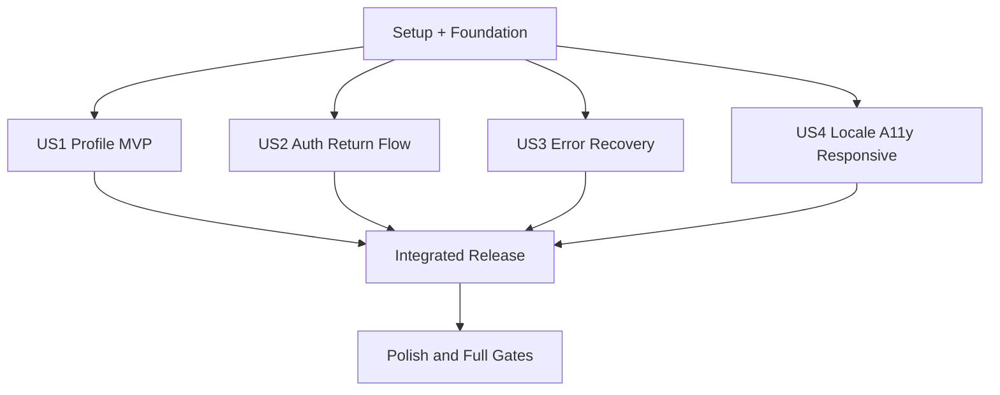

# Tasks: Account Profile Page

**Input**: Design documents from `/specs/20260720-account-profile-page/`

**Prerequisites**: plan.md, spec.md, research.md, data-model.md, contracts/account-profile.md, quickstart.md

**Tests**: Automated tests are required by the feature specification, implementation plan, and constitution. In each user-story phase, add the listed tests first and confirm they fail for the intended missing behavior before implementation.

**Organization**: Tasks are grouped by user story so the profile MVP, authentication return flow, error recovery, and localized accessible responsive experience can be implemented and validated as explicit increments.

## Format: `[ID] [P?] [Story] Description`

- **[P]**: Can run in parallel because it changes a different file and has no dependency on another incomplete task in the same phase
- **[Story]**: Maps the task to a user story from spec.md
- Every task names the exact file or files it changes

## Phase 1: Setup (Shared Infrastructure)

**Purpose**: Add the one missing shared UI primitive and establish the account module surface without changing dependencies, schema, or infrastructure.

- [X] T001 Document the selected installed Base UI/shadcn Avatar primitive pattern and confirm that no package installation is required in src/modules/account/README.md
- [X] T002 Document account-module ownership, server/client boundaries, strict mutation scope, and no-public-API constraint in src/modules/account/README.md

---

## Phase 2: Foundational (Blocking Prerequisites)

**Purpose**: Define shared validation, payload, state, and translation contracts that all user stories consume.

**CRITICAL**: Complete this phase before any user-story implementation.

- [X] T003 [P] Add failing boundary tests for required, trimmed, 80-character, Unicode-letter, space, apostrophe, and hyphen name validation in tests/unit/account-profile-schema.test.ts
- [X] T004 [P] Define serializable ProfileActionState, ProfileFormEntry, AccountLocale, and message-key types in src/modules/account/types.ts
- [X] T005 Implement the shared required name schema and strict ordered-entry parser that rejects duplicate or unknown controls in src/lib/validation/profile-name.ts
- [X] T006 [P] Define the complete typed Account message-key inventory for headings, navigation, avatar, fields, descriptions, actions, pending state, validation, success, and failure feedback in src/modules/account/messages.ts
- [X] T007 Run the focused schema test and confirm the foundational contract passes in tests/unit/account-profile-schema.test.ts

**Checkpoint**: Shared account contracts are ready; no Prisma schema, migration, package, environment, or infrastructure change has been introduced.

---

## Phase 3: User Story 1 - View and Update My Profile (Priority: P1) MVP

**Goal**: An authenticated user can open Account from navigation, see their image or fallback initials plus read-only email, update only their normalized name, and see the saved value after reload.

**Independent Test**: Create an existing user and database session, open the account page, verify the current profile, submit a valid changed name, reload, and confirm only the normalized name changed while email, image, and record count remain unchanged.

### Tests for User Story 1

- [X] T008 [P] [US1] Add failing initials tests for one-word, multi-word, null-name email fallback, Unicode names, and unusable inputs in tests/unit/account-initials.test.ts
- [X] T009 [P] [US1] Add failing service tests that require explicit server-derived selection and a Prisma update data object containing only name in tests/unit/account-service.test.ts
- [X] T010 [P] [US1] Add failing Server Action tests for authenticated success, normalization, unchanged-name replay, strict extra-field rejection including a forged locale entry, and no client identity acceptance in tests/unit/account-action.test.ts
- [X] T011 [P] [US1] Add failing component tests for image/fallback avatar, labeled editable name, labeled read-only email, explanatory text, Save changes, pending suppression, and success announcement in tests/unit/account-profile-form.test.tsx
- [X] T012 [P] [US1] Add failing PostgreSQL integration coverage for session-associated reads, successful one-field updates, forged user/email/image fields, replay safety, record-count invariance, and last-accepted concurrent writes in tests/integration/account-profile.test.ts
- [X] T013 [US1] Run the US1 test set in tests/unit/account-initials.test.ts, tests/unit/account-service.test.ts, tests/unit/account-action.test.ts, tests/unit/account-profile-form.test.tsx, and tests/integration/account-profile.test.ts and confirm failures correspond to missing US1 behavior

### Implementation for User Story 1

- [X] T014 [P] [US1] Implement the tested shadcn-compatible Avatar primitive and accessible name-first then email fallback initials derivation in src/components/ui/avatar.tsx and src/modules/account/initials.ts
- [X] T015 [P] [US1] Implement server-only current-user profile read and explicit `{ name }` Prisma update operations without create/upsert or PII logging in src/modules/account/service.ts
- [X] T016 [US1] Implement updateProfile with locale supplied only through validated bound route context, session-derived identity, strict rejection of any locale or other extra payload entry, normalized one-field persistence, replay safety, safe success state, and sanitized failure categories in src/modules/account/actions/update-profile.ts
- [X] T017 [US1] Implement the client profile form adapter and settings-form UI with avatar fallback, editable name, read-only email, pending submission lock, and success live region in src/modules/account/components/profile-form.tsx
- [X] T018 [US1] Implement the protected localized account page metadata, server-session profile loading, unframed Profile-only settings composition, and main form wiring in src/app/[locale]/account/page.tsx
- [X] T019 [US1] Add a localized Account link for authenticated users while preserving logout, language, and theme controls in src/components/app-navigation.tsx and pass its label from the shared header
- [X] T020 [US1] Run and pass the complete US1 unit/component/integration set in tests/unit/account-initials.test.ts, tests/unit/account-service.test.ts, tests/unit/account-action.test.ts, tests/unit/account-profile-form.test.tsx, and tests/integration/account-profile.test.ts

**Checkpoint**: User Story 1 is a deployable profile-editing MVP for an already authenticated user.

---

## Phase 4: User Story 2 - Preserve My Destination Through Sign-In (Priority: P2)

**Goal**: Signed-out visitors and users whose sessions expire during save are sent to the login page in the same locale and return only to a validated localized account destination after successful authentication.

**Independent Test**: Request each localized account URL signed out, verify the matching login and callback destination, reject malicious or mismatched callback values, authenticate with an existing-user magic link, and return to the requested account page; an expired mutation session writes nothing.

### Tests for User Story 2

- [X] T021 [P] [US2] Add failing callback-path tests for accepted locale-matched account paths and rejected absolute, protocol-relative, encoded-external, malformed, unknown, and cross-locale values in tests/unit/login-schema.test.ts
- [X] T022 [P] [US2] Add failing account-route and login-page tests for English, Spanish, and Catalan signed-out redirects, safe fallback destinations, and profile-data non-disclosure in tests/unit/account-routes.test.tsx and tests/unit/login-routes.test.tsx
- [X] T023 [P] [US2] Extend failing login-form tests to require the validated callback path while preserving CSRF, generic anti-enumeration responses, and existing-user-only magic-link behavior in tests/unit/login-form.test.tsx
- [X] T024 [P] [US2] Add failing mutation-time tests for missing, expired, and invalid sessions producing no database write and a localized login redirect in tests/unit/account-action.test.ts and tests/integration/account-profile.test.ts
- [X] T025 [US2] Run the US2 test set in tests/unit/login-schema.test.ts, tests/unit/account-routes.test.tsx, tests/unit/login-routes.test.tsx, tests/unit/login-form.test.tsx, tests/unit/account-action.test.ts, and tests/integration/account-profile.test.ts and confirm failures correspond to missing US2 behavior

### Implementation for User Story 2

- [X] T026 [P] [US2] Implement locale-matched account path construction and strict callback-path validation with locale-home fallback in src/modules/login/schema.ts
- [X] T027 [US2] Parse and validate callbackUrl on the localized login server page and pass only the trusted destination to the login form in src/app/[locale]/login/page.tsx
- [X] T028 [US2] Submit the trusted callback destination through the unchanged Auth.js email sign-in request in src/modules/login/components/login-form.tsx
- [X] T029 [US2] Complete signed-out page access and mutation-time session-expiry redirects with localized safe account callbacks in src/app/[locale]/account/page.tsx and src/modules/account/actions/update-profile.ts
- [X] T030 [US2] Run and pass the complete US2 unit/component/integration set in tests/unit/login-schema.test.ts, tests/unit/account-routes.test.tsx, tests/unit/login-routes.test.tsx, tests/unit/login-form.test.tsx, tests/unit/account-action.test.ts, and tests/integration/account-profile.test.ts

**Checkpoint**: User Story 2 independently protects all localized account entry and mutation paths without changing magic-link account-creation behavior.

---

## Phase 5: User Story 3 - Recover From Invalid Input or Save Failure (Priority: P3)

**Goal**: Validation and persistence failures retain the attempted name, announce localized feedback, apply the clarified focus behavior, and permit a successful retry without reload.

**Independent Test**: Submit empty, overlong, unsupported-character, duplicate-field, and extra-field payloads plus a simulated database failure; verify no partial write, retained value, correct live announcement and focus, then correct/retry successfully.

### Tests for User Story 3

- [X] T031 [P] [US3] Extend failing action tests for required/overlong/invalid-character/duplicate/extra input states, retained values, generic persistence errors, sanitized logs, and successful retry in tests/unit/account-action.test.ts
- [X] T032 [P] [US3] Extend failing form tests for assertive validation/persistence announcements, name focus after validation, Save changes focus after persistence failure, retained values, and retry without reload in tests/unit/account-profile-form.test.tsx
- [X] T033 [P] [US3] Extend failing PostgreSQL integration tests for validation no-write guarantees, atomic persistence failure, immutable email/image, and non-enumerating results in tests/integration/account-profile.test.ts
- [X] T034 [US3] Run the US3 test set in tests/unit/account-action.test.ts, tests/unit/account-profile-form.test.tsx, and tests/integration/account-profile.test.ts and confirm failures correspond to missing US3 behavior

### Implementation for User Story 3

- [X] T035 [US3] Map strict schema issues and persistence failures to non-PII ProfileActionState variants while retaining the attempted name in src/modules/account/actions/update-profile.ts
- [X] T036 [US3] Implement controlled value recovery, field/form error associations, assertive announcements, and clarified validation-versus-persistence focus management in src/modules/account/components/profile-form.tsx
- [X] T037 [US3] Run and pass the complete US3 unit/component/integration set in tests/unit/account-action.test.ts, tests/unit/account-profile-form.test.tsx, and tests/integration/account-profile.test.ts

**Checkpoint**: User Story 3 provides deterministic, accessible recovery from every specified save failure.

---

## Phase 6: User Story 4 - Use the Profile Page in Any Supported Locale and Viewport (Priority: P4)

**Goal**: English, Spanish, and Catalan users receive equivalent content and keyboard/accessibility behavior in light and dark themes at desktop and 320 px mobile widths without overlap or horizontal scrolling.

**Independent Test**: Run component accessibility checks and the complete production-artifact account flow in all locales with keyboard input on desktop and 320×900; verify active navigation semantics, read-only email, feedback announcements, theme legibility, no serious/critical axe violations, and zero horizontal overflow.

### Tests for User Story 4

- [X] T038 [P] [US4] Add failing catalog parity tests requiring every typed Account key from src/modules/account/messages.ts and behaviorally equivalent English, Spanish, and Catalan content in tests/unit/account-messages.test.ts
- [X] T039 [P] [US4] Add failing axe and keyboard tests for labels, read-only email semantics, active Profile navigation, tab order, pending/success/error live regions, and both avatar states in tests/unit/account-accessibility.test.tsx
- [X] T040 [P] [US4] Extend failing authenticated-navigation tests for localized Account links and active semantics without regressing logout, language, or theme behavior in tests/unit/app-navigation.test.tsx
- [X] T041 [P] [US4] Create an isolated Playwright helper that seeds and cleans an existing user plus database Session and installs the Auth.js session cookie in tests/e2e/helpers/authenticated-user.ts
- [X] T042 [US4] Add failing standalone-production Playwright journeys for signed-out redirects, authenticated render/update/reload, image and initials, all locales, keyboard submission, axe states, desktop/mobile navigation, and horizontal-overflow checks in tests/e2e/account-profile.spec.ts
- [X] T043 [US4] Run the US4 unit/component tests and targeted Playwright account test in tests/unit/account-messages.test.ts, tests/unit/account-accessibility.test.tsx, tests/unit/app-navigation.test.tsx, and tests/e2e/account-profile.spec.ts and confirm failures correspond to missing US4 behavior

### Implementation for User Story 4

- [X] T044 [P] [US4] Populate every typed Account key with complete behaviorally equivalent translations, including long validation, pending, success, and failure strings, in src/messages/en.json, src/messages/es.json, and src/messages/ca.json
- [X] T045 [US4] Implement responsive desktop-column/mobile-top Profile navigation, active `aria-current` semantics, stable widths, long-content wrapping, and light/dark token styling in src/app/[locale]/account/page.tsx
- [X] T046 [US4] Finalize keyboard order, explicit labels, read-only semantics, avatar accessible naming, live-region behavior, and responsive no-overflow constraints in src/modules/account/components/profile-form.tsx
- [X] T047 [US4] Run and pass the complete US4 unit/component and standalone-production Playwright coverage in tests/unit/account-messages.test.ts, tests/unit/account-accessibility.test.tsx, tests/unit/app-navigation.test.tsx, and tests/e2e/account-profile.spec.ts

**Checkpoint**: All four user stories are independently verified and the complete localized account experience is production-artifact tested.

---

## Phase 7: Polish & Cross-Cutting Concerns

**Purpose**: Validate the integrated feature against security, quality, operational, and visual constraints without expanding scope.

- [X] T048 [P] Add explicit regression assertions that profile failures never log names, emails, submitted values, image URLs, or session tokens in tests/unit/account-action.test.ts and tests/unit/logger.test.ts
- [X] T049 [P] Document implemented account routes, profile limits, immutable fields, and authenticated navigation in README.md
- [X] T050 Run `pnpm lint`, `pnpm typecheck`, `RUN_INTEGRATION_TESTS=true pnpm test:coverage`, `pnpm build`, and `pnpm audit:prod`; record command results and any feature-specific verification notes in specs/20260720-account-profile-page/quickstart.md
- [X] T051 Run the full isolated standalone production suite with `pnpm test:e2e`, including existing smoke coverage plus desktop and 320×900 account scenarios in tests/e2e/account-profile.spec.ts
- [X] T052 Verify light/dark English, Spanish, and Catalan layouts manually for avatar failure fallback, long names/emails/translations, no nested cards, no empty sections, no overlap, and no horizontal scrolling; record results in specs/20260720-account-profile-page/quickstart.md
- [X] T053 Confirm git diff contains no changes to prisma/schema.prisma, prisma/migrations/, .env.example, docker-compose.yml, docker-compose.prod.yml, authentication provider semantics, or infrastructure and record the result in specs/20260720-account-profile-page/quickstart.md

---

## Dependencies & Execution Order

### Phase Dependencies

- **Phase 1 Setup**: Starts immediately.
- **Phase 2 Foundational**: Depends on Phase 1 and blocks every user story.
- **Phase 3 US1**: Depends on Phase 2 and delivers the MVP.
- **Phase 4 US2**: Depends on Phase 2; integrates with the account page/action created by US1 when executed sequentially.
- **Phase 5 US3**: Depends on Phase 2; extends the action/form contracts created by US1 when executed sequentially.
- **Phase 6 US4**: Depends on Phase 2; performs final localized, accessibility, responsive, and production integration over the selected completed stories.
- **Phase 7 Polish**: Depends on all user stories selected for release.

### User Story Dependency Graph



- **US1 (P1)**: No dependency on another story; can be demonstrated with an authenticated fixture.
- **US2 (P2)**: Independently testable as protected routing/callback behavior; sequential implementation reuses US1 route/action files.
- **US3 (P3)**: Independently testable against action/form failure contracts; sequential implementation extends US1 files.
- **US4 (P4)**: Independently testable for localization/accessibility/responsiveness with a profile fixture; final E2E naturally validates integrated stories.

### Within Each User Story

1. Add story tests and confirm they fail for the intended missing behavior.
2. Implement pure helpers and schemas before services/actions.
3. Implement services before route/form integration.
4. Run the focused story set until it passes.
5. Stop at the checkpoint before beginning the next story.

## Parallel Opportunities

### User Story 1

```text
T008 initials tests | T009 service tests | T010 action tests | T011 form tests | T012 integration tests
T014 initials helper | T015 account service
```

### User Story 2

```text
T021 callback tests | T022 route tests | T023 login form tests | T024 session-expiry tests
```

### User Story 3

```text
T031 action failure tests | T032 form recovery tests | T033 integration failure tests
```

### User Story 4

```text
T038 catalog tests | T039 accessibility tests | T040 navigation tests | T041 E2E auth helper
T044 translation catalogs (after T038) can proceed while T045/T046 responsive and accessibility implementation is prepared in separate files
```

## Implementation Strategy

### MVP First

1. Complete T001–T007 (Setup and Foundation).
2. Complete T008–T020 (US1).
3. Stop and verify authenticated render, one-field name update, reload persistence, replay safety, and immutable email/image.
4. Demo or deploy the authenticated Profile MVP only if the release does not require the remaining specified stories; the full feature is not complete until US2–US4 pass.

### Incremental Delivery

1. **Foundation**: Shared strict validation, state contracts, and translations.
2. **US1**: Authenticated profile read/update MVP.
3. **US2**: Localized protected routing and safe post-authentication return.
4. **US3**: Accessible validation/persistence recovery.
5. **US4**: Complete localization, accessibility, responsive behavior, and production E2E.
6. **Polish**: Full quality, security, visual, and no-infrastructure-change gates.

### Parallel Team Strategy

After Phase 2, separate developers may prepare tests and isolated files for each story in parallel. Coordinate edits to shared files before merging:

- src/app/[locale]/account/page.tsx is touched by US1, US2, and US4.
- src/modules/account/actions/update-profile.ts is touched by US1, US2, and US3.
- src/modules/account/components/profile-form.tsx is touched by US1, US3, and US4.
- src/messages/en.json, src/messages/es.json, and src/messages/ca.json are touched in Foundation and US4.
- tests/unit/account-action.test.ts and tests/integration/account-profile.test.ts span multiple stories.

## Implementation notes

- `[P]` means different files and no incomplete-task dependency at that point, not merely that work is conceptually separable.
- No task may add a Prisma migration, user/profile record, environment variable, secret, container, volume, external service, upload control, or unavailable account section.
- No profile mutation may accept client identity or use create/upsert/mass assignment.
- Existing email magic-link sign-in remains existing-user-only; this feature defines a reusable future-registration name invariant but does not add or change registration.
- Application logs must remain free of names, emails, submitted profile values, image URLs, and session tokens.
- After all tasks are checked, the registered `after_implement` hooks run `bash .specify/scripts/bash/compliance-check.sh --all` followed by the local quality gate; CI independently repeats compliance, coverage, audit, build, and production E2E checks.
