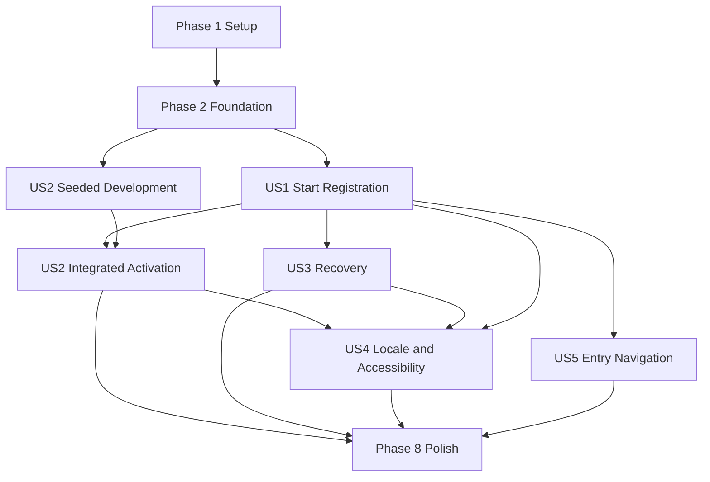

# Tasks: Signup Page

**Input**: Design documents from `/specs/20260818-signup-page/`

**Prerequisites**: plan.md, spec.md, research.md, data-model.md, contracts/openapi.yaml, quickstart.md

**Tests**: Automated tests are mandatory because the specification defines VR-001 through VR-016
and the feature changes public registration, email delivery, account activation, and session creation.
Write each story's tests first and confirm that they fail for the intended missing behavior.

**Organization**: Tasks are grouped by user story so each slice can be implemented and validated
independently. Shared account lifecycle and login protections are foundational because pending users
must be safe before any public signup request can create one.

## Format: `[ID] [P?] [Story] Description`

- **[P]**: Can run in parallel with adjacent tasks after its stated phase dependencies are complete
- **[Story]**: Maps the task to a user story in spec.md
- Every task names the exact file or files it creates or modifies

## Product Input Gate

The user authorized clearly labeled development dummy English, Spanish, and Catalan Terms and
Privacy Notice copy with stable `2026-08-18-draft` version identifiers on 2026-08-18. T001 and T002
must preserve the visible unreviewed-draft notice and must not represent the content as legal advice.

---

## Phase 1: Setup (Shared Inputs and Test Infrastructure)

**Purpose**: Add the product-owned policy inputs and deterministic test fixtures needed by every
signup story. The existing Next.js project and production infrastructure require no scaffolding.

- [x] T001 Record the user-authorized `2026-08-18-draft` Terms and Privacy Notice version identifiers, unreviewed-content status, and locale-aware policy destinations in `src/modules/signup/policy.ts`
- [x] T002 Add the clearly labeled development dummy English, Spanish, and Catalan Terms and Privacy Notice copy to `src/messages/en.json`, `src/messages/es.json`, and `src/messages/ca.json`
- [x] T003 [P] Add pinned test-only SMTP server dependencies to `package.json` and `pnpm-lock.yaml` and implement deterministic delivery capture, rejection, timeout, and teardown in `tests/helpers/smtp-server.ts`
- [x] T004 [P] Create unique signup account/token/session/acceptance/limiter factories and complete cleanup helpers in `tests/helpers/signup-fixtures.ts`

**Checkpoint**: Approved policy inputs and deterministic SMTP/database fixtures are available.

---

## Phase 2: Foundational (Blocking Account and Token Invariants)

**Purpose**: Make pending accounts representable while preserving every existing-user login and
generic-callback protection.

**Critical**: No user-story implementation may create a pending user until this phase is complete.

### Tests for Shared Foundations

- [x] T005 [P] Add fresh-install, legacy-user backfill, normalized-email collision abort, token-default, and no-fabricated-acceptance migration coverage in `tests/integration/signup-migration.test.ts`
- [x] T006 [P] Extend `tests/unit/auth-adapter.test.ts` with failing coverage for active-only email lookup, unconditional `createUser` rejection, and unchanged login-purpose token behavior
- [x] T007 [P] Extend `tests/unit/login-service.test.ts` with failing coverage that active users remain eligible while pending and unknown normalized addresses receive the existing private no-creation behavior

### Implementation for Shared Foundations

- [x] T008 Extend `prisma/schema.prisma` with `UserStatus`, `VerificationPurpose`, required unique `User.normalizedEmail`, `User.status`, purpose-tagged signup snapshot fields on `VerificationToken`, global token uniqueness, and the one-to-one immutable `PolicyAcceptance` relation, then regenerate `src/generated/prisma/`
- [x] T009 Create the forward-only backfill, collision preflight, token schema reconciliation, check constraints, lookup index, and partial newest-signup-token uniqueness migration in `prisma/migrations/20260818000000_add_signup_lifecycle/migration.sql`
- [x] T010 [P] Filter generic adapter user lookup to active normalized accounts while preserving the hard `createUser` failure and login-purpose token contract in `src/lib/auth-adapter.ts`
- [x] T011 [P] Restrict ordinary magic-link eligibility to active normalized accounts without changing its public privacy behavior in `src/modules/login/service.ts`
- [x] T012 [P] Supply normalized email and explicit active status in existing account creators in `prisma/seed.mjs`, `tests/integration/magic-link-login.test.ts`, and `tests/e2e/helpers/authenticated-user.ts`

**Checkpoint**: Fresh and upgraded databases enforce lifecycle invariants; pending users cannot use
ordinary login; existing active-user magic links still work.

---

## Phase 3: User Story 1 - Start Registration Privately (Priority: P1)

**Goal**: Accept a valid explicit signup, create or reuse one pending account, issue only the newest
link-bound candidate snapshot, privately route active accounts to login, and expose one uniform
accepted result.

**Independent Test**: Submit matched valid requests for a new, pending, and active normalized
address. Verify identical `200 {"status":"accepted"}` outcomes, visible confirmation,
URL/navigation behavior, and response floors; one current signup token for new/pending accounts;
the correct private email type; no active-account mutation; and no session or authoritative
acceptance before activation.

### Tests for User Story 1

- [x] T013 [P] [US1] Add failing exact-object, Unicode name, normalized email, affirmative acceptance, locale, boundary-length, and client-policy-metadata rejection tests in `tests/unit/signup-schema.test.ts`
- [x] T014 [P] [US1] Add failing raw-token generation, Auth.js-compatible hashing, 15-minute expiry, and no-raw-token-persistence tests in `tests/unit/signup-token.test.ts`
- [x] T015 [P] [US1] Add failing localized credential-bearing onboarding and credential-free active-account notice tests in `tests/unit/signup-email.test.ts`
- [x] T016 [P] [US1] Add failing service tests for first signup, normalized pending reuse, active-account immutability, newest candidate snapshot, advisory-lock arbitration, isolated delivery cleanup, and sanitized logging in `tests/unit/signup-service.test.ts`
- [x] T017 [P] [US1] Add failing contract tests for valid new/pending/active submissions, exact accepted status/content/structure parity, client-before-CSRF and address-after-validation ordering, provider-health precheck, and request-start-relative response floor in `tests/unit/signup-route.test.ts`
- [x] T018 [US1] Add PostgreSQL plus controlled-SMTP integration coverage for valid new, retained-pending, and active-account submissions, normalized uniqueness, newest-only snapshot storage, private email effects, and zero pre-activation sessions/acceptances in `tests/integration/signup-onboarding.test.ts`

### Implementation for User Story 1

- [x] T019 [P] [US1] Define public result, validated request, candidate snapshot, lifecycle outcome, and sanitized event types in `src/modules/signup/types.ts`
- [x] T020 [P] [US1] Implement the strict server/client signup schemas and shared name/email normalization contract in `src/modules/signup/schema.ts`
- [x] T021 [P] [US1] Implement 32-byte Base64URL token generation, Auth.js-compatible salted hashing, and fixed 15-minute expiry in `src/modules/signup/token.ts`
- [x] T022 [US1] Add core signup form, accepted-result, onboarding-email, and active-account-notice messages to `src/messages/en.json`, `src/messages/es.json`, and `src/messages/ca.json`
- [x] T023 [US1] Build localized onboarding and active-account notice content with canonical app-local links and the existing Nodemailer transport boundary in `src/modules/signup/email.ts`
- [x] T024 [US1] Implement advisory-locked new/pending/active submission orchestration, candidate snapshot replacement, failed-delivery token cleanup, response-floor timing, and PII-safe events in `src/modules/signup/service.ts`
- [x] T025 [US1] Implement `POST /api/signup` with client limiting, CSRF, exact parsing, normalized-address limiting, account-independent provider health, uniform accepted outcomes, and contract headers in `src/app/api/signup/route.ts`
- [x] T026 [US1] Implement the name/email/unchecked-policy signup form with initial, pending, and generic accepted states in `src/modules/signup/components/signup-form.tsx`
- [x] T027 [US1] Render the public signup form with server-issued CSRF data and current policy destinations in `src/app/[locale]/signup/page.tsx`
- [x] T028 [P] [US1] Render the approved localized policy content in `src/app/[locale]/terms/page.tsx` and `src/app/[locale]/privacy/page.tsx`

**Checkpoint**: User Story 1 is independently functional and non-enumerating; form submission alone
never authenticates a visitor.

---

## Phase 4: User Story 2 - Verify and Enter the New Account (Priority: P1)

**Goal**: Consume only the newest valid onboarding token, atomically activate its pending account
and acceptance snapshot, and delegate exactly one normal database session to Auth.js without account
switching or callback-based creation.

**Independent Test**: Seed a pending account with a current signup token, open it with no session,
and verify activation, name and acceptance persistence, one Auth.js session/cookie, localized home
redirect, and replay failure. Repeat with invalid links, concurrent use, a different current session,
and injected session-creation failure.

### Tests for User Story 2

- [x] T029 [P] [US2] Extend `tests/unit/auth-adapter.test.ts` with failing purpose-aware atomic activation, snapshot persistence, replay, stale-token, active-account, and missing-activation-context cases
- [x] T030 [P] [US2] Add failing malformed/expired/invalid-link, canonical-host, safe redirect, conflicting-session non-consumption, and durable session-failure mapping tests in `tests/unit/signup-activation-route.test.ts`
- [x] T031 [P] [US2] Extend `tests/integration/magic-link-login.test.ts` with failing regression coverage that pending users and direct signup-token callbacks cannot authenticate while active-user login-purpose links still succeed
- [x] T032 [US2] Extend `tests/integration/signup-onboarding.test.ts` with failing full activation/session, immutable acceptance, replay, concurrent consumption, signup-versus-activation commit order, conflicting-session preservation, and post-activation session-failure recovery coverage
- [x] T033 [US2] Add production-artifact English new/pending/active submission comparisons for identical accepted confirmation and URL/navigation behavior, then complete captured-email activation, secure-cookie, authenticated-page, and replay smoke coverage in `tests/e2e/signup-onboarding.spec.ts` and register its controlled SMTP environment in `playwright.config.ts`

### Implementation for User Story 2

- [x] T034 [P] [US2] Implement request-scoped, server-only signup activation authorization that cannot leak across concurrent requests in `src/modules/signup/verification-context.ts`
- [x] T035 [US2] Register the dedicated signup email provider/callback configuration while preserving the existing login provider and database-session settings in `src/lib/auth.ts`
- [x] T036 [US2] Make `useVerificationToken` purpose-aware so a current signup token atomically activates its pending user, consumes all signup credentials, and inserts one acceptance only inside the activation context in `src/lib/auth-adapter.ts`
- [x] T037 [US2] Reject direct signup-purpose callback use and preserve canonical-origin, cookie, CSRF, and unknown-user protections in `src/app/api/auth/[...nextauth]/route.ts`
- [x] T038 [US2] Implement `GET /api/signup/activate` token hashing/lookup, different-session preservation, activation-context delegation to Auth.js, safe localized redirects, generic invalid results, and durable session-failure recovery in `src/app/api/signup/activate/route.ts`
- [x] T039 [US2] Render generic invalid-link, sign-out-and-reopen, and localized ordinary-login recovery states without exposing account details in `src/app/[locale]/signup/page.tsx` and `src/modules/signup/components/signup-form.tsx`

**Checkpoint**: User Story 2 is independently testable from seeded pending state; combined with User
Story 1 it forms the first complete, usable passwordless registration journey.

---

## Phase 5: User Story 3 - Recover From Rejected or Delayed Requests (Priority: P2)

**Goal**: Reject unsafe requests before account work and provide consistent localized recovery for
validation, limiting, shared outages, and isolated processing failures.

**Independent Test**: Exercise invalid name/email/acceptance, extra fields, malformed JSON, invalid
CSRF, client and address limits, shared mail outage, recipient rejection, timeout, persistence error,
and notice failure. Verify precise limit accounting, accessible recovery, uniform permitted public
results, and no unsafe account/token/session state.

### Tests for User Story 3

- [x] T040 [P] [US3] Extend `tests/unit/signup-route.test.ts` with failing malformed JSON, extra-field, invalid-CSRF, invalid-field, exact client/address boundary, retry-header, shared-outage parity, isolated-failure response tests, and request-start-relative response-floor timing after isolated onboarding and active-notice delivery failures
- [x] T041 [P] [US3] Add failing field-error, first-invalid focus, generic invalid-request, rate-limited, unavailable, pending/duplicate prevention, and live-region tests in `tests/unit/signup-form.test.tsx`
- [x] T042 [US3] Extend `tests/integration/signup-onboarding.test.ts` with invalid, malicious, additional-field, and invalid-CSRF route requests that assert no account, token, acceptance, or session mutation; combined login/signup limiter boundaries; trusted-proxy identity; shared-outage no-mutation; isolated SMTP/persistence failure cleanup; pending reuse; and failed active-notice cases
- [x] T043 [P] [US3] Extend `tests/unit/email.test.ts` with account-independent provider-health transitions and assertions that recipient, name, token, URL, acceptance, account, and session data never enter logs

### Implementation for User Story 3

- [x] T044 [P] [US3] Expose only account-independent availability and normalized delivery outcome categories to signup while retaining SMTP timeout behavior in `src/lib/email.ts`
- [x] T045 [US3] Complete isolated lookup/persistence/token/delivery failure compensation and coarse Pino outcome logging in `src/modules/signup/service.ts`
- [x] T046 [US3] Complete invalid, rate-limited, shared-unavailable, and isolated-accepted response mapping with `Retry-After` and `X-RateLimit-Remaining` behavior in `src/app/api/signup/route.ts`
- [x] T047 [US3] Add stable-layout validation and recovery states, duplicate-submit prevention, pending announcement, and first-invalid focus behavior in `src/modules/signup/components/signup-form.tsx`

**Checkpoint**: User Story 3 is independently recoverable and all public failure behavior preserves
the specified trust and privacy boundaries.

---

## Phase 6: User Story 4 - Use Signup in Any Supported Locale and Viewport (Priority: P2)

**Goal**: Make every signup, email, activation, policy, validation, and recovery state equivalent in
English, Spanish, and Catalan and operable with keyboard, assistive technology, mobile, and desktop.

**Independent Test**: Complete submission and activation at `/signup`, `/es/signup`, and
`/ca/signup` with keyboard-only interaction; run axe; verify route-language emails and redirects;
and measure all states at 375x667 and 1440x900 in both appearances for clipping or overflow.

### Tests for User Story 4

- [x] T048 [P] [US4] Add key parity, translated interpolation, policy destination, email content, and forbidden fallback checks for all supported catalogs in `tests/unit/signup-messages.test.ts`
- [x] T049 [P] [US4] Add localized route rendering, locale preservation, policy-page, and authenticated-visitor redirect tests in `tests/unit/signup-routes.test.tsx`
- [x] T050 [P] [US4] Add axe, labels/descriptions, native unchecked checkbox, 24x24 targets, keyboard order, visible focus, live-region urgency, and first-invalid focus tests in `tests/unit/signup-accessibility.test.tsx`
- [x] T051 [US4] Extend `tests/e2e/signup-onboarding.spec.ts` across en/es/ca, light/dark appearances, keyboard flow, axe, 375x667 and 1440x900 overflow/control bounds, and stable error/status-region dimensions

### Implementation for User Story 4

- [x] T052 [US4] Complete behaviorally equivalent signup, email, activation, conflict, recovery, policy, and navigation messages in `src/messages/en.json`, `src/messages/es.json`, and `src/messages/ca.json`
- [x] T053 [US4] Preserve the resolved locale through authenticated guards, form state, policy links, activation results, and safe home/login redirects in `src/app/[locale]/signup/page.tsx`
- [x] T054 [US4] Finalize native semantics, keyboard/focus behavior, target sizes, contrast, stable dimensions, and responsive wrapping in `src/modules/signup/components/signup-form.tsx`
- [x] T055 [US4] Preserve route locale in onboarding/notice email text and all application-local destinations in `src/modules/signup/email.ts` and `src/modules/signup/service.ts`

**Checkpoint**: User Story 4 passes equivalent locale, accessibility, appearance, and responsive
checks for the complete registration journey.

---

## Phase 7: User Story 5 - Find the Correct Account Entry Flow (Priority: P3)

**Goal**: Expose distinct localized Signup and Login entry points, provide a no-PII route from signup
to login, and keep authenticated users out of registration.

**Independent Test**: In all locales, use public navigation to open distinct login and signup
routes, follow signup's existing-account prompt without name/email query data, and verify an
authenticated visit to signup returns to localized home without starting registration.

### Tests for User Story 5

- [x] T056 [P] [US5] Update `tests/unit/app-navigation.test.tsx` with failing signed-out localized Login/Signup visibility, distinct destinations, and unchanged signed-in navigation coverage
- [x] T057 [P] [US5] Update `tests/unit/home-navigation.test.tsx` with failing enabled localized Signup and separate Login action coverage
- [x] T058 [P] [US5] Extend `tests/unit/signup-form.test.tsx` with failing localized existing-account prompt and no submitted name/email propagation coverage
- [x] T059 [US5] Add public-navigation, signup-to-login, authenticated-signup redirect, and no-PII URL checks for every locale in `tests/e2e/signup-navigation.spec.ts`

### Implementation for User Story 5

- [x] T060 [P] [US5] Enable the localized Signup action beside the existing Login action without changing authenticated controls in `src/components/app-navigation.tsx`
- [x] T061 [P] [US5] Enable the distinct localized Signup destination in the public home actions in `src/components/home-navigation.tsx`
- [x] T062 [US5] Add a localized existing-account login link that never carries submitted form values in `src/modules/signup/components/signup-form.tsx`
- [x] T063 [US5] Redirect authenticated visitors from signup to the matching localized home before rendering or issuing CSRF form state in `src/app/[locale]/signup/page.tsx`

**Checkpoint**: User Story 5 is independently discoverable and login remains an existing-user-only
flow distinct from registration.

---

## Phase 8: Polish and Cross-Cutting Validation

**Purpose**: Validate the integrated feature, operational recovery, documentation, usability target,
and repository governance after all desired story phases are complete.

- [x] T064 [P] Document explicit signup versus login lifecycle, approved-policy ownership, pending-account behavior, SMTP reuse, and no-new-secret deployment impact in `README.md`
- [x] T065 Execute fresh-install, existing-data upgrade, collision-abort, logical backup, clean restore, migration deploy, and signup/login recovery checks and record verified outcomes in `specs/20260818-signup-page/quickstart.md` using `scripts/db-backup.sh` and `scripts/db-restore.sh`
- [ ] T066 Conduct the SC-010 no-coaching usability evaluation with at least 20 first-time target users who have not seen the flow, at least five participants assigned to each locale, at least eight participants using a mobile viewport, and at least eight participants using a desktop viewport; apply the first-attempt two-minute success script and `ceil(0.95 × N)` threshold; and record only anonymized aggregate results in `specs/20260818-signup-page/usability-results.md`
- [x] T067 Run the lint, typecheck, production audit, integration coverage, production-artifact Playwright, and runner/migrator Docker build gate documented in `specs/20260818-signup-page/quickstart.md` and mirrored by `.github/workflows/ci.yml`
- [x] T068 Run `.specify/scripts/bash/compliance-check.sh --all` and confirm `specs/20260818-signup-page/spec.md`, `specs/20260818-signup-page/plan.md`, and `specs/20260818-signup-page/tasks.md` remain complete and placeholder-free

---

## Dependencies and Execution Order

### Phase Dependencies

- **Phase 1 - Setup**: Starts immediately; T001/T002 implement the user-authorized development policy input.
- **Phase 2 - Foundational**: Depends on Phase 1 test fixtures and blocks creation of pending users.
- **Phase 3 - US1**: Depends on Phase 2 and delivers secure submission plus private email routing.
- **Phase 4 - US2**: Depends on Phase 2 for implementation and may use seeded fixtures for isolated
  development; integrated delivery depends on US1-issued tokens.
- **Phase 5 - US3**: Depends on US1's submission route, service, and form; can proceed in parallel
  with US2 after US1 is stable.
- **Phase 6 - US4**: Depends on US1-US3 because it verifies every submission, activation, and
  recovery state across locales and viewports.
- **Phase 7 - US5**: Depends on the US1 signup route/page contract and can proceed in parallel with
  US2-US4.
- **Phase 8 - Polish**: Depends on every story selected for the release.

### User Story Completion Graph



### Within Each User Story

1. Add the story's tests and confirm they fail for the intended missing behavior.
2. Add types/schema or context primitives before services.
3. Complete services before public endpoints.
4. Complete endpoints before UI/E2E integration.
5. Run the story's focused tests and independent-test procedure before its checkpoint.

### Parallel Opportunities

- T003 and T004 can run in parallel after the policy input work begins.
- T005-T007 can be authored in parallel; after T008/T009, T010-T012 touch separate ownership paths.
- US1 test tasks T013-T017 and primitive tasks T019-T021 use separate files.
- US2 tests T029-T031 can run in parallel; T034 can be implemented independently before adapter and
  route integration.
- US3 route, form, and mail tests T040, T041, and T043 use separate files.
- US4 message, route, and accessibility tests T048-T050 use separate files.
- US5 navigation and form tests T056-T058 and component updates T060-T061 use separate files.
- After US1 stabilizes, US2, US3, and US5 can be staffed in parallel; US4 follows the complete state
  surface.

---

## Parallel Execution Examples

### User Story 1

```text
Parallel test batch: T013 signup schema | T014 token | T015 email | T016 service | T017 route
Parallel primitive batch after tests: T019 types | T020 schema | T021 token
Then: T022 -> T023 -> T024 -> T025 -> T026/T028 -> T027 -> T018 focused integration rerun
```

### User Story 2

```text
Parallel test batch: T029 adapter | T030 activation route | T031 login regression
Parallel implementation start: T034 activation context | T035 provider configuration preparation
Then: T036 -> T037/T038 -> T039 -> T032/T033 focused integration and E2E rerun
```

### User Story 3

```text
Parallel test batch: T040 route recovery | T041 form recovery | T043 provider/log hygiene
Parallel implementation start: T044 email outcome boundary | T047 form recovery states
Then: T045 -> T046 -> T042 focused PostgreSQL/SMTP integration rerun
```

### User Story 4

```text
Parallel test batch: T048 message parity | T049 localized routes | T050 accessibility
Then: T052 -> T053/T054/T055 -> T051 locale/appearance/viewport E2E rerun
```

### User Story 5

```text
Parallel test batch: T056 app navigation | T057 home navigation | T058 signup login prompt
Parallel implementation batch: T060 app navigation | T061 home navigation
Then: T062/T063 -> T059 localized navigation E2E rerun
```

---

## Implementation Strategy

### Secure Submission Increment

1. Complete Setup and Foundational phases.
2. Complete US1 and validate its uniform public result independently.
3. This is a demonstrable pending-registration increment, but it is not a shippable account journey
   because users cannot enter the product until US2 is complete.

### Shippable MVP

1. Complete Setup, Foundational, US1, and US2; both stories are P1.
2. Validate the complete submit-email-activate-session journey and all P1 race/recovery invariants.
3. Do not release until T001/T002 and the US1/US2 critical integration/E2E tests pass; the policy
  pages must continue to identify their content as an unreviewed development draft.

### Incremental Delivery

1. Add US3 for robust visitor recovery and provider/limit failure handling.
2. Add US4 for required locale, accessibility, appearance, and responsive equivalence.
3. Add US5 for discoverable, separate account entry navigation.
4. Complete Phase 8 and use CI as the authoritative merge gate.

### Parallel Team Strategy

1. Complete Setup and Foundation together.
2. Develop US1 issuance and US2 activation against shared seeded fixtures in parallel, then integrate
   them in US1 -> US2 delivery order.
3. After US1 stabilizes, assign US3 and US5 independently while US2 integration completes.
4. Run US4 after all visible states exist, then converge on Phase 8 validation.

## Notes

- `[P]` means separate files and no dependency on another incomplete task in the same batch.
- Story labels provide traceability to the five user stories in spec.md.
- The migration is forward-only; application rollback is never described as schema or data rollback.
- Raw tokens, verification URLs, names, emails, acceptance values, account IDs, and session material
  must not appear in test output, fixtures committed with real data, or logs.
- Do not weaken `createUser`, invent a custom session cookie, draft legal content, or add another
  runtime service while completing these tasks.