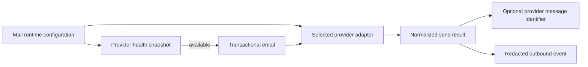
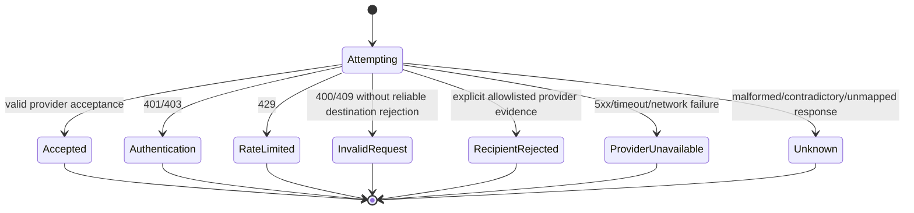
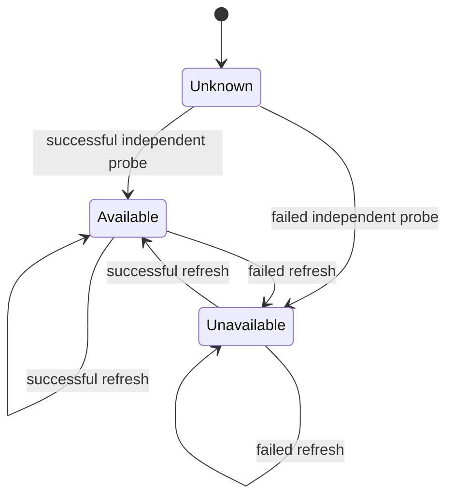

# Data Model: Transactional Email HTTP Providers

**Feature**: `20260819-http-email-providers`
**Date**: 2026-08-19

## Persistence Impact

This feature adds no Prisma model, migration, delivery record, webhook event, or administrative data. Transactional messages and provider responses exist only in server memory for one request. The existing `RateLimitBucket` table stores only provider-scoped operational health and lock state; it stores no recipient, account, message content, provider credential, provider response, or delivery status.

## Entity Relationships



A public email-dependent flow first evaluates the global gate and one provider-health snapshot. Only an enabled, available flow may construct a transactional email and invoke the selected adapter. A normalized result governs existing token compensation but never creates a delivery state.

## 1. Provider Configuration

A server-only discriminated configuration selected at startup.

| Field | Type | Required | Rules |
|---|---|---:|---|
| `enabled` | boolean | yes | False when `MAIL_ENABLED` is false or absent |
| `provider` | `brevo` or `mailjet` | when enabled | Exact lowercase value; chooses a fixed endpoint |
| `apiKey` | secret string | when enabled | Non-empty; never returned, logged, or placed outside the authentication header |
| `apiSecret` | secret string | Mailjet only | Non-empty for Mailjet; absent from normalized Brevo configuration |
| `fromEmail` | email address | when enabled | Exactly one bare address; no display-name syntax; verified externally with the provider |
| `senderName` | string | when enabled | Derived only from `PROJECT_NAME`; trimmed, 1-70 characters, and no control characters or line breaks |
| `sendTimeoutMs` | constant | yes | 2,500 |
| `healthTimeoutMs` | constant | yes | 1,500 |
| `responseLimitBytes` | constant | yes | 65,536 |

### Validation

- Invalid `MAIL_ENABLED` always fails startup validation.
- When disabled, provider credentials alone do not activate any flow and normalized configuration contains no active provider.
- When enabled, incomplete or unsupported provider configuration fails startup before an email-dependent flow is served.
- `MAIL_API_BASE_URL` and `MAIL_FROM_NAME` are not fields and cannot affect the entity.
- A Mailjet secret present while Brevo is selected is normalized away and is never read by the Brevo adapter; production wiring should omit it.
- Validation errors contain field names and safe reasons only, never values.

### State Transitions

```text
Disabled --restart with complete configuration--> Enabled(Brevo|Mailjet)
Enabled(provider A) --restart with complete configuration--> Enabled(provider B)
Enabled --restart with invalid configuration--> Startup rejected
```

Provider selection does not change within a running process.

## 2. Transactional Email

A transient, server-originated message with exactly one recipient.

| Field | Type | Rules |
|---|---|---|
| `recipient` | email address | Exactly one validated address; never logged |
| `locale` | `en`, `es`, or `ca` | Must equal the locale selected by the invoking flow |
| `subject` | string | Non-empty, no CR/LF or control characters |
| `text` | string | Non-empty localized plain text |
| `html` | string | Non-empty localized HTML |

### Validation and Invariants

- Both `text` and `html` are required. A text-only or HTML-only message is rejected before an outbound request.
- Sender fields are bound separately by the production provider factory from validated configuration; they are not message input fields and clients or routes cannot override them.
- The serialized provider request must not exceed 1 MiB. Current transactional messages are expected to remain far below this bound.
- A message may contain a confidential authentication URL. Message fields must not enter structured logs, exception messages, snapshots, or public results.
- The provider adapter receives already-localized content and does not translate or modify links.

### Lifetime

```text
Composed -> Validated -> Submitted once -> Discarded
                    \-> Invalid request result -> Discarded
```

The application does not persist the message or any post-acceptance delivery state.

## 3. Normalized Send Result

The only provider outcome visible to business flows.

| Field | Type | Rules |
|---|---|---|
| `accepted` | boolean | True only when category is `accepted` and the provider-specific response is valid |
| `providerMessageId` | string or null | Provider value when present and safe; never invented |
| `provider` | `brevo` or `mailjet` | The configured adapter that made the attempt |
| `category` | enum | `accepted`, `authentication`, `rate_limited`, `recipient_rejected`, `provider_unavailable`, `invalid_request`, or `unknown` |

### Invariants

- The object has exactly these four fields.
- `accepted === true` if and only if `category === "accepted"`.
- Non-accepted results use `providerMessageId: null`.
- A missing, empty, oversized, control-character-containing, or malformed identifier becomes null; it does not cause an identifier to be invented.
- A timeout or connection failure after bytes may have been sent is `accepted: false`, category `provider_unavailable`; the actual delivery state remains unknown.
- No result can transition to `delivered`, `bounced`, `blocked`, or any other follow-up state.

### Terminal States



The initial Brevo and Mailjet documentation provides no reliable send-time destination-rejection code, so the initial `recipient_rejected` allowlist is empty.

## 4. Provider Message Identifier

A value object nested in an accepted result.

| Property | Rule |
|---|---|
| Source | Brevo `messageId`; Mailjet `MessageUUID`, falling back to a valid `MessageID` |
| Normalization | Trimmed string, 1-512 characters, no ASCII control characters |
| Absence | Represented as null |
| Meaning | Submission correlation only; never proof of recipient identity or delivery |
| Retention | Structured log field only when allowed and safe; no product-data row |

## 5. Provider Health Snapshot

Recipient-independent operational state for the selected provider.

| Field | Type | Storage |
|---|---|---|
| `provider` | `brevo` or `mailjet` | Encoded in namespaced key |
| `available` | boolean | `RateLimitBucket.count`: 0 available, 1 unavailable |
| `refreshAfter` | timestamp | `RateLimitBucket.resetAt` |
| `observedAt` | timestamp | `RateLimitBucket.updatedAt` |
| `retryAfterSeconds` | positive integer or 0 | Derived, not persisted |

### Existing Row Encoding

- State key: `mail:provider-health:<provider>`
- Probe-lock key: `mail:provider-health-lock:<provider>`
- Lock expiry: two seconds
- State freshness/outage interval: 60 seconds

The lock row coordinates a single probe across app instances. It contains no product or provider response data.

### State Transitions



Only the recipient-independent probe may perform these transitions. Every individual send category is read-only with respect to provider health.

## 6. Redacted Outbound Event

An ephemeral structured log record, not product data.

Allowed fields are `provider`, `category`, `accepted`, safe `providerMessageId`, safe HTTP status class, duration, and a non-personal correlation identifier. Forbidden fields include all credentials, authorization headers, endpoint URLs, recipients, names, account identifiers, tokens, subjects, text, HTML, authentication links, raw requests, and raw provider responses.
