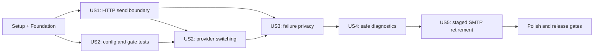

# Tasks: Transactional Email HTTP Providers

**Input**: Design documents from `/specs/20260819-http-email-providers/`

**Prerequisites**: `plan.md`, `spec.md`, `research.md`, `data-model.md`, `contracts/`, `quickstart.md`

**Tests**: Required by the specification. Write each story's tests first and confirm they fail for the intended reason before implementing that story.

**Organization**: Tasks are grouped by user story so each increment has an explicit independent test. No Prisma model or migration is created by this feature.

## Format: `[ID] [P?] [Story] Description`

- **[P]**: Can run in parallel after its phase prerequisites because it touches different files and has no dependency on another incomplete task in the same batch
- **[Story]**: Maps the task to a user story in `spec.md`
- Every task names the exact file or directory it changes

---

## Phase 1: Setup (Shared Structure)

**Purpose**: Establish the source and test layout for the HTTP transport without changing current SMTP behavior.

- [X] T001 Create the planned module and fixture directory structure at `src/lib/email/` and `tests/e2e/helpers/`, reserving `tests/helpers/http-mail-provider.ts` for the shared controlled transport

---

## Phase 2: Foundational (Blocking Prerequisites)

**Purpose**: Define the common message/result contract, safe HTTP primitive, deterministic fake transport, and validated runtime configuration used by every story.

**CRITICAL**: No user-story implementation begins until this phase is complete.

- [X] T002 [P] Replace the SMTP-only suite with failing provider-neutral boundary tests for transactional-message validation, exact normalized-result fields, 1 MiB request bounds, nullable 512-character-safe identifiers, and test-adapter substitution without business-flow changes in `tests/unit/email.test.ts`
- [X] T003 [P] Implement a deterministic injected HTTP fake with logical-URL capture, request counts, delayed responses, malformed/oversized bodies, and network-failure modes in `tests/helpers/http-mail-provider.ts`
- [X] T004 Define `EmailProviderName`, `EmailSendCategory`, `TransactionalEmail`, `NormalizedSendResult`, adapter/request interfaces, timeout constants, size limits, and validation helpers in `src/lib/email/types.ts`
- [X] T005 Implement one-attempt fetch execution, a 1 MiB serialized request limit, manual redirect handling, 2,500 ms/1,500 ms abort support, 64 KiB bounded response consumption, and safe status classification in `src/lib/email/http.ts`
- [X] T006 [P] Replace SMTP environment cases with failing tests for disabled mail, Brevo, Mailjet, invalid booleans/providers/senders/project names, missing secrets, redacted errors, and ignored legacy/endpoint variables in `tests/unit/env.test.ts`
- [X] T007 Replace SMTP environment parsing with the discriminated `MAIL_ENABLED`/`MAIL_PROVIDER` configuration contract and a disabled `{ enabled: false }` state in `src/lib/env.ts`

**Checkpoint**: Common contracts compile, the fake can exercise every required response/network condition, and environment validation fails closed without exposing values.

---

## Phase 3: User Story 1 - Send Transactional Email Through the Selected Provider (Priority: P1) MVP

**Goal**: Submit the three existing localized messages—magic-link login, signup onboarding/activation, and existing-account notice—through Brevo or Mailjet using one normalized server-only boundary.

**Independent Test**: Invoke login and signup against the injected transport for each provider and verify the official logical endpoint, authentication scheme, sender/project name, one recipient, localized subject/text/HTML, accepted/null identifier behavior, and existing token lifecycle with zero SMTP calls.

### Tests for User Story 1

- [X] T008 [P] [US1] Add failing Brevo contract tests for the exact POST URL, `api-key` header, one-recipient JSON shape, accepted identifier/null cases, status mappings, redirects, malformed/oversized bodies, network failures, and one-attempt behavior in `tests/unit/email-brevo.test.ts`
- [X] T009 [P] [US1] Add failing Mailjet contract tests for the exact POST URL, Basic authentication, one-message JSON shape, `Messages[].Status`, embedded errors, UUID/ID/null handling, contradictory bodies, status mappings, network failures, and one-attempt behavior in `tests/unit/email-mailjet.test.ts`
- [X] T010 [P] [US1] Replace Nodemailer mocks with failing custom Auth.js provider tests covering sender, subject, text, HTML, link, equivalent meaning in English/Spanish/Catalan, 15-minute provider expiry, callback-only signup-provider behavior, locale preservation, and callback protections in `tests/unit/auth.test.ts`
- [X] T011 [P] [US1] Extend signup email tests to assert boundary calls, sender, subject, text, HTML, links, and equivalent meaning for onboarding/activation and credential-free active-account notices in English, Spanish, and Catalan in `tests/unit/signup-email.test.ts`
- [X] T012 [P] [US1] Add controlled Brevo/Mailjet acceptance coverage for known-user login, new/pending signup, active-account notices, captured content, and nullable provider IDs in `tests/integration/magic-link-login.test.ts` and `tests/integration/signup-onboarding.test.ts`

### Implementation for User Story 1

- [X] T013 [P] [US1] Implement the fixed-endpoint Brevo request mapper and deterministic response/error normalizer in `src/lib/email/brevo.ts`
- [X] T014 [P] [US1] Implement the fixed-endpoint Mailjet request mapper and deterministic HTTP/body-level response normalizer in `src/lib/email/mailjet.ts`
- [X] T015 [US1] Implement provider construction, common message validation, one-attempt dispatch, and exact four-field result returns in `src/lib/email/index.ts`, retaining `src/lib/email.ts` only until the T018 consumer cutover
- [X] T016 [P] [US1] Replace `next-auth/providers/email` and direct Nodemailer usage with internal `EmailConfig`-compatible login/signup providers that call the common boundary while preserving 15-minute tokens and locale selection in `src/lib/auth.ts`
- [X] T017 [P] [US1] Replace SMTP delivery with the common boundary while preserving all localized message builders and credential-free active-account notices in `src/modules/signup/email.ts`
- [X] T018 [US1] Consume `NormalizedSendResult.accepted` for onboarding confirmation and active-account notice outcomes in `src/modules/signup/service.ts`, then normalize boundary imports and delete the obsolete `src/lib/email.ts` after every consumer uses `src/lib/email/index.ts`

**Checkpoint**: US1 independently sends every existing transactional message through both HTTP adapters and preserves message copy, links, locale, and token semantics on accepted responses.

---

## Phase 4: User Story 2 - Change Providers Through Configuration (Priority: P1)

**Goal**: Select Brevo or Mailjet and globally enable/disable every transactional email flow through validated runtime/deployment configuration only.

**Independent Test**: Start the same artifact with disabled, complete Brevo, and complete Mailjet configurations; prove disabled requests stop before account access, enabled provider switching changes only the adapter contract, incomplete configurations fail startup, and no request/env value can override endpoints.

### Tests for User Story 2

- [X] T019 [P] [US2] Add failing route tests proving `MAIL_ENABLED=false` stops before provider health, account lookup, mutation, token issuance, and delivery for login and signup in `tests/unit/auth-route.test.ts` and `tests/unit/signup-route.test.ts`
- [X] T020 [P] [US2] Add integration cases for disabled mail, startup-invalid provider configurations, and Brevo/Mailjet switching without business-code or SMTP changes in `tests/integration/magic-link-login.test.ts` and `tests/integration/signup-onboarding.test.ts`

### Implementation for User Story 2

- [X] T021 [P] [US2] Enforce the global mail gate before provider health and existing-email lookup while preserving accepted/unavailable response contracts in `src/app/api/auth/[...nextauth]/route.ts`
- [X] T022 [P] [US2] Enforce the global mail gate before provider health and signup account lookup/mutation while preserving public response contracts in `src/app/api/signup/route.ts`
- [X] T023 [P] [US2] Replace the SMTP example with classified `MAIL_ENABLED`, `MAIL_PROVIDER`, `MAIL_API_KEY`, Mailjet-only `MAIL_API_SECRET`, and bare `MAIL_FROM` placeholders in `.env.example`
- [X] T024 [P] [US2] Replace SMTP runtime pass-through with the new non-sensitive and secret `MAIL_*` variables in `docker-compose.prod.yml`
- [X] T025 [US2] Inject Repository Variables/Secrets for both providers, remove the credential-printing SMTP verification step, and retain redacted app-health deployment checks in `.github/workflows/deploy.yml`

**Checkpoint**: US2 independently validates both provider configurations and disables every email-dependent public action before private work when the global gate is off.

---

## Phase 5: User Story 3 - Preserve Private Authentication Outcomes During Failures (Priority: P1)

**Goal**: Preserve anti-enumeration, response floors, token compensation, and account lifecycle across every isolated provider outcome, with health controlled only by recipient-independent probes.

**Independent Test**: Compare known/unknown login and new/pending/active signup under acceptance, 400/401/403/409/429/5xx, malformed response, timeout, DNS/TLS/reset failure, and unavailable-health preflight; verify identical public behavior, exact token compensation, one send attempt, and no health mutation from sends.

### Tests for User Story 3

- [X] T026 [P] [US3] Replace cooldown-marker tests with failing provider-scoped cache, two-second lock, 60-second freshness, fail-closed lock-loser/DB-error, fixed probe, and send-read-only tests in `tests/unit/provider-availability.test.ts`
- [X] T027 [P] [US3] Add failing Auth.js tests for every non-accepted category, exact new-token deletion, superseded/newest-link invalidity, unknown-email no-op behavior, and exactly one provider request in `tests/unit/auth.test.ts`
- [X] T028 [P] [US3] Add failing signup tests for onboarding-token compensation, reusable pending accounts, active-notice no-op behavior, no health writes, and exactly one request in `tests/unit/signup-email.test.ts` and `tests/unit/signup-service.test.ts`
- [X] T029 [P] [US3] Add failing route-order tests proving one captured availability snapshot governs each request before account work while preserving canonical-origin enforcement, CSRF/anti-forgery checks, shared rate limits, trusted-client identity, and account-independent behavior in `tests/unit/auth-route.test.ts` and `tests/unit/signup-route.test.ts`
- [X] T030 [P] [US3] Add PostgreSQL-backed known/unknown login comparisons across isolated provider failures, exact token compensation, 15-minute expiry, newest-link-only and single-use behavior, callback/redirect parity, response shape, and 500-600 ms floor in `tests/integration/magic-link-login.test.ts`
- [X] T031 [P] [US3] Replace SMTP failure coverage with PostgreSQL-backed new/pending/active signup comparisons, token compensation, account-state checks, health preflight, one-attempt behavior, and atomic single-use/concurrent activation assertions in `tests/integration/signup-onboarding.test.ts`
- [X] T032 [P] [US3] Add PostgreSQL-backed concurrent stale/missing provider-health races proving one cross-instance probe claim and two-second lock recovery in `tests/integration/provider-availability.test.ts`, and prove provider outage leaves application/database liveness unchanged in `tests/unit/health.test.ts`
- [X] T033 [P] [US3] Add the SC-010 CI sample with two warm-ups plus 20 sequential measured requests per login/signup and Brevo/Mailjet combination, requiring at least 19 per combination below five seconds, every accepted response at or above 500 ms, and no retries/outlier exclusions in `tests/integration/email-response-time.test.ts`

### Implementation for User Story 3

- [X] T034 [US3] Implement provider-scoped PostgreSQL health snapshots, atomic single-flight probe locks, fixed Brevo/Mailjet metadata probes, fail-closed behavior, and safe retry durations in `src/lib/provider-availability.ts`
- [X] T035 [US3] Pass validated provider configuration into one pre-account health snapshot and preserve that snapshot for the request in `src/app/api/auth/[...nextauth]/route.ts` and `src/app/api/signup/route.ts`
- [X] T036 [P] [US3] Convert all non-accepted login results into exact token compensation and generic public outcomes without health writes, retries, fallback, or provider exceptions escaping in `src/lib/auth.ts`
- [X] T037 [P] [US3] Convert all non-accepted onboarding/notice results into existing signup compensation outcomes without health writes, retries, fallback, or superseded-token restoration in `src/modules/signup/email.ts` and `src/modules/signup/service.ts`

**Checkpoint**: US3 independently proves provider failures cannot reveal account state, preserve unusable credentials, alter shared health, or trigger a second transport attempt.

---

## Phase 6: User Story 4 - Diagnose Provider Submission Outcomes Safely (Priority: P2)

**Goal**: Emit useful allowlisted submission and health events without leaking personal/confidential data or claiming provider acceptance is delivery.

**Independent Test**: Exercise accepted, rejected, rate-limited, unavailable, malformed, and indeterminate outcomes; inspect logs/public errors for zero secrets, recipients, names, account IDs, tokens, URLs, subjects, bodies, raw payloads, or delivery claims, and verify no webhook/persistence/admin surface exists.

### Tests for User Story 4

- [X] T038 [P] [US4] Add failing tests for allowlisted send/health logs, safe identifiers/status classes/durations, acceptance-not-delivery wording, and absence of credentials, recipients, names, tokens, URLs, content, headers, and raw bodies from logs/public errors in `tests/unit/email-logging.test.ts`, `tests/unit/logger.test.ts`, `tests/unit/auth-route.test.ts`, and `tests/unit/signup-route.test.ts`
- [X] T039 [P] [US4] Add an architecture test that rejects provider webhook routes, delivery-status Prisma fields/models, admin delivery views, and runtime endpoint overrides in `tests/unit/email-architecture.test.ts`

### Implementation for User Story 4

- [X] T040 [P] [US4] Emit one redacted outbound submission event per attempt using only provider, category, accepted, safe message ID/status class, duration, and request correlation in `src/lib/email/index.ts`
- [X] T041 [P] [US4] Emit redacted provider-health transition events without URLs, headers, metadata bodies, recipients, or raw exception objects in `src/lib/provider-availability.ts`

**Checkpoint**: US4 independently distinguishes accepted submission from normalized failure while every later delivery state remains unknown.

---

## Phase 7: User Story 5 - Complete a Staged SMTP Retirement (Priority: P2)

**Goal**: Validate the HTTP artifact in controlled development/production sends, then remove every SMTP code/config/test/dependency path without adding fallback.

**Independent Test**: Run the production artifact against the exact-URL HTTP fixture and the active real provider, then verify login/signup with no SMTP environment values, source imports, fixture processes, package dependencies, deployment wiring, or fallback attempts.

### Tests for User Story 5

- [X] T042 [P] [US5] Add a migration guard that fails on application SMTP/Nodemailer imports, legacy env/deploy variables, runtime endpoint overrides, webhook routes, or direct/transitive Nodemailer installation in `tests/unit/email-migration.test.ts`
- [X] T043 [P] [US5] Replace SMTP capture assertions with exact logical HTTP endpoint/auth/body/request-count assertions for the production artifact in `tests/e2e/signup-onboarding.spec.ts`

### Implementation for User Story 5

- [X] T044 [P] [US5] Implement the controlled provider HTTP fixture and inspection API with configurable health/send behaviors in `tests/e2e/helpers/provider-http-fixture.ts`
- [X] T045 [P] [US5] Implement the isolated exact-URL allowlisted fetch preload that forwards only the four official send/health targets to the fixture in `tests/e2e/helpers/provider-fetch-preload.mjs`
- [X] T046 [US5] Replace SMTP process lifecycle/env setup with the provider fixture, preload, safe fake credentials, and readiness checks in `scripts/test-e2e.sh`
- [X] T047 [US5] Start the standalone app with `MAIL_*` configuration and the isolated preload while exposing no application base-URL override in `playwright.config.ts`
- [X] T048 [US5] Execute the redacted development login/signup smoke procedure for the selected real provider and record provider, timestamp, acceptance, usable-link result, and zero-secret evidence in `specs/20260819-http-email-providers/verification.md`
- [ ] T049 [US5] Deploy the HTTP artifact with legacy SMTP secrets retained only for release rollback, execute controlled production login/signup smoke sends, and append redacted evidence plus the rollback artifact reference to `specs/20260819-http-email-providers/verification.md`
- [X] T050 [P] [US5] Delete the obsolete SMTP fixtures in `tests/helpers/smtp-server.ts` and `tests/e2e/helpers/smtp-fixture-server.ts` after T049 succeeds
- [X] T051 [US5] Remove `nodemailer`, `@types/nodemailer`, `smtp-server`, `@types/smtp-server`, and the Nodemailer override from `package.json` and `pnpm-workspace.yaml`, regenerate `pnpm-lock.yaml`, and make `pnpm why nodemailer` report no installed path
- [X] T052 [P] [US5] Replace SMTP architecture/configuration/deployment guidance with provider setup, staged verification, rollback-before-cleanup, credential rotation, and post-cleanup recovery instructions in `README.md`
- [ ] T053 [US5] Remove the legacy GitHub `AUTH_EMAIL_ENABLED`/`SMTP_*` Variables and SMTP Secrets only after T049-T052, redeploy without them, rerun controlled login/signup smoke checks, and append non-secret cleanup evidence to `specs/20260819-http-email-providers/verification.md`

**Checkpoint**: US5 independently proves the completed artifact and deployment operate through HTTP with zero SMTP/Nodemailer path and a documented forward-recovery procedure.

---

## Phase 8: Polish & Cross-Cutting Validation

**Purpose**: Verify all stories together against repository, security, performance, build, and deployment gates.

- [X] T054 Run `pnpm lint`, `pnpm typecheck`, `pnpm test`, and `pnpm test:coverage`, then record command outcomes and any justified exclusions in `specs/20260819-http-email-providers/verification.md`
- [X] T055 Run `pnpm test:e2e`, `pnpm audit:prod`, and `pnpm build`, then record command outcomes in `specs/20260819-http-email-providers/verification.md`
- [ ] T056 Build the production image with `docker build -f docker/Dockerfile .`, execute the complete matrix from `specs/20260819-http-email-providers/quickstart.md`, and record final release readiness in `specs/20260819-http-email-providers/verification.md`

---

## Dependencies & Execution Order

### Phase Dependencies

- **Phase 1 - Setup**: No dependencies
- **Phase 2 - Foundational**: Depends on Phase 1 and blocks all user stories
- **Phase 3 - US1**: Depends on Phase 2; establishes the provider boundary and is the MVP
- **Phase 4 - US2**: Depends on Phase 2 for configuration types and US1 for end-to-end adapter switching; its route/config tests can start after Phase 2
- **Phase 5 - US3**: Depends on US1 send results and US2 gate/configuration behavior
- **Phase 6 - US4**: Depends on completed US3 behavior and tests because T038/T041 extend the same route-test and provider-health files
- **Phase 7 - US5**: Depends on US1-US4 and requires successful development/production smoke gates before cleanup tasks T050-T053
- **Phase 8 - Polish**: Depends on every selected story and SMTP cleanup

### User Story Dependency Graph



### Within Each User Story

- Write the story's tests and confirm they fail for the intended missing behavior before implementation
- Implement shared/model types before adapters, adapters before consumers, and consumers before integration validation
- Never run live provider smoke checks before automated redaction and one-attempt tests pass
- Never execute SMTP dependency/secret cleanup before both T048 and T049 are complete
- Stop at each checkpoint and run the story's focused tests before proceeding

---

## Parallel Execution Examples

### User Story 1

```text
Parallel test batch: T008, T009, T010, T011, T012
Parallel adapter batch after T004-T005: T013, T014
Parallel consumer batch after T015: T016, T017
```

### User Story 2

```text
Parallel test batch: T019, T020
Parallel route/config batch after failing tests: T021, T022, T023, T024
T025 follows once the runtime variable contract is consistent
```

### User Story 3

```text
Parallel test batch: T026, T027, T028, T029, T030, T031, T032, T033
Parallel domain compensation batch after T034-T035: T036, T037
```

### User Story 4

```text
Parallel test batch: T038, T039
Parallel implementation batch after tests: T040, T041
```

### User Story 5

```text
Parallel test batch: T042, T043
Parallel fixture batch: T044, T045
Parallel post-smoke cleanup after T049: T050, T052
T051 and T053 remain ordered dependency/operations gates
```

---

## Implementation Strategy

### MVP First

1. Complete Setup and Foundational phases.
2. Complete US1 through T018.
3. Run US1 unit and integration tests against both controlled provider contracts.
4. Stop and review the provider boundary before changing public route gates or deployment wiring.

### Incremental Delivery

1. **US1**: Provider-neutral HTTP delivery for all existing messages.
2. **US2**: Runtime selection and one global feature gate.
3. **US3**: Failure privacy, token compensation, health single-flight, and timing guarantees.
4. **US4**: Redacted operational diagnostics with honest acceptance semantics.
5. **US5**: Production verification followed by irreversible SMTP cleanup.
6. **Polish**: Full quality, security, build, Docker, and quickstart gates.

### Release Discipline

- Keep legacy SMTP credentials available only as rollback material for the previously deployed SMTP artifact; the HTTP artifact never reads them.
- Do not remove packages, fixtures, or repository secrets until controlled production login and signup are verified.
- After cleanup, recovery is a credential/configuration correction or forward application fix, never SMTP fallback or database rollback.

---

## Notes

- `[P]` tasks touch distinct files or are independent command gates after their prerequisites.
- Provider acceptance is never described as delivery; later delivery remains unknown.
- The existing `RateLimitBucket` table is reused; no schema migration or delivery-status model is permitted.
- Production endpoints are fixed constants; only injected tests and the isolated E2E preload may substitute transport destinations.
- Never place real provider or SMTP secret values in `tasks.md`, tests, logs, snapshots, verification evidence, or deployment output.