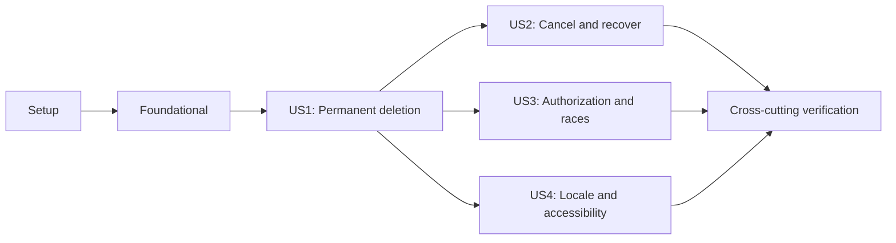

# Tasks: Permanent Account Deletion

**Input**: Design documents from `/specs/20260820-account-deletion/`

**Prerequisites**: `plan.md`, `spec.md`, `research.md`, `data-model.md`, `contracts/`, and `quickstart.md`

**Tests**: Automated tests are mandatory because this is an irreversible authentication and data-lifecycle flow. Foundational work may define shared contracts and helpers, but for each user-story phase write its tests first and confirm they fail for the intended reason before implementing that story's behavior.

**Organization**: Tasks are grouped by user story so each behavior slice can be implemented and verified independently. No task may introduce soft deletion, a tombstone, a retention copy, a recovery window, a protected deletion ledger, or a background deletion worker.

## Format: `[ID] [P?] [Story] Description`

- **[P]**: Can run in parallel because it uses different files and has no dependency on an incomplete task
- **[Story]**: Maps the task to User Story 1, 2, 3, or 4
- Every task names the exact file or directory it changes or validates

## Phase 1: Setup (Schema Preparation)

**Purpose**: Apply the additive canonical schema changes required by every story without adding persistent deletion state.

- [X] T001 Add `ACCOUNT_DELETION` to `VerificationPurpose` and nullable `Session.authenticatedAt` in `prisma/schema.prisma`, then create the forward-only migration in `prisma/migrations/20260821000000_add_account_deletion_auth/migration.sql` with existing sessions left null and no deletion table
- [X] T002 Regenerate the canonical Prisma client in `src/generated/prisma/` and validate `prisma/schema.prisma` with `pnpm db:generate` and `pnpm exec prisma validate`

---

## Phase 2: Foundational (Blocking Prerequisites)

**Purpose**: Establish shared validation, UI, navigation, rate-limit, and fixture boundaries used across the four stories.

**CRITICAL**: Complete this phase before starting any user story.

- [X] T003 [P] Define only the serializable API/UI outcomes and exact locale/action/state constants in `src/modules/account/deletion/types.ts`, leaving runtime validation behavior for the test-first User Story 1 phase
- [X] T004 [P] Extract the deterministic `auth:email:address:<sha256>` key builder into `src/lib/auth-email-rate-limit.ts` and replace duplicate derivation in `src/app/api/auth/[...nextauth]/route.ts`, `src/app/api/signup/route.ts`, and `src/modules/login/service.ts`
- [X] T005 [P] Add the thin accessible Base UI dialog primitive, including close, title, description, and focus-management exports, in `src/components/ui/dialog.tsx`
- [X] T006 [P] Extract locale-aware Profile and Data & Privacy navigation with active `aria-current` support into `src/modules/account/components/account-navigation.tsx`
- [X] T007 [P] Add reusable full account-data graph, multi-session, token, policy, and rate-limit fixtures in `tests/helpers/account-deletion.ts` and extend cookie/session setup in `tests/e2e/helpers/authenticated-user.ts`

**Checkpoint**: Canonical schema and shared boundaries are ready; story tests can now be written against stable interfaces.

---

## Phase 3: User Story 1 - Permanently Delete My Account (Priority: P1) MVP

**Goal**: Let an authenticated account holder review consequences, obtain fresh email authentication when required, explicitly confirm, and atomically remove the account and all attributable active data.

**Independent Test**: Seed an active user with identities, multiple sessions, policy acceptance, pending links, and an email-address rate-limit bucket; complete same-device and cross-device localized deletion and verify that every targeted row and session is gone, cookies are expired, and the generic public completion page is shown. Abort the final response once and verify recovery reaches completion without a second deletion POST.

### Tests for User Story 1

> Write these tests first and confirm they fail for the expected missing behavior.

- [X] T008 [P] [US1] Add strict command, locale, fixed callback, and browser pending-signal unit tests in `tests/unit/account-deletion-schema.test.ts`
- [X] T009 [P] [US1] Add Auth.js session timestamp and deletion-token purpose isolation tests in `tests/unit/auth-adapter.test.ts`
- [X] T010 [P] [US1] Add supported session-cookie lookup, expiry-header, and lost-response signal tests in `tests/unit/account-deletion-cookie.test.ts`
- [X] T011 [P] [US1] Add first-click safety, complete consequence copy, fresh-auth transition, separate final confirmation, and pending recovery tests in `tests/unit/account-deletion-dialog.test.tsx`
- [X] T012 [P] [US1] Add live PostgreSQL/provider tests for deletion-token issuance, same-device and cross-device consumption, and fresh Auth.js session creation in `tests/integration/account-deletion-reauth.test.ts`
- [X] T013 [P] [US1] Add live PostgreSQL success tests for complete account graph removal, all-session revocation, pending-link invalidation, exact address-bucket cleanup, and shared-bucket retention in `tests/integration/account-deletion.test.ts`
- [X] T014 [P] [US1] Add Playwright journeys for protected discovery, fresh-auth return, separate confirmation, successful deletion, second-device revocation, cookie clearing, and no-resubmit lost-response recovery in `tests/e2e/account-deletion.spec.ts`

### Implementation for User Story 1

- [X] T015 [P] [US1] Implement the failing tests' strict locale, command, callback-state, and pending-signal validators in `src/modules/account/deletion/schema.ts`, plus exact Auth.js cookie-to-database-session lookup, active-user checks, expiry checks, and the 10-minute freshness decision in `src/modules/account/deletion/session.ts`
- [X] T016 [P] [US1] Implement cryptographically random raw credentials, persisted digests, 10-minute expiry, and request-local callback authorization in `src/modules/account/deletion/token.ts` and `src/modules/account/deletion/verification-context.ts`
- [X] T017 [P] [US1] Implement provider-neutral English, Spanish, and Catalan fresh-auth email composition with escaped fixed callback URLs in `src/modules/account/deletion/email.ts`
- [X] T018 [US1] Implement the successful session-derived verification issuance path and successful bounded atomic deletion sequence with explicit policy, all-purpose email-token, exact address-bucket, and User deletion in `src/modules/account/deletion/service.ts`, leaving provider compensation and exception-to-outcome mapping to T032
- [X] T019 [US1] Extend `hardenAdapter` to timestamp newly authenticated sessions and consume delivered `ACCOUNT_DELETION` tokens only inside the authorized callback context in `src/lib/auth-adapter.ts`
- [X] T020 [US1] Register the non-public deletion verification provider with fixed callback semantics and normal Auth.js database-session creation in `src/lib/auth.ts`
- [X] T021 [US1] Implement the authenticated, strict-body, CSRF-protected reauthentication issuance contract and `202/400/401/403/429/503` outcomes in `src/app/api/account/deletion/reauthenticate/route.ts`
- [X] T022 [US1] Implement the one-time deletion verification callback, generic invalid/conflict redirects, and guarded Auth.js delegation in `src/app/api/account/deletion/verify/route.ts`
- [X] T023 [US1] Implement the strict final-confirmation route, server-only target resolution, recent-auth outcome, generic completion payload, and expiry of both Auth.js cookie variants in `src/app/api/account/deletion/route.ts`
- [X] T024 [P] [US1] Add localized page, consequence, action, authentication, progress, error, email, and completion message keys in `src/messages/en.json`, `src/messages/es.json`, and `src/messages/ca.json`
- [X] T025 [US1] Integrate shared navigation into `src/app/[locale]/account/page.tsx` and add the protected localized Data & Privacy composition in `src/app/[locale]/account/data/page.tsx`
- [X] T026 [US1] Add the generic localized public completion page and home navigation in `src/app/[locale]/account-deleted/page.tsx`
- [X] T027 [US1] Implement the account deletion dialog state machine, separate final confirmation, sessionStorage pending signal, cookie/session recovery check, and locale-preserving navigation in `src/modules/account/deletion/components/delete-account-dialog.tsx`

**Checkpoint**: User Story 1 is functionally complete and independently testable, but must not be released until the mandatory security controls in User Story 3 also pass.

---

## Phase 4: User Story 2 - Leave Without Deleting or Recover From Failure (Priority: P2)

**Goal**: Preserve the complete account on cancellation, delivery failure, or deletion failure and provide an accessible, duplicate-safe retry path.

**Independent Test**: Cancel through the button, Escape, and close control; inject a provider failure and a failure at every deletion stage; verify zero data/session changes, full rollback, restored focus and controls, one in-flight attempt, generic localized errors, and successful retry without a reload.

### Tests for User Story 2

- [X] T028 [P] [US2] Extend dialog tests with Cancel/Escape/close equivalence, focus restoration, duplicate prevention, pending dismissal lockout, error focus, and retry in `tests/unit/account-deletion-dialog.test.tsx`
- [X] T029 [P] [US2] Add generic delivery/deletion failure, retry metadata, and definitive pending-signal clearing route tests in `tests/unit/account-deletion-routes.test.ts`
- [X] T030 [P] [US2] Add provider-rejection compensation and failure injection at every transaction stage with complete rollback assertions in `tests/integration/account-deletion-reauth.test.ts` and `tests/integration/account-deletion.test.ts`
- [X] T031 [P] [US2] Add Playwright cancellation, delivery-failure retry, transaction-failure retry, focus restoration, pending lockout, and unchanged-account journeys in `tests/e2e/account-deletion.spec.ts`

### Implementation for User Story 2

- [X] T032 [P] [US2] Wrap the T018 issuance path with exact provisional-token compensation and map provider/transaction exceptions to retry metadata and sanitized failure outcomes in `src/modules/account/deletion/service.ts` without changing the successful deletion order
- [X] T033 [US2] Map provider and transaction failures to generic localized retryable responses without internal details in `src/app/api/account/deletion/reauthenticate/route.ts` and `src/app/api/account/deletion/route.ts`
- [X] T034 [P] [US2] Complete cancellation, pending lockout, asserted progress, programmatic error focus, control restoration, and in-place retry transitions in `src/modules/account/deletion/components/delete-account-dialog.tsx`

**Checkpoint**: User Stories 1 and 2 now prove both successful deletion and complete preservation on every avoid/failure path.

---

## Phase 5: User Story 3 - Prevent Unauthorized or Ambiguous Deletion (Priority: P3)

**Goal**: Ensure only the exact current, recently authenticated server session can delete its account, while forged, cross-origin, replayed, wrong-purpose, and racing requests remain ineffective and non-enumerating.

**Independent Test**: Exercise signed-out, expired, stale, forged-identity, cross-origin, invalid-CSRF, wrong-purpose, consumed-link, conflicting-session, concurrent confirmation, session-creation race, and replay cases; verify that only one authorized physical deletion can occur and all other outcomes disclose no account state.

### Tests for User Story 3

- [X] T035 [P] [US3] Extend route tests with unknown/duplicate/identity fields, both cookie names, invalid CSRF, mismatched canonical origin, signed-out, stale, revoked, replayed, operation-specific client-limit, shared address-limit, generic `429`, and `Retry-After` cases in `tests/unit/account-deletion-routes.test.ts`
- [X] T036 [P] [US3] Add live-database tests for two pre-authorized confirmations, post-revocation replay, and session/token creation racing deletion in `tests/integration/account-deletion.test.ts`
- [X] T037 [P] [US3] Add malformed, expired, superseded, consumed, wrong-purpose, direct-provider, and different-account callback tests in `tests/integration/account-deletion-reauth.test.ts`
- [X] T038 [P] [US3] Add Playwright signed-out localization, foreign-origin rejection, conflicting-browser identity, replay, and generic failure-disclosure journeys in `tests/e2e/account-deletion.spec.ts`

### Implementation for User Story 3

- [X] T039 [P] [US3] Extend canonical-origin enforcement to every `/api/account/deletion` request while preserving request IDs and CSP behavior in `src/proxy.ts`
- [X] T040 [P] [US3] Add stable user-scoped advisory locking around session creation and reject direct or wrong-purpose deletion-provider callbacks in `src/lib/auth-adapter.ts`
- [X] T041 [US3] Add email-then-user advisory locking, post-lock session revalidation, concurrent-completed convergence, and postcondition-safe transaction ordering in `src/modules/account/deletion/service.ts`
- [X] T042 [US3] Apply separate 5-per-15-minute shared client buckets to `src/app/api/account/deletion/reauthenticate/route.ts` and `src/app/api/account/deletion/route.ts`, apply the 3-per-15-minute exact address bucket through `src/modules/account/deletion/service.ts` and `src/lib/auth-email-rate-limit.ts`, return generic `429` plus `Retry-After` before email/transaction work, and retain client buckets while deleting only the exact address bucket
- [X] T043 [US3] Emit only sanitized `reauth_sent`, `reauth_failed`, `delete_completed`, `delete_failed`, and `delete_concurrent_completed` events with duration/retry metadata in `src/modules/account/deletion/service.ts`, `src/app/api/account/deletion/reauthenticate/route.ts`, and `src/app/api/account/deletion/route.ts`

**Checkpoint**: User Stories 1-3 satisfy the release-blocking authorization, request-integrity, replay, concurrency, rate-limit, and log-hygiene requirements.

---

## Phase 6: User Story 4 - Use the Flow in Every Supported Locale and Viewport (Priority: P4)

**Goal**: Make every flow state behaviorally equivalent in English, Spanish, and Catalan and operable with keyboard or assistive technology at mobile and desktop sizes.

**Independent Test**: Run the full page/dialog/authentication/error/completion journey in all three locales, both themes, desktop and 320 x 900; verify semantic active navigation, initial/restored/error focus, focus containment, announcements, zero serious/critical axe findings, and no overflow, clipping, or overlap.

### Tests for User Story 4

- [X] T044 [P] [US4] Add catalog completeness and behavioral-equivalence tests for page, dialog, email, progress, error, and completion keys in `tests/unit/account-messages.test.ts`
- [X] T045 [P] [US4] Add dialog semantics, initial/final/restored/error focus, focus containment, live-region, Escape, reduced-motion, and long-content tests in `tests/unit/account-deletion-dialog.test.tsx`
- [X] T046 [P] [US4] Add all-locale, light/dark, axe, keyboard-only, desktop, and 320 x 900 overflow/clipping journeys in `tests/e2e/account-deletion.spec.ts`

### Implementation for User Story 4

- [X] T047 [P] [US4] Complete behaviorally equivalent, non-truncated account-deletion and metadata copy in `src/messages/en.json`, `src/messages/es.json`, and `src/messages/ca.json`
- [X] T048 [P] [US4] Finalize semantic active navigation, locale-preserving links, mobile stacking, and desktop positioning in `src/modules/account/components/account-navigation.tsx`
- [X] T049 [P] [US4] Finalize Base UI focus containment/restoration, Cancel initial focus, live regions, target sizes, responsive internal scrolling, wrapped actions, and reduced motion in `src/components/ui/dialog.tsx` and `src/modules/account/deletion/components/delete-account-dialog.tsx`
- [X] T050 [US4] Finalize localized metadata, public-result heading focus, and responsive unframed layouts in `src/app/[locale]/account/data/page.tsx` and `src/app/[locale]/account-deleted/page.tsx`

**Checkpoint**: All four stories are complete across every supported locale, input method, theme, and viewport.

---

## Phase 7: Polish & Cross-Cutting Verification

**Purpose**: Prove performance, migration safety, production quality, and the absence of forbidden retention infrastructure.

- [X] T051 Add the opt-in ARM64 benchmark with 10 warm-ups and 100 nearest-rank measurements for each committed and database-injected rollback cohort in `tests/e2e/account-deletion.performance.spec.ts`, and keep sanitized outcome-log assertions in `tests/integration/account-deletion.test.ts`
- [X] T052 Validate additive deployment and compatible application rollback using `prisma/schema.prisma`, `prisma/migrations/20260821000000_add_account_deletion_auth/migration.sql`, and the commands in `specs/20260820-account-deletion/quickstart.md`
- [X] T053 Run the focused unit/component command in `specs/20260820-account-deletion/quickstart.md` and resolve failures only in the account-deletion and Auth.js adapter test surface under `tests/unit/`
- [X] T054 Run the live PostgreSQL/provider command in `specs/20260820-account-deletion/quickstart.md` and verify shared rate limits, rollback, race, session revocation, link invalidation, and log assertions under `tests/integration/`
- [X] T055 Run `pnpm lint`, `pnpm typecheck`, `RUN_INTEGRATION_TESTS=true pnpm test:coverage`, `pnpm build`, and `pnpm audit:prod` from `package.json` and retain the configured coverage thresholds
- [X] T056 Run the standalone production-artifact Playwright suite through `scripts/test-e2e.sh` and verify `tests/e2e/account-deletion.spec.ts` in desktop Chromium and the 320 x 900 mobile project
- [X] T059 Audit the final diff against `docker-compose.yml`, `docker-compose.prod.yml`, `src/generated/protected/`, and `worker/`, confirm no backup/retention/worker path participates, then run `bash .specify/scripts/bash/compliance-check.sh --all` against `specs/20260820-account-deletion/`

### External Product Validation

These checks do not represent unfinished implementation work and are not asserted by CI:

- Before production release, complete the light/dark desktop/mobile and VoiceOver checks documented in `specs/20260820-account-deletion/quickstart.md`, recording any reproducible defect as an automated assertion where practical.
- After release, measure the representative first-attempt usability KPI with a separately approved cohort of at least 20 target participants, at least 5 per locale and both viewport classes, and retain only aggregate threshold evidence and non-identifying defects in `specs/20260820-account-deletion/usability-results.md`.

---

## Dependencies & Execution Order

### Phase Dependencies

- **Phase 1 - Setup**: Starts immediately; T002 depends on T001.
- **Phase 2 - Foundational**: Depends on Phase 1 and blocks every user story.
- **Phase 3 - User Story 1**: Depends on Phase 2 and provides the functional MVP.
- **Phase 4 - User Story 2**: Depends on User Story 1 because it hardens the same service, routes, and dialog for failure paths.
- **Phase 5 - User Story 3**: Depends on User Story 1. T039-T040 can proceed beside User Story 2, but T035-T038 and T041-T043 wait for User Story 2 because they edit the same test, service, route, or E2E files.
- **Phase 6 - User Story 4**: Depends on User Story 1 and can proceed beside User Stories 2 and 3 after the core UI exists.
- **Phase 7 - Polish**: Depends on all selected stories; release requires all four stories and every Phase 7 task.

### User Story Dependency Graph



### Within Each User Story

- Foundational tasks define contracts/helpers only; within each story, write its tests and confirm
    they fail before changing that story's implementation.
- Complete lower-numbered implementation tasks before tasks that name them as dependencies through ordering.
- Run the story's focused unit, integration, and E2E tests at its checkpoint.
- Do not mark a story complete while a targeted data category, locale, failure state, or threat case remains unverified.

### Parallel Opportunities

- **Foundation**: T003-T007 use separate schema/type, rate-limit, dialog, navigation, and fixture files.
- **US1**: T008-T014 can be authored in parallel; after those fail, T015-T017 and T024 can proceed in parallel before service/route/UI integration.
- **US2**: T028-T031 can be authored in parallel; T032 and T034 can proceed in parallel because they change server and client files respectively.
- **US3**: T035-T038 can be authored in parallel; T039 and T040 can proceed in parallel before transaction/rate-limit integration.
- **US4**: T044-T046 can be authored in parallel; T047-T049 can proceed in parallel before final page composition.
- **Cross-story guard**: Do not run T029-T033 beside T035-T043 or T031 beside T038; these pairs share route, service, integration, or E2E files and must follow phase order.

---

## Parallel Execution Examples

### User Story 1

```text
Parallel tests: T008, T009, T010, T011, T012, T013, T014
Parallel implementation after failing tests: T015, T016, T017, T024
Then sequence: T018 -> T019 -> T020 -> T021/T022/T023 -> T025/T026/T027
```

### User Story 2

```text
Parallel tests: T028, T029, T030, T031
Parallel implementation after failing tests: T032 and T034
Then sequence: T032 -> T033
```

### User Story 3

```text
Parallel tests: T035, T036, T037, T038
Parallel implementation after failing tests: T039 and T040
Then sequence: T040 -> T041 -> T042 -> T043
```

### User Story 4

```text
Parallel tests: T044, T045, T046
Parallel implementation after failing tests: T047, T048, T049
Then sequence: T047/T048/T049 -> T050
```

---

## Implementation Strategy

### MVP First

1. Complete Phases 1 and 2.
2. Complete User Story 1 and run its independent unit, integration, and E2E checks.
3. Treat this as the functional MVP for demonstration only.
4. Do not release until User Story 3 and the final quality gates pass; irreversible deletion cannot ship without its authorization and race controls.

### Incremental Delivery

1. **Foundation**: Add only the canonical schema delta and shared boundaries.
2. **US1**: Deliver the successful direct permanent-deletion journey and lost-response recovery.
3. **US2**: Prove cancellation and full preservation/retry for failures.
4. **US3**: Complete release-blocking authorization, concurrency, abuse, and log controls.
5. **US4**: Complete locale, keyboard, assistive-technology, and viewport equivalence.
6. **Verification**: Run migration, focused, full-gate, production-artifact, and manual checks.

### Parallel Team Strategy

1. Complete Setup and Foundational work together.
2. Implement User Story 1 as the shared core.
3. Split User Story 2 server/client work from only T039-T040 of User Story 3; defer the remaining User Story 3 tasks until shared User Story 2 files are complete.
4. Run User Story 4 catalog and accessibility work in parallel with server hardening.
5. Rejoin for Phase 7 and release only after every required gate passes.

---

## Implementation notes

- `[P]` means file-level parallelism is safe at that point in the dependency graph.
- Story labels provide traceability to `spec.md`; setup, foundational, and polish tasks intentionally have no story label.
- Identity always comes from the exact server session; no task may add email, user ID, session token, or ownership to deletion request bodies.
- Successful deletion is intentionally unrecoverable; application rollback never reconstructs an account.
- Existing repository backup operations remain operationally separate and are neither consulted nor modified by this feature.
- External usability validation records no participant names, contact details, account data, recordings, or raw observation transcripts.

---

## Phase 8: Convergence

- [X] T060 Handle `unauthenticated` results from both account-deletion client operations in `src/modules/account/deletion/components/delete-account-dialog.tsx` by navigating to the validated locale-preserving `redirectTo`, and add focused lost-session coverage in `tests/unit/account-deletion-dialog.test.tsx` and `tests/e2e/account-deletion.spec.ts` per FR-004, FR-024, FR-030, and the session-loss edge case (partial)