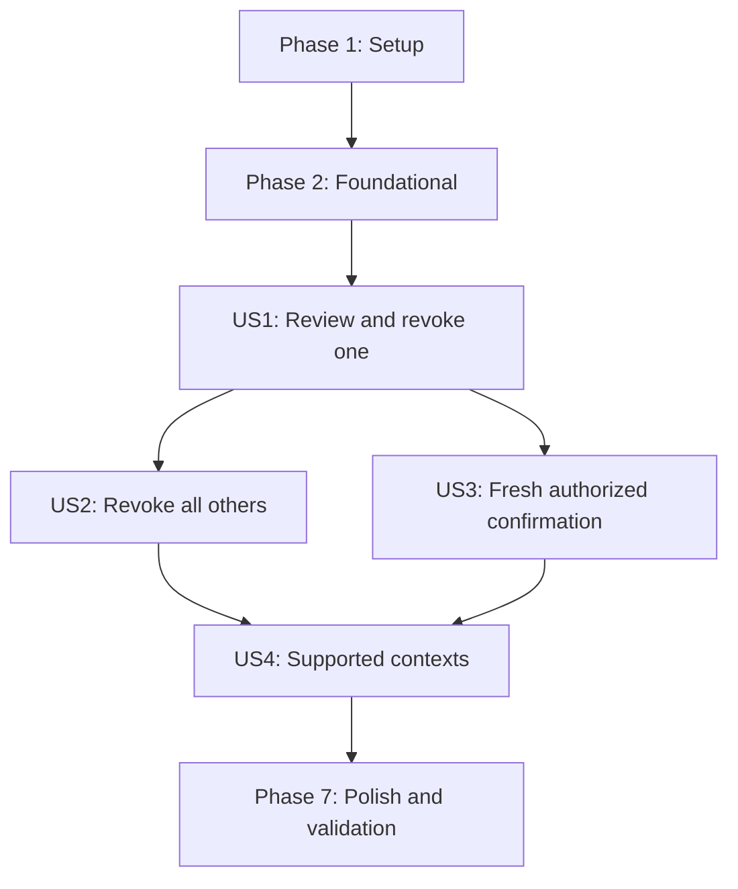

# Tasks: Active Session Management

**Input**: Design documents from `specs/20260821-account-session-management/`

**Prerequisites**: `plan.md`, `spec.md`, `research.md`, `data-model.md`, `contracts/`, `quickstart.md`

**Tests**: Automated tests are required by the feature verification strategy and Constitution Principle XII. Within each phase, write the listed tests first and confirm they fail for the intended reason before implementation.

**Organization**: Tasks are grouped by user story so each story has an explicit goal and independent verification boundary.

## Format: `[ID] [P?] [Story] Description`

- **[P]**: Can run in parallel after the phase prerequisites are met because it changes different files and has no dependency on another incomplete task in that group.
- **[Story]**: Maps the task to a user story in `spec.md`.
- Every task includes the exact repository path it changes or validates.

## Phase 1: Setup (Shared Test Infrastructure)

**Purpose**: Prepare deterministic multi-session fixtures used by the required unit, PostgreSQL, provider, and browser tests. No package or infrastructure setup is needed.

- [X] T001 Create deterministic account-security database fixtures for active, expired, current, legacy-null, equal-time, over-cap, verification-token, and cleanup cases in `tests/helpers/account-security.ts`
- [X] T002 [P] Extend `tests/e2e/helpers/authenticated-user.ts` to seed immutable `createdAt`, return session row identities/tokens, create up to 20 additional sessions, and clean security limiter/token fixtures

---

## Phase 2: Foundational (Blocking Prerequisites)

**Purpose**: Establish the schema, immutable ordering, shared session boundary, creation cap, deployment ordering, and localized message contract used by every story.

**CRITICAL**: Complete this phase before implementing any user story.

### Tests for Foundational Behavior

- [X] T003 [P] Add schema-isolated forward-migration tests for enum visibility, nullable backfill, constraint/index creation, deterministic over-cap normalization, transactional rollback, and idempotent retry in `tests/integration/account-security-migration.test.ts`
- [X] T004 [P] Extend `tests/unit/auth-adapter.test.ts` with failing tests for one captured creation time, the shared user advisory lock, null-first deterministic pre-insert eviction, defensive over-cap cleanup, new-row survival, and rollback on insert failure
- [X] T005 [P] Add shared cookie, exact active-session, and 10-minute freshness tests in `tests/unit/account-security-session.test.ts` and preserve deletion regressions in `tests/unit/account-deletion-cookie.test.ts`
- [X] T006 [P] Add fail-fast workflow-order tests for prebuild, database readiness, app quiescence, synchronous migration, forced app recreation, and no restart after migration failure in `tests/unit/account-security-deploy.test.ts`
- [X] T007 [P] Extend `tests/unit/account-messages.test.ts` with complete account-security key parity, non-empty EN/ES/CA values, and forbidden sensitive-placeholder assertions

### Implementation for Foundational Behavior

- [X] T008 Add `VerificationPurpose.ACCOUNT_SECURITY`, nullable `Session.createdAt`, and `Session(userId, expires)` to `prisma/schema.prisma`; add the enum value idempotently before the transaction, then transactionally copy only non-null pre-feature `authenticatedAt` values into `createdAt`, update the verification-token check constraint for the localized non-signup `ACCOUNT_SECURITY` shape, create the index, and normalize unexpired sessions to each account's deterministic newest 20 in `prisma/migrations/20260821010000_add_account_session_management/migration.sql`; regenerate `src/generated/prisma/`
- [X] T009 [P] Move supported-cookie parsing, exact active-session resolution, and freshness calculation into `src/modules/account/session.ts`, then refactor `src/modules/account/deletion/session.ts` to consume the shared boundary without changing deletion behavior
- [X] T010 Extend the locked `createSession` transaction in `src/lib/auth-adapter.ts` to evict enough oldest prior active rows before insert, initialize `createdAt` and `authenticatedAt` from one time, preserve the new row, and roll back eviction on failure
- [X] T011 [P] Replace the production deploy command with build, database wait, app stop/wait, migrator cleanup, synchronous migration, and forced new-app startup in `.github/workflows/deploy.yml`
- [X] T012 [P] Add the complete navigation, list, timestamp, dialog, reauthentication, pending, recovery, success, and error key contract to `src/modules/account/messages.ts`, `src/messages/en.json`, `src/messages/es.json`, and `src/messages/ca.json`

**Checkpoint**: Migration, session creation, shared authorization helpers, deployment safety, and message catalogs are ready for story work.

---

## Phase 3: User Story 1 - Review and Revoke Another Session (Priority: P1) MVP

**Goal**: Let an authenticated person review at most 20 owned active sessions, identify the exact current session, and revoke one other session without affecting any unselected session.

**Independent Test**: Sign in to one account in multiple browser contexts, open the localized Security page, verify current-first metadata-minimal ordering, revoke one different session, and confirm only that context fails its next protected request.

### Tests for User Story 1

- [X] T013 [P] [US1] Add failing strict-selector, locale/path, individual-action-marker, unknown/duplicate-field, and credential/identity rejection tests in `tests/unit/account-security-schema.test.ts`
- [X] T014 [P] [US1] Add failing individual-route tests for canonical origin, CSRF, authentication, strict payload mapping, generic completed/no-op responses, rollback errors, and sanitized logs in `tests/unit/account-security-routes.test.ts`
- [X] T015 [P] [US1] Add failing protected-page tests for signed-out redirects, owned unexpired projection, exact current pinning, immutable newest-first ordering, unavailable legacy starts, and forbidden metadata omission in `tests/unit/account-security-page.test.tsx`
- [X] T016 [P] [US1] Add failing individual-review tests for generic ordinal/date consequences, unavailable metadata, disabled current-row revocation, cancellation, pending lockout, and authoritative refresh in `tests/unit/account-security-dialog.test.tsx`
- [X] T017 [P] [US1] Extend `tests/unit/login-schema.test.ts` with failing allowlist tests for exact localized Security callback paths and rejection of external, mismatched-locale, query, fragment, and sibling paths
- [X] T018 [P] [US1] Add live-PostgreSQL tests for list isolation and locked individual revocation of owned non-current rows, including expired/current/foreign/missing/replayed no-ops and immediate authorization loss, in `tests/integration/account-security.test.ts`
- [X] T019 [P] [US1] Create the signed-out, current-first list, immutable timestamp, current sign-out, individual confirmation/cancel, and selected-context invalidation journeys in `tests/e2e/account-security.spec.ts`

### Implementation for User Story 1

- [X] T020 [US1] Define session-list projection, ordinal, revocation outcome, callback state, and sanitized outcome types in `src/modules/account/security/types.ts`
- [X] T021 [P] [US1] Implement strict individual command parsing plus locale-aware Security/login path helpers in `src/modules/account/security/schema.ts`
- [X] T022 [US1] Implement server-only owned active-session projection and advisory-locked individual revocation with final current/account/freshness revalidation and non-disclosing no-ops in `src/modules/account/security/service.ts`
- [X] T023 [P] [US1] After T022, implement the canonical-origin and CSRF-protected individual revocation handler with generic bodies and outcome-only logging in `src/app/api/account/security/sessions/revoke/route.ts`
- [X] T024 [P] [US1] Build the semantic current-first session list, localized `time` values, unavailable state, generic ordinals, current sign-out, and non-current revoke controls in `src/modules/account/security/components/security-session-list.tsx`
- [X] T025 [P] [US1] Build the individual confirmation, cancel, pending, transaction-error, refresh, and no-automatic-replay states in `src/modules/account/security/components/security-session-dialog.tsx`
- [X] T026 [P] [US1] Allow only exact locale-matching `/account/security` destinations in `src/modules/login/schema.ts`
- [X] T027 [P] [US1] Add the locale-preserving Security destination and active-section support in `src/modules/account/components/account-navigation.tsx`, `src/app/[locale]/account/page.tsx`, and `src/app/[locale]/account/data/page.tsx`
- [X] T028 [US1] Implement authenticated server rendering, safe localized sign-in fallback, authoritative projection, and individual controls in `src/app/[locale]/account/security/page.tsx`

**Checkpoint**: User Story 1 is independently usable and testable as the MVP.

---

## Phase 4: User Story 2 - Revoke All Other Sessions (Priority: P2)

**Goal**: Let a recently authenticated person revoke every account session except the exact session that confirms the action.

**Independent Test**: Create at least three sessions, open the bulk review from one, create another session before confirmation, confirm, and verify that only the confirming context remains authorized.

### Tests for User Story 2

- [X] T029 [P] [US2] Extend `tests/unit/account-security-dialog.test.tsx` with failing bulk consequence, cancel/Escape, pending, newly-created-session scope, current-only, and no-authoritative-count tests
- [X] T030 [P] [US2] Extend `tests/unit/account-security-routes.test.ts` with failing strict bulk payload, forbidden target field, generic completion, stale-auth, and rollback-response tests
- [X] T031 [P] [US2] Extend `tests/integration/account-security.test.ts` with failing atomic bulk deletion tests that preserve the locked confirming row, include rows created before the lock, leave later creations valid, and roll back completely on failure
- [X] T032 [P] [US2] Extend `tests/e2e/account-security.spec.ts` with bulk open/cancel, current-only disablement, session-created-while-open, and exact-confirming-context survival journeys

### Implementation for User Story 2

- [X] T033 [US2] Add advisory-locked revoke-all-others behavior with final current/account/freshness revalidation and exact current-row preservation to `src/modules/account/security/service.ts`
- [X] T034 [P] [US2] After T033, implement the strict canonical-origin and CSRF-protected bulk handler with generic outcomes and no deleted count in `src/app/api/account/security/sessions/revoke-others/route.ts`
- [X] T035 [P] [US2] Add bulk review, pending, rolled-back error, and authoritative-refresh states to `src/modules/account/security/components/security-session-dialog.tsx`
- [X] T036 [P] [US2] Add the revoke-all-others command and current-only unavailable state without a stale count claim in `src/modules/account/security/components/security-session-list.tsx`

**Checkpoint**: User Stories 1 and 2 provide independently verifiable individual and emergency bulk revocation.

---

## Phase 5: User Story 3 - Require Fresh, Authorized Confirmation (Priority: P3)

**Goal**: Require fresh proof tied to the exact confirming session and reject stale, forged, cross-origin, replayed, conflicting-account, and ineligible callback attempts without changing or disclosing sessions.

**Independent Test**: Exercise stale authentication, provider failure, same-device and already-authenticated same-account cross-device links, ineligible callbacks, cross-origin requests, forged selectors, races, replays, and lost responses; only a fresh explicit same-account confirmation may revoke sessions.

### Tests for User Story 3

- [X] T037 [P] [US3] Extend `tests/unit/account-security-schema.test.ts` with failing strict reauthentication request, callback token, allowlisted state, credential-free redirect, and action/selector carry-over rejection tests
- [X] T038 [P] [US3] Extend `tests/unit/account-security-routes.test.ts` with failing issuance/callback tests for the exact five-per-trusted-client-in-15-minutes limit, generic `429` plus `Retry-After` before provider delivery, CSRF, canonical POST origin, missing-Origin canonical callback GET, `421` mismatch, provider failure, stale-auth mapping, safe redirects, and sanitized outcomes
- [X] T039 [P] [US3] Add live-provider and PostgreSQL tests for the shared three-per-normalized-address-in-15-minutes limit before delivery, provisional delivery, compensation, supersession, purpose isolation, single use, in-place freshness, unchanged `createdAt`/row count/cookies at cap 20, and ineligible-token non-consumption in `tests/integration/account-security-reauth.test.ts`
- [X] T040 [P] [US3] Extend `tests/integration/account-security.test.ts` with failing stale/null/future freshness, inactive/revoked current session, forged ownership, transaction rollback, replay, and concurrent creation/individual/bulk convergence tests plus log-redaction assertions
- [X] T041 [P] [US3] Extend `tests/e2e/account-security.spec.ts` with stale reauthentication, delivery failure, same-device and eligible cross-device return, cap-20 invariance, invalid/reused/conflicting links, cleared action state, and lost-response single-refresh journeys
- [X] T042 [P] [US3] Extend `tests/unit/proxy.test.ts` with failing canonical-origin coverage for all `/api/account/security` routes while preserving top-level callback navigation without an HTTP `Origin` header

### Implementation for User Story 3

- [X] T043 [US3] Add strict reauthentication parsing, callback token validation, localized callback states, credential-free Security redirects, and login fallback helpers to `src/modules/account/security/schema.ts`
- [X] T044 [P] [US3] Implement 32-byte raw credential generation, secret hashing, and 10-minute expiry helpers in `src/modules/account/security/token.ts`
- [X] T045 [P] [US3] Implement provider-neutral localized account-security email delivery with escaped project name and one intended credential-bearing link in `src/modules/account/security/email.ts`
- [X] T046 [US3] Extend `src/modules/account/security/service.ts` with exact-session recipient derivation, shared address limiting, provisional token replacement/compensation, provider confirmation, and address-lock-then-user-lock callback consumption that updates only `authenticatedAt`
- [X] T047 [P] [US3] After T043 and T046, implement the five-per-client issuance limit, strict body, canonical origin, CSRF, trusted-cookie resolution, generic provider/rate outcomes, and sanitized logging in `src/app/api/account/security/reauthenticate/route.ts`
- [X] T048 [P] [US3] After T043 and T046, implement canonical effective-URL validation, eligible same-account session resolution, atomic credential consumption/freshness refresh, and credential-free localized redirects in `src/app/api/account/security/verify/route.ts`
- [X] T049 [P] [US3] Add `/api/account/security` to the canonical request boundary without requiring browser `Origin` for GET navigation in `src/proxy.ts`
- [X] T050 [US3] Add reauthentication-required, sending, sent, rate/provider error, disabled-in-flight, lost-response recovery, and second-explicit-confirmation behavior to `src/modules/account/security/components/security-session-dialog.tsx`
- [X] T051 [US3] Render only allowlisted callback/recovered notices, refresh the authoritative list, clear selected actions, and redirect invalid current sessions safely in `src/app/[locale]/account/security/page.tsx`

**Checkpoint**: Every revocation boundary is fresh, same-origin, session-bound, replay-safe, and non-disclosing.

---

## Phase 6: User Story 4 - Use Security Controls in Every Supported Context (Priority: P4)

**Goal**: Make every security state understandable and operable in English, Spanish, and Catalan with keyboard or assistive technology on mobile and desktop.

**Independent Test**: Run the full locale/state matrix with keyboard navigation, axe, light/dark themes, maximum 20 rows, and 320 x 900 plus desktop viewports; no serious/critical violation, focus failure, overlap, clipping, or horizontal overflow is allowed.

### Tests for User Story 4

- [X] T052 [P] [US4] Extend `tests/unit/account-security-page.test.tsx` with failing EN/ES/CA date and unavailable rendering, semantic list/current labels, hidden selector/freshness checks, callback notices, and current-only state tests
- [X] T053 [P] [US4] Extend `tests/unit/account-security-dialog.test.tsx` with failing initial/restored/error focus, focus containment, Escape/cancel, polite status, assertive alert, stable pending footprint, removed-trigger fallback, and axe state tests
- [X] T054 [P] [US4] Extend `tests/unit/account-routes.test.tsx` with failing locale-preserving Profile/Data & Privacy/Security navigation and exact `aria-current="page"` assertions
- [X] T055 [P] [US4] Extend `tests/e2e/account-security.spec.ts` with all-locale keyboard/focus/axe journeys and light/dark maximum-20-row checks at desktop and 320 x 900 for overflow, overlap, clipping, hidden timestamps, and obscured focus

### Implementation for User Story 4

- [X] T056 [P] [US4] Apply semantic list descriptions, localized explicit `time` values, accessible generic ordinals, bounded responsive tracks, wrapping, target sizing, contrast, and reduced-motion behavior in `src/modules/account/security/components/security-session-list.tsx`
- [X] T057 [P] [US4] Apply Cancel-first focus, containment/restoration, pending dismissal lockout, live-region announcements, responsive stacked actions, stable dimensions, contrast, and removed-trigger fallback in `src/modules/account/security/components/security-session-dialog.tsx`
- [X] T058 [P] [US4] Finalize locale-preserving active navigation, unframed responsive account layout, localized callback alerts, and session-list heading focus target in `src/modules/account/components/account-navigation.tsx` and `src/app/[locale]/account/security/page.tsx`

**Checkpoint**: All four stories pass the supported locale, keyboard, assistive, theme, and viewport contract.

---

## Phase 7: Polish and Cross-Cutting Validation

**Purpose**: Prove target-device latency, production-artifact behavior, migration/deploy recovery, and the repository quality gate without expanding feature scope.

- [X] T059 Create the opt-in 10-warm-up/100-measurement individual and bulk ARM64 cohorts with nearest-rank p50/p95/max reporting and a two-second p95 gate in `tests/e2e/account-security.performance.spec.ts`
- [X] T060 Add `RUN_ACCOUNT_SECURITY_PERF` selection while preserving ordinary E2E behavior and production-artifact isolation in `scripts/test-e2e.sh`
- [X] T061 Run every focused unit, live-PostgreSQL/provider, full coverage, lint, typecheck, build, production audit, and standalone E2E command documented in `specs/20260821-account-session-management/quickstart.md`, then run `bash .specify/scripts/bash/compliance-check.sh --all`, fixing only feature regressions in their owning files
- [X] T062 Execute the quiesced staging rollout/failure/retry drill plus desktop/mobile visual and VoiceOver checks documented in `specs/20260821-account-session-management/quickstart.md`, and verify the data/operations diff introduces no unplanned service, secret, config, metadata, or recovery mechanism

---

## Dependencies and Execution Order

### Phase Dependencies

- **Phase 1 - Setup**: No dependencies.
- **Phase 2 - Foundational**: Depends on Phase 1 and blocks every user story.
- **Phase 3 - US1**: Depends on Phase 2 and is the MVP.
- **Phase 4 - US2**: Depends on the US1 list/dialog/service boundaries, then remains independently testable as a bulk journey.
- **Phase 5 - US3**: Depends on US1 revocation boundaries; its test work can proceed alongside US2, but shared `service.ts` and dialog edits must be integrated sequentially.
- **Phase 6 - US4**: Depends on all functional page and dialog states from US1-US3.
- **Phase 7 - Polish**: Depends on every selected user story.

### User Story Dependency Graph



### Within Each Phase

- Complete and run the phase's tests before implementation; confirm failures are caused by missing intended behavior.
- Apply schema/migration and shared session boundaries before adapter and story services.
- Implement domain services before route handlers and page integration.
- Treat the server-rendered session projection as authoritative after every mutation outcome.
- Do not begin the next checkpoint until the current story passes independently.

## Parallel Execution Examples

### User Story 1

After Phase 2, these test tasks can run together because they use separate files:

```text
T013 account-security schema tests
T014 individual route tests
T015 protected page tests
T016 individual dialog tests
T017 login callback allowlist tests
T018 PostgreSQL listing/revocation tests
T019 browser listing/revocation journeys
```

After T020-T022 establish types, schemas, and service behavior, T023-T027 can be split by route, components, login callback, and navigation ownership.

### User Story 2

```text
T029 bulk dialog tests
T030 bulk route tests
T031 PostgreSQL atomic bulk tests
T032 browser bulk journeys
```

After T033, route task T034 and component tasks T035-T036 can run together.

### User Story 3

```text
T037 reauthentication schema tests
T038 issuance/callback route tests
T039 provider and freshness integration tests
T040 authorization/concurrency integration tests
T041 browser reauthentication/recovery journeys
T042 proxy canonical-origin tests
```

After T043 and T046, token/email tasks T044-T045 and route/proxy tasks T047-T049 can be assigned to separate files; integrate T050-T051 afterward.

### User Story 4

```text
T052 localized page tests
T053 focus/announcement/dialog tests
T054 account navigation tests
T055 browser accessibility/responsive matrix
```

Implementation tasks T056-T058 can run together because list, dialog, and page/navigation ownership are separate.

## Implementation Strategy

### MVP First

1. Complete Phase 1 fixtures.
2. Complete Phase 2 schema, migration, shared session, adapter, deploy, and messages.
3. Complete Phase 3 / US1.
4. Stop and run the US1 independent test across multiple browser contexts.
5. Ship only after the migration/deployment checkpoint is also proven.

### Incremental Delivery

1. Add US2 for emergency bulk recovery and retest US1.
2. Add US3 for fresh proof, callback eligibility, anti-forgery, replay, and recovery; retest US1-US2.
3. Add US4 accessibility, localization, and responsive guarantees across every accumulated state.
4. Complete ARM64, full quality, rollout, and assistive validation in Phase 7.

### Post-Release Evidence

The moderated 20-participant usability measurement in `specs/20260821-account-session-management/quickstart.md` is a post-release KPI, not a merge-blocking implementation task. Record only the aggregate, non-identifying results at the documented path after release.

## Implementation notes

- No task adds a runtime dependency, provider, worker, queue, cache, service, port, network, volume, secret, or environment variable.
- Security reauthentication consumes its own token directly; it does not add an Auth.js provider or create a session/cookie.
- `createdAt` is immutable display/age evidence; `authenticatedAt` is mutable freshness evidence only.
- Selectors remain strict JSON action values and never appear in URLs, visible markup, locators, or logs.
- Application rollback and backup restore never recreate revoked authorization grants.
