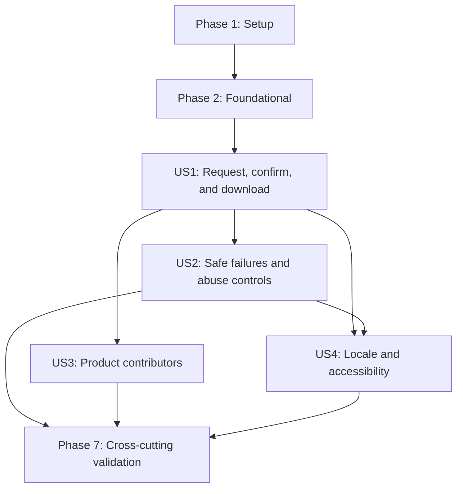

# Tasks: Personal Data Export

**Input**: Design documents from `specs/20260823-personal-data-export/`

**Prerequisites**: `plan.md`, `spec.md`, `research.md`, `data-model.md`, `contracts/`, and `quickstart.md`

**Tests**: Automated tests are mandatory because this feature crosses authentication, privacy, database consistency, email delivery, accessibility, and bounded resource-use contracts. In every user-story phase, write the listed tests first and confirm they fail for the intended missing behavior before implementing that story.

**Organization**: Tasks are grouped by user story so each slice has an explicit goal and independent verification boundary. The export is always generated in memory from one read-only snapshot; no task may persist an export artifact or add a worker, queue, cache, object store, file volume, package, service, port, or network.

## Format: `[ID] [P?] [Story] Description`

- **[P]**: Can run in parallel after its stated prerequisites because it changes different files and does not depend on another incomplete task in that group.
- **[Story]**: Maps the task to User Story 1, 2, 3, or 4 in `spec.md`.
- Every task names the exact repository file or directory it changes or validates.

## Phase 1: Setup (Shared Test Infrastructure)

**Purpose**: Prepare deterministic database, provider, and browser fixtures for the required test-first story work. The existing project and dependencies need no initialization.

- [X] T001 Create deterministic users, linked accounts, exact sessions, policy acceptances, export credentials, export grants, rate-limit buckets, and expected canonical payload builders in `tests/helpers/personal-data-export.ts`
- [X] T002 [P] Extend `tests/e2e/helpers/authenticated-user.ts` with multiple same-account and conflicting-account browser sessions, export fixture cleanup, and exact session-row access without exposing credentials in test output
- [X] T003 [P] Add controlled real-HTTP email capture, rejection, timeout, and credential-link extraction helpers for browser journeys in `tests/e2e/helpers/personal-data-export.ts`

---

## Phase 2: Foundational (Blocking Prerequisites)

**Purpose**: Establish the additive persistence model, bounded configuration, strict shared types, credentials, rate-limit scopes, immutable registry, and canonical serialization boundary required by every story.

**CRITICAL**: Complete this phase before starting any user story.

### Tests for Foundational Behavior

- [X] T004 [P] Add failing schema-isolated forward-migration tests for the enum value, one-to-one Session cascade, expiry index, transactional rollback on injected migration failure, idempotent retry, and application rollback compatibility in `tests/integration/personal-data-export-migration.test.ts`
- [X] T005 [P] Add failing validation and wiring tests for the `26214400`-byte and `30000`-ms defaults, positive bounded overrides, invalid values, Compose injection, and deploy-variable propagation in `tests/unit/personal-data-export-config.test.ts`
- [X] T006 [P] Add failing unit tests for ordered immutable registration, unique namespaces, rejected late mutation, and deterministic contributor lookup in `tests/unit/personal-data-export-registry.test.ts`

### Implementation for Foundational Behavior

- [X] T007 Add `VerificationPurpose.ACCOUNT_DATA_EXPORT`, the optional Session relation, and `DataExportAuthorization` to `prisma/schema.prisma`; create the additive forward migration with `ON DELETE CASCADE` and an expiry index in `prisma/migrations/20260823000000_add_personal_data_export/migration.sql`; then regenerate `src/generated/prisma/`
- [X] T008 [P] Validate `ACCOUNT_DATA_EXPORT_MAX_BYTES` and `ACCOUNT_DATA_EXPORT_TIMEOUT_MS` as non-sensitive positive integer settings with documented defaults in `src/lib/env.ts` and `.env.example`
- [X] T009 Propagate the two validated export settings without adding secrets or infrastructure through `docker-compose.prod.yml`, `.github/workflows/deploy.yml`, and the standalone app environment in `playwright.config.ts`
- [X] T010 [P] Define exact-session authorization, contributor result, manifest, envelope v1, bounded generation, and non-identifying outcome types in `src/modules/account/data-export/types.ts`
- [X] T011 [P] After T010, implement strict request, callback, locale, state, and credential-free redirect validation in `src/modules/account/data-export/schema.ts`
- [X] T012 [P] After T010, implement cryptographically random raw credentials, persisted digests, constant-time comparison inputs, and contract expiry helpers in `src/modules/account/data-export/token.ts`
- [X] T013 [P] After T010, define operation-isolated trusted-client, normalized-account, and exact-Session bucket keys over `consumeSharedRateLimit` allowance windows in `src/modules/account/data-export/rate-limit.ts`
- [X] T014 [P] After T006 and T010, implement the immutable ordered contributor registry with unique namespace enforcement and no runtime discovery in `src/modules/account/data-export/registry.ts`
- [X] T015 [P] After T010, implement canonical UTF-8 JSON encoding, deterministic key ordering, JSON-value validation, exact byte measurement, and envelope v1 serialization in `src/modules/account/data-export/serializer.ts`

**Checkpoint**: Persistence, configuration, and shared domain boundaries are stable; story tests can target public behavior without inventing infrastructure.

---

## Phase 3: User Story 1 - Request, Confirm, and Download Personal Data (Priority: P1) MVP

**Goal**: Let an authenticated account holder request an email link, confirm from an eligible exact active session, and explicitly download one complete canonical JSON snapshot without changing authentication freshness or retaining the payload.

**Independent Test**: Seed one account with linked identities, two active sessions, and policy acceptances; request and consume one newly delivered credential in the first browser and explicitly download, then issue a second credential, consume it in the other eligible same-account browser, and explicitly download there; verify both allowlisted attachments, snapshot consistency, exact-session grants, unchanged Auth.js sessions/cookies/`authenticatedAt`, and absence of persisted export content.

### Tests for User Story 1

> Write these tests first and confirm they fail for the expected missing behavior.

- [X] T016 [P] [US1] Add failing strict request/callback/download parsing, token digest, purpose isolation, locale path, and credential-free redirect tests in `tests/unit/personal-data-export-schema.test.ts`
- [X] T017 [P] [US1] Add failing canonical envelope v1, stable ordering, Unicode UTF-8 length, timestamp, JSON-value, deterministic output, and exact-cap boundary tests in `tests/unit/personal-data-export-serializer.test.ts`
- [X] T018 [P] [US1] Add failing allowlist tests for account profile, linked identity, active-session, and policy-acceptance sections, including explicit rejection of password material, provider secrets, session tokens, verification credentials, and internal IDs, in `tests/unit/personal-data-export-contributors.test.ts`
- [X] T019 [P] [US1] Add failing English, Spanish, and Catalan email tests for escaped project content, one intended confirmation link, purpose-specific copy, and no account data in the subject or URL in `tests/unit/personal-data-export-email.test.ts`
- [X] T020 [P] [US1] Add failing successful request, clean confirmation redirect, authorized download, attachment header, no-store, and exact `Content-Length` route tests in `tests/unit/personal-data-export-routes.test.ts`
- [X] T021 [P] [US1] Add failing panel tests for explicit request, sending, sent, confirmed, generating, browser download, completed, and second-explicit-action states with no callback-triggered automatic download in `tests/unit/personal-data-export-panel.test.tsx`
- [X] T022 [P] [US1] Add failing live PostgreSQL and real-provider tests for provisional issuance, successful delivery supersession, one-time confirmation, purpose isolation, same-device confirmation, eligible same-account other-session confirmation, and exact-session grant creation in `tests/integration/personal-data-export-authorization.test.ts`
- [X] T023 [P] [US1] Add failing live PostgreSQL tests for one read-only REPEATABLE READ snapshot, built-in contributor projections, canonical complete buffering, repeat authorized generation, no source mutation, and no retained payload in `tests/integration/personal-data-export-generation.test.ts`
- [X] T024 [P] [US1] Add failing Playwright journeys for protected discovery, localized request/email return, explicit same-device download, same-account other-session authorization, exact filename/headers, and a second explicit download in `tests/e2e/personal-data-export.spec.ts`

### Implementation for User Story 1

- [X] T025 [P] [US1] Implement the explicit account/profile and linked-identity allowlist projection, excluding authentication and provider secrets, in `src/modules/account/data-export/contributors/account.ts`
- [X] T026 [P] [US1] Implement the active-session allowlist projection with non-sensitive timestamps and no token, IP, device, or internal identifier leakage in `src/modules/account/data-export/contributors/active-sessions.ts`
- [X] T027 [P] [US1] Implement the policy-acceptance allowlist projection with public policy/version/timestamp fields only in `src/modules/account/data-export/contributors/policy-acceptances.ts`
- [X] T028 [US1] Register the three built-in contributors explicitly in stable order and freeze the application composition root in `src/modules/account/data-export/composition.ts`
- [X] T029 [P] [US1] Implement provider-neutral localized export-confirmation email composition and its complete message keys in `src/modules/account/data-export/email.ts`, `src/messages/en.json`, `src/messages/es.json`, and `src/messages/ca.json`
- [X] T030 [US1] Implement exact-session recipient derivation, provisional credential creation, provider delivery confirmation, and successful supersession without placing credentials or identity in outcomes in `src/modules/account/data-export/service.ts`
- [X] T031 [US1] Add atomic delivered-token consumption and `DataExportAuthorization` upsert for the exact eligible active Session without invoking Auth.js, creating a Session/cookie, or updating `Session.authenticatedAt` in `src/modules/account/data-export/service.ts`
- [X] T032 [US1] Add bounded generation from one Prisma read-only REPEATABLE READ transaction, one immutable contributor context, complete canonical buffering, and no payload persistence in `src/modules/account/data-export/service.ts`
- [X] T033 [P] [US1] After T030, implement the authenticated strict-body request endpoint with canonical-origin and CSRF checks plus the contract's successful generic response in `src/app/api/account/data-export/request/route.ts`
- [X] T034 [P] [US1] After T031, implement the custom confirmation callback with effective-URL validation, exact current-session eligibility, atomic grant creation, and locale-preserving credential-free redirects in `src/app/api/account/data-export/verify/route.ts`
- [X] T035 [P] [US1] After T032, implement the authenticated explicit download endpoint with buffered `application/json; charset=utf-8`, attachment disposition, exact length, `Cache-Control: no-store`, and `X-Content-Type-Options: nosniff` in `src/app/api/account/data-export/download/route.ts`
- [X] T036 [P] [US1] Build the explicit request/confirmation/download client state machine, browser attachment handling, duplicate-action lockout, and no automatic callback download in `src/modules/account/data-export/components/data-export-panel.tsx`
- [X] T037 [US1] Insert the unframed export section before account deletion, derive only safe server-side authorization state, and preserve protected account navigation in `src/app/[locale]/account/data/page.tsx`

**Checkpoint**: User Story 1 is a complete functional MVP with independent unit, provider, PostgreSQL, and browser evidence. It is demonstrable but not releasable until the failure and abuse controls in User Story 2 pass.

---

## Phase 4: User Story 2 - Fail Safely Without Revealing Account State (Priority: P2)

**Goal**: Preserve prior usable credentials and all source data on delivery or generation failure while rejecting unauthorized, conflicting, replayed, cross-origin, over-limit, oversized, and timed-out attempts with generic responses and non-identifying logs.

**Independent Test**: Exercise signed-out, revoked, expired, different-account, wrong-purpose, replayed, concurrent, cross-origin, provider-failure, contributor-failure, timeout, one-byte-over-cap, and every operation-specific rate-limit case across two app instances; verify no partial attachment byte, no authentication change, no account-state disclosure, preserved prior links, fixed sanitized outcomes, and successful explicit retry where allowed.

### Tests for User Story 2

> Write these tests first and confirm they fail for the expected missing behavior.

- [x] T038 [P] [US2] Extend route tests with failing unknown/duplicate/identity fields, signed-out and revoked sessions, invalid CSRF, non-canonical origins/effective URLs, generic status bodies, `Retry-After`, and absent attachment headers on error in `tests/unit/personal-data-export-routes.test.ts`
- [x] T039 [P] [US2] Extend authorization integration tests with failing provider rejection/timeout compensation, prior-link preservation, successful supersession, malformed/expired/consumed/wrong-purpose credentials, different-account conflicts, exact-session revocation, callback replay, and concurrent confirmation in `tests/integration/personal-data-export-authorization.test.ts`
- [x] T040 [P] [US2] Extend generation integration tests with failing unavailable grant, grant expiry/cascade, source mutation attempts, contributor rejection, transaction failure, exact-cap success, one-byte-over-cap rejection, and active-timeout rejection under both the defaults and one application-specific byte/time configuration, with full rollback and zero partial-response evidence in `tests/integration/personal-data-export-generation.test.ts`
- [x] T041 [P] [US2] Add live two-instance PostgreSQL tests for request `5/client` and `3/account`, confirmation `5/client`, generation `3/Session`, atomic reset-window expiry, and operation isolation; prove exhausted request scopes reject before provider delivery, confirmation rejects before any credential read/consume or grant creation, and generation rejects before contributor invocation, all with generic retry timing, in `tests/integration/personal-data-export-rate-limit.test.ts`
- [x] T042 [P] [US2] Add failing log-capture tests that allow only `request_sent`, `request_failed`, `request_rate_limited`, `confirmation_completed`, `confirmation_rejected`, `confirmation_expired`, `confirmation_rate_limited`, `generation_failed`, `generation_expired`, `generation_rate_limited`, `contributor_failed`, and `download_completed` plus duration, while rejecting email, user/Session IDs, tokens or digests, grants, limiter values, byte/section counts, filenames, URLs, namespaces, payloads, bodies, and internal errors, in `tests/integration/personal-data-export-observability.test.ts`
- [x] T043 [P] [US2] Extend Playwright coverage with signed-out, delivery-failure retry, preserved older link, invalid/conflicting/replayed link, revoked session, generic rate-limit, timeout/oversize, no-partial-download, and no-automatic-retry journeys in `tests/e2e/personal-data-export.spec.ts`

### Implementation for User Story 2

- [x] T044 [US2] Add provider rejection/timeout compensation that removes only the new provisional credential, preserves every prior delivered credential until a newer delivery succeeds, and maps failures to generic retryable outcomes in `src/modules/account/data-export/service.ts`
- [x] T045 [US2] Harden confirmation with final locked token/Session/ACTIVE-owner revalidation, atomic consume-plus-grant creation, purpose/replay/conflict handling, and no privilege beyond export authorization in `src/modules/account/data-export/service.ts`
- [x] T046 [US2] Apply the four shared allowance-window scopes through `src/modules/account/data-export/rate-limit.ts`, `src/app/api/account/data-export/request/route.ts`, `src/app/api/account/data-export/verify/route.ts`, and `src/app/api/account/data-export/download/route.ts`, returning generic `429` plus `Retry-After` before provider delivery, any confirmation credential read/consume or grant creation, and any contributor invocation or generation work
- [x] T047 [US2] Enforce the active generation deadline, transaction cancellation, canonical completed-payload cap, contributor/serialization failure convergence, and full-buffer-before-response guarantee in `src/modules/account/data-export/service.ts` and `src/modules/account/data-export/serializer.ts`
- [x] T048 [US2] Enforce the canonical request boundary in `src/proxy.ts`, complete generic response mapping, and emit only the fixed outcome vocabulary established by T042 plus duration in `src/app/api/account/data-export/request/route.ts`, `src/app/api/account/data-export/verify/route.ts`, and `src/app/api/account/data-export/download/route.ts`
- [x] T049 [US2] Add localized delivery-failed, rate-limit-wait, and generic confirmation/generation failure states with restored controls, programmatic error focus, and explicit retry in `src/modules/account/data-export/components/data-export-panel.tsx`; map internal invalid-link, session-conflict, timeout, and oversize causes to identical public status, copy, and action

**Checkpoint**: User Stories 1 and 2 prove the complete success path and every release-blocking authorization, abuse, failure, disclosure, and no-partial-attachment invariant.

---

## Phase 5: User Story 3 - Contribute Application-Specific Personal Data (Priority: P2)

**Goal**: Let product modules add versioned personal-data sections through one explicit immutable registry while keeping output deterministic, privacy-reviewed, snapshot-consistent, and distinguishable as included-empty, unavailable, or failed.

**Independent Test**: Register a fixture product contributor beside the built-ins; seed materially classified user-provided, observed, and derived values plus present, empty, unavailable, normalized-duplicate, globally shared/static, intentionally nondeterministic, invalid, and failing modes; verify deterministic namespace/version output, manifest distinctions, exclusion rules and interpretive exception, no automatic discovery, omission detection, and whole-request generic failure where required.

### Tests for User Story 3

> Write these tests first and confirm they fail for the expected missing behavior.

- [x] T050 [P] [US3] Extend registry tests with failing contributor namespace/version syntax, duplicate ownership, stable execution order, frozen registration, narrow read-context, asynchronous result, and no filesystem/model auto-discovery assertions in `tests/unit/personal-data-export-registry.test.ts`
- [x] T051 [P] [US3] Add failing projection-audit tests for materially required user-provided/observed/derived classification, normalized/internal duplicate exclusion, globally shared/static exclusion with the permitted interpretive exception, attributable fixture-data omission, intentionally nondeterministic ordering, forbidden-field scans, independently versioned sections, included-empty versus unavailable manifest entries, and invalid/non-JSON result rejection in `tests/unit/personal-data-export-projection-audit.test.ts`
- [x] T052 [P] [US3] Extend live generation tests with failing custom classified-present, empty, unavailable, nondeterministic, invalid, and thrown contributors, normalized/shared-content exclusion fixtures, one shared snapshot, deterministic repeated output, namespace isolation, and whole-export failure semantics in `tests/integration/personal-data-export-generation.test.ts`
- [x] T053 [P] [US3] Add failing envelope-schema compatibility tests for built-in plus fixture sections, unknown future namespaces, section-version independence, and manifest/section consistency in `tests/unit/personal-data-export-versioning.test.ts`

### Implementation for User Story 3

- [x] T054 [US3] Complete contributor namespace/version/result validation, narrow immutable read-context exposure, ordered execution, and frozen explicit registration in `src/modules/account/data-export/types.ts` and `src/modules/account/data-export/registry.ts`
- [x] T055 [P] [US3] Create a representative product-owned contributor with materially classified user-provided, observed, and derived records plus present, empty, unavailable, normalized-duplicate, globally shared/static with permitted interpretive context, intentionally nondeterministic, invalid, and thrown-result modes in `tests/fixtures/personal-data-export-product-contributor.ts`
- [x] T056 [US3] Encode independently versioned sections plus disjoint included and unavailable manifest entries while treating thrown or invalid contributor results as whole-export failures in `src/modules/account/data-export/serializer.ts` and `src/modules/account/data-export/service.ts`
- [x] T057 [US3] Keep production registration as an explicit immutable built-in list while enabling deliberate fixture injection and omission auditing through `src/modules/account/data-export/composition.ts` and `tests/helpers/personal-data-export.ts`

**Checkpoint**: User Story 3 proves that product data can be added without weakening determinism, privacy review, snapshot integrity, or failure semantics.

---

## Phase 6: User Story 4 - Complete the Journey Accessibly in Any Supported Language (Priority: P3)

**Goal**: Make every export state behaviorally equivalent in English, Spanish, and Catalan and operable with keyboard and assistive technology in both themes at mobile and desktop sizes.

**Independent Test**: Run request, sent, confirmation, countdown, generation, completion, invalid-link, rate-limit, and retry states in all three locales with keyboard only and axe at `375 x 667` and `1440 x 900` in light and dark themes; verify focus placement/restoration, announcements, target sizing, wrapping, and zero serious/critical accessibility findings, clipping, overlap, or horizontal overflow.

### Tests for User Story 4

> Write these tests first and confirm they fail for the expected missing behavior.

- [x] T058 [P] [US4] Add failing catalog parity, non-empty value, behavioral-equivalence, countdown, security-copy, email, and forbidden sensitive-placeholder tests in `tests/unit/account-messages.test.ts`
- [x] T059 [P] [US4] Add failing locale-preserving callback path, credential-free state projection, protected page, panel ordering before deletion, and localized metadata tests in `tests/unit/personal-data-export-page.test.tsx`
- [x] T060 [P] [US4] Extend panel tests with failing semantic headings, keyboard operation, initial/restored/error focus, polite status, assertive errors, countdown expiry, stable pending footprint, reduced motion, target size, and axe state assertions in `tests/unit/personal-data-export-panel.test.tsx`
- [x] T061 [P] [US4] Extend Playwright journeys across EN/ES/CA, keyboard only, axe, light/dark themes, and `375 x 667` plus `1440 x 900` for focus, overlap, clipping, wrapping, and horizontal-overflow assertions in `tests/e2e/personal-data-export.spec.ts`

### Implementation for User Story 4

- [x] T062 [P] [US4] Complete behaviorally equivalent request, email, confirmation, countdown, generation, completion, security, and error copy in `src/messages/en.json`, `src/messages/es.json`, and `src/messages/ca.json`
- [x] T063 [P] [US4] Implement semantic status/error regions, deterministic focus transitions, keyboard-safe actions, an expiry countdown, stable controls, responsive wrapping, target sizing, contrast, and reduced motion in `src/modules/account/data-export/components/data-export-panel.tsx`
- [x] T064 [P] [US4] Preserve validated locale paths and map every confirmation result to a credential-free localized state in `src/modules/account/data-export/schema.ts` and `src/app/api/account/data-export/verify/route.ts`
- [x] T065 [US4] Finalize localized metadata, server authorization projection, callback notice focus, unframed responsive layout, and export-before-deletion order in `src/app/[locale]/account/data/page.tsx`

**Checkpoint**: All four stories satisfy the supported locale, keyboard, screen-reader, theme, and viewport contract.

---

## Phase 7: Polish and Cross-Cutting Validation

**Purpose**: Prove target-device performance, migration and restore safety, production-artifact behavior, full repository quality, and the absence of forbidden infrastructure or retained export data.

- [x] T066 Add the opt-in ARM64 built-in-dataset cohort with 10 warm-ups, 100 nearest-rank measurements, p50/p95/max reporting, and a sub-two-second p95 gate in `tests/e2e/personal-data-export.performance.spec.ts`; add `RUN_PERSONAL_DATA_EXPORT_PERF` selection without affecting normal suites in `scripts/test-e2e.sh`
- [x] T067 Execute the additive migration, application rollback, clean reapply, database backup/restore, Session cascade, and no-export-artifact recovery drills documented in `specs/20260823-personal-data-export/quickstart.md` against `prisma/migrations/20260823000000_add_personal_data_export/migration.sql`
- [x] T068 Run the focused unit/component, live PostgreSQL/provider, two-instance limiter, full coverage, lint, typecheck, build, and production audit commands in `specs/20260823-personal-data-export/quickstart.md`, fixing only personal-data-export regressions in their owning files under `src/modules/account/data-export/`, `src/app/api/account/data-export/`, and `tests/`
- [x] T069 Run the standalone production-artifact browser and ARM64 cohorts plus the documented light/dark desktop/mobile visual, keyboard, and VoiceOver checks in `specs/20260823-personal-data-export/quickstart.md`, recording reproducible defects as automated assertions in `tests/e2e/personal-data-export.spec.ts` where practical
- [x] T070 Audit the final data/operations diff against `docker-compose.yml`, `docker-compose.prod.yml`, `src/generated/protected/`, and `worker/`; prove no payload retention, discovery, worker, queue, cache, file store, service, port, network, volume, dependency, credential, or identifying log was added; then run `bash .specify/scripts/bash/compliance-check.sh --all` for `specs/20260823-personal-data-export/`

---

## Dependencies and Execution Order

### Phase Dependencies

- **Phase 1 - Setup**: No dependencies; fixture files can be prepared immediately.
- **Phase 2 - Foundational**: Depends on Phase 1 and blocks every user story. T007-T009 satisfy the migration/configuration tests; T010 precedes T011-T015.
- **Phase 3 - User Story 1**: Depends on Phase 2 and provides the functional MVP.
- **Phase 4 - User Story 2**: Depends on User Story 1 because it hardens the same service, routes, serializer, and panel. It is release-blocking.
- **Phase 5 - User Story 3**: Depends on the User Story 1 registry and generation path. Its test and fixture work can proceed beside User Story 2, but edits to `service.ts`, `serializer.ts`, and shared integration tests must be integrated sequentially.
- **Phase 6 - User Story 4**: Depends on the complete User Stories 1 and 2 state machine; it is independent of the fixture-only product contributor after the shared registry exists.
- **Phase 7 - Polish**: Depends on every selected story. Production release requires all four stories and every Phase 7 gate.

### User Story Dependency Graph



### Within Each User Story

- Write all tests in the story first and run them to confirm failures come from the intended missing behavior.
- Implement domain types and services before route handlers, then integrate server pages and client state.
- Run the story's focused unit, live-boundary, and browser checks at its checkpoint.
- Do not mark a story complete while any named data category, locale, state, threat, failure, or accessibility assertion remains unverified.

### Parallel Opportunities

- **Setup**: T002 and T003 use separate browser session and provider helper files after T001 defines shared fixtures.
- **Foundation**: T004-T006 can be authored together; after T010, T011-T015 split across schema, token, limiter, registry, and serializer files, while T007-T009 proceed on schema/configuration paths.
- **User Story 1**: T016-T024 use separate test files; after they fail, T025-T027 and T029 can proceed independently before T028 and T030-T037 integrate the flow.
- **User Story 2**: T038-T043 use separate route, authorization, generation, limiter, observability, and browser test files; T049 can proceed beside server hardening, while T044-T048 remain ordered around shared files.
- **User Story 3**: T050-T053 can be authored together; T055 can proceed beside T054 before T056-T057 integrate result semantics and composition.
- **User Story 4**: T058-T061 can be authored together; T062-T064 split across catalogs, client UI, and callback routing before T065 finalizes page composition.

---

## Parallel Execution Examples

### User Story 1

```text
Parallel failing tests: T016, T017, T018, T019, T020, T021, T022, T023, T024
Parallel implementation after tests fail: T025, T026, T027, T029
Then sequence: T025/T026/T027 -> T028 -> T030 -> T031 -> T032 -> T033/T034/T035/T036 -> T037
```

### User Story 2

```text
Parallel failing tests: T038, T039, T040, T041, T042, T043
Server sequence: T044 -> T045 -> T046 -> T047 -> T048
Client implementation in parallel with server work: T049
```

### User Story 3

```text
Parallel failing tests: T050, T051, T052, T053
Parallel implementation: T054 and T055
Then sequence: T054/T055 -> T056 -> T057
```

### User Story 4

```text
Parallel failing tests: T058, T059, T060, T061
Parallel implementation: T062, T063, T064
Then sequence: T062/T063/T064 -> T065
```

---

## Implementation Strategy

### MVP First

1. Complete Setup and Foundational phases.
2. Complete User Story 1 and run its independent unit, provider, PostgreSQL, and browser checks.
3. Use that slice as the functional MVP for demonstration.
4. Do not release it until User Story 2 and all cross-cutting gates pass.

### Incremental Delivery

1. **Foundation**: Add only the additive grant schema, bounded settings, and reusable domain boundaries.
2. **User Story 1**: Deliver the successful request, exact-session confirmation, and explicit snapshot download.
3. **User Story 2**: Complete authorization, compensation, rate-limit, bounded-failure, no-partial-response, and log-hygiene controls.
4. **User Story 3**: Prove explicit application-owned extension without discovery or privacy drift.
5. **User Story 4**: Complete locale, keyboard, assistive-technology, theme, and viewport equivalence.
6. **Verification**: Run migration/recovery, complete quality, standalone artifact, ARM64, and manual checks.

### Parallel Team Strategy

1. Complete fixture and foundational contracts together.
2. Build User Story 1 as the shared vertical core.
3. Split User Story 2 tests/client states from User Story 3 contract/fixture work, integrating their shared service and serializer changes in phase order.
4. Run User Story 4 catalogs and accessibility work after the complete functional state machine exists.
5. Rejoin for Phase 7 and release only after every required gate passes.

### Post-Release Evidence

The representative 20-person usability measurement in `specs/20260823-personal-data-export/quickstart.md` is an external product KPI, not unfinished implementation work. After release, retain only aggregate threshold evidence and non-identifying reproducible defects at the documented location; do not retain participant identity, contact details, account data, recordings, or raw observation transcripts.

## Implementation notes

- `[P]` means file-level parallelism is safe only after the dependencies stated in that phase are complete.
- Setup, foundational, and polish tasks intentionally have no story label; all story tasks carry exactly one `[US1]`-`[US4]` label.
- Identity always comes from the exact server Session. Request bodies and URLs never accept an email, user ID, Session ID/token, grant, or ownership claim.
- Export confirmation is a custom callback and never delegates to Auth.js session creation or authentication-freshness updates.
- The canonical payload exists only in request memory until the buffered response is sent and is never written to PostgreSQL, disk, cache, logs, or provider metadata.
- Existing backup and restore operations remain operationally separate and never become an export delivery or retention path.

## Phase 8: Convergence

- [x] T071 Reconcile callback presentation notices with server-derived ready authorization in `src/modules/account/data-export/components/data-export-panel.tsx`, preserving Download data and the remaining window for an exact unexpired grant after invalid, replayed, or confirmation-rate-limited callbacks, and add compound-state unit and E2E replay assertions per FR-016 and US1/AC2 (partial)
- [x] T072 Constrain composed export observability across `src/modules/account/data-export/email.ts`, `src/lib/email/index.ts`, the shared rate-limit boundary, and `tests/integration/personal-data-export-observability.test.ts` so the journey emits only fixed sanitized outcome-plus-duration records and never provider message identifiers, downstream event metadata, or raw cleanup/internal errors per FR-038, FR-039, and T042 (contradicts)
- [x] T073 Preserve the validated callback locale as the presentation fallback when token lookup cannot recover a persisted locale for replayed, consumed, superseded, wrong-purpose, or unknown credentials, and add EN/ES/CA integration and browser coverage in `src/modules/account/data-export/service.ts`, `src/app/api/account/data-export/verify/route.ts`, `tests/integration/personal-data-export-authorization.test.ts`, and `tests/e2e/personal-data-export.spec.ts` per FR-036, SC-006, and US4/AC1 (partial)
