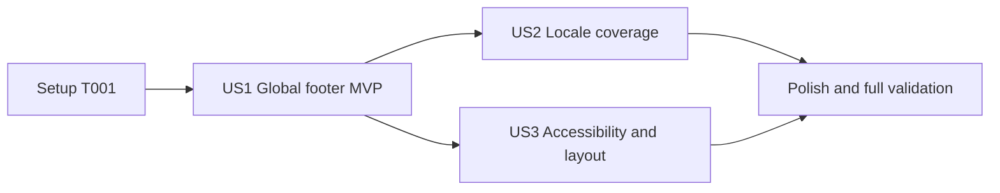

---

description: "Implementation tasks for the global legal footer"
---

# Tasks: Global Legal Footer

**Input**: Design documents from `specs/20260824-global-legal-footer/`

**Prerequisites**: [plan.md](plan.md), [spec.md](spec.md), [research.md](research.md),
[data-model.md](data-model.md), [global-footer-ui.md](contracts/global-footer-ui.md),
[quickstart.md](quickstart.md)

**Tests**: Automated tests are required by the specification and Constitution Principle XII. Add
the story-specific assertions before the corresponding implementation or hardening task and prove
the expected failure whenever that behavior is not already supplied by the preceding shared story.

**Organization**: Tasks are grouped by user story so each story has an explicit goal, independent
test, and checkpoint. The footer's locale-aware implementation is shared by US1; US2 independently
locks its behavior across every supported locale without duplicating production code.

## Format: `[ID] [P?] [Story] Description`

- **[P]**: Can run in parallel because it touches a different file and has no incomplete dependency
- **[Story]**: Maps the task to US1, US2, or US3 from `spec.md`
- Every task names the exact file or files it changes or validates

## Phase 1: Setup (Shared Infrastructure)

**Purpose**: Add the only new shared catalog contract before the footer is rendered.

- [X] T001 Add `Footer.navigationLabel` with `Legal information`, `Información legal`, and `Informació legal` while preserving catalog parity in src/messages/en.json, src/messages/es.json, and src/messages/ca.json

---

## Phase 2: Foundational (Blocking Prerequisites)

**Purpose**: Confirm that existing infrastructure already satisfies every cross-story prerequisite.

No additional foundational implementation is required. The validated locale layout,
`NextIntlClientProvider`, locale-aware navigation helper, `POLICY_PATHS`, theme tokens,
authenticated-user E2E fixture, and axe-core helper already exist. T001 is the only blocking setup
task.

**Checkpoint**: T001 complete; all user-story work may begin from the existing application shell.

---

## Phase 3: User Story 1 - Reach Legal Information from Any Page (Priority: P1) MVP

**Goal**: Give signed-out and signed-in users exactly one shared footer with Terms and Privacy links
on representative public, authentication, account, and legal pages.

**Independent Test**: In English, visit `/`, `/login`, seeded `/account`, `/terms`, and `/privacy`;
each page has exactly one `contentinfo` landmark after page content with exactly two links ordered
Terms then Privacy, and the footer contract is identical across authentication states.

### Tests for User Story 1

- [X] T002 [P] [US1] Write failing server-rendered Vitest contract tests for one native footer, one named legal navigation, exactly two ordered links, canonical `POLICY_PATHS`, and no extra controls in tests/unit/app-footer.test.tsx
- [X] T003 [P] [US1] Write failing Playwright coverage for one footer on English public, authentication, seeded account, Terms, and Privacy routes and compare signed-in versus signed-out link contracts in tests/e2e/global-footer.spec.ts

### Implementation for User Story 1

- [X] T004 [US1] Implement the async stateless `AppFooter` Server Component with one immutable Terms-then-Privacy destination collection, native footer/nav/list/link semantics, `POLICY_PATHS`, server translations, and locale-aware `Link` in src/components/app-footer.tsx
- [X] T005 [US1] Render `AppFooter` exactly once after the flex-growing page-content region while preserving provider scope and passing the validated locale in src/app/[locale]/layout.tsx
- [X] T006 [US1] Run the focused Vitest file and production E2E workflow, then resolve US1 contract failures only in tests/unit/app-footer.test.tsx, tests/e2e/global-footer.spec.ts, src/components/app-footer.tsx, and src/app/[locale]/layout.tsx

**Checkpoint**: US1 independently provides globally available legal navigation in one shared shell
for public and authenticated users.

---

## Phase 4: User Story 2 - Keep the Active Language (Priority: P2)

**Goal**: Prove that English, Spanish, and Catalan users see fully localized footer copy and reach
the canonical legal destination without losing their active locale.

**Independent Test**: On one representative page per locale, the legal navigation and both link
labels match the UI contract, all six rendered hrefs match the locale matrix, both links navigate to
the expected localized page, and changing locale immediately before activation changes the footer
destination locale.

**Shared implementation note**: T001 and US1 intentionally implement the locale-aware production
path once. This phase adds independent acceptance coverage rather than introducing a second locale
or route abstraction.

### Tests for User Story 2

- [X] T007 [P] [US2] Extend Vitest coverage with exact `Footer` catalog parity, English/Spanish/Catalan navigation names, reused `Policies` title labels, canonical path inputs, and Spanish/Catalan no-fallback assertions in tests/unit/app-footer.test.tsx
- [X] T008 [P] [US2] Extend Playwright with a data-driven matrix covering public, login, authenticated account, Terms, and Privacy routes in English, Spanish, and Catalan; for every matrix row assert exactly one contentinfo landmark and legal navigation, exactly two ordered localized links, expected hrefs and clicked destinations, required authentication state, footer position after page content, no horizontal overflow, no serious or critical WCAG A/AA axe violations, and cover legal-page self-links plus the change-locale-then-follow-link edge case in tests/e2e/global-footer.spec.ts
- [X] T009 [US2] Run the focused Vitest file and production E2E workflow, then correct any locale-contract defect without manual prefix construction in src/components/app-footer.tsx, src/messages/en.json, src/messages/es.json, src/messages/ca.json, and tests/e2e/global-footer.spec.ts

**Checkpoint**: US2 independently verifies complete footer localization and locale-preserving
navigation for all supported languages.

---

## Phase 5: User Story 3 - Use the Footer Across Devices and Access Methods (Priority: P3)

**Goal**: Keep the footer semantic, keyboard-operable, readable, and unobstructed across supported
themes, viewport sizes, content lengths, and assistive technology paths.

**Independent Test**: At 320 x 568, 768 x 1024, and 1440 x 900 in light and dark themes, short,
long, and dynamically expanded pages keep the footer after content without overflow or overlap;
axe reports no serious/critical A/AA issue, and keyboard focus reaches Terms then Privacy with a
visible indicator and successful Enter activation.

### Tests for User Story 3

- [X] T010 [P] [US3] Extend the server-rendered Vitest contract with native contentinfo/navigation/list semantics, a localized navigation name, descriptive link names, and no redundant ARIA roles in tests/unit/app-footer.test.tsx
- [X] T011 [P] [US3] Extend Playwright coverage for keyboard focus and Enter activation, browser axe-core, light/dark themes, 320/768/1440 viewports, at least 24px target height for both links including wrapped labels, horizontal overflow, short/long-page geometry, and dynamically expanded content in tests/e2e/global-footer.spec.ts

### Implementation for User Story 3

- [X] T012 [US3] Apply normal-flow, content-driven, wrapping footer layout with existing semantic theme tokens, at least 24px link target height, distinct gaps, and visible focus states without fixed/sticky positioning or animation in src/components/app-footer.tsx
- [X] T013 [US3] Run the focused Vitest file and both Playwright projects, then resolve accessibility or geometry failures only in src/components/app-footer.tsx, src/app/[locale]/layout.tsx, tests/unit/app-footer.test.tsx, and tests/e2e/global-footer.spec.ts

**Checkpoint**: US3 independently proves the footer is usable across the required browser,
viewport, theme, content, keyboard, and screen-reader surfaces.

---

## Phase 6: Polish & Cross-Cutting Validation

**Purpose**: Validate the full feature, manual-only outcomes, scope boundaries, and repository gates.

- [X] T014 Audit the final diff to keep src/modules/signup/policy.ts, prisma/, docker-compose.yml, docker-compose.prod.yml, docker-compose.e2e.yml, .env.example, policy versions, logging, and authentication behavior unchanged, and complete the future-destination extension review from specs/20260824-global-legal-footer/quickstart.md for SC-005
- [X] T015 Execute the 200% zoom, forced-colors, contrast-ratio, keyboard, VoiceOver, short/long/dynamic-content, and theme review from specs/20260824-global-legal-footer/quickstart.md and record reproducible outcomes there
- [X] T017 Run `pnpm lint`, `pnpm typecheck`, `pnpm test`, `pnpm build`, and `pnpm test:e2e` from specs/20260824-global-legal-footer/quickstart.md and resolve only regressions attributable to src/components/app-footer.tsx, src/app/[locale]/layout.tsx, src/messages/en.json, src/messages/es.json, src/messages/ca.json, tests/unit/app-footer.test.tsx, or tests/e2e/global-footer.spec.ts

---

## Dependencies & Execution Order

### Phase Dependencies

- **Setup (Phase 1)**: Starts immediately; T001 is the only new shared prerequisite.
- **Foundational (Phase 2)**: Requires T001 and confirms no database, API, dependency, or deployment
  work is needed.
- **US1 (Phase 3)**: Depends on T001; delivers the MVP shared footer.
- **US2 (Phase 4)**: Depends on the US1 footer contract because localization is an attribute of the
  same links, but remains independently testable through its locale matrix.
- **US3 (Phase 5)**: Depends on the US1 markup; it may proceed alongside US2 on a separate branch,
  although both stories extend the same two test files and require merge coordination.
- **Polish (Phase 6)**: Depends on all selected user stories.

### User Story Dependency Graph



### Within Each User Story

- Write contract tests before the corresponding production implementation or hardening task.
- Keep the immutable destination model and shared shell composition ahead of route-matrix checks.
- Use semantic role assertions rather than test IDs.
- Complete each story's focused verification task before its checkpoint.
- Do not add storage, APIs, client state, session reads, logging, or route-level footer markup.

### Parallel Opportunities

- T002 and T003 can run in parallel after T001 because they create different test files.
- T007 and T008 can run in parallel after US1 because they modify different test files.
- T010 and T011 can run in parallel after US1 because they modify different test files.
- US2 and US3 are logically parallel after US1, but they both extend
  `tests/unit/app-footer.test.tsx` and `tests/e2e/global-footer.spec.ts`; use separate branches and
  merge deliberately rather than editing those files concurrently in one checkout.

---

## Parallel Example: User Story 1

```text
Task T002: Add the server-rendered component contract in tests/unit/app-footer.test.tsx
Task T003: Add the global route/authentication contract in tests/e2e/global-footer.spec.ts
```

## Parallel Example: User Story 2

```text
Task T007: Add catalog and label parity coverage in tests/unit/app-footer.test.tsx
Task T008: Add three-locale navigation coverage in tests/e2e/global-footer.spec.ts
```

## Parallel Example: User Story 3

```text
Task T010: Add the server-rendered semantic contract in tests/unit/app-footer.test.tsx
Task T011: Add browser accessibility and geometry coverage in tests/e2e/global-footer.spec.ts
```

---

## Implementation Strategy

### MVP First (User Story 1)

1. Complete T001.
2. Write T002 and T003 in parallel and confirm the new contract fails before implementation.
3. Complete T004 and T005.
4. Complete T006 and stop at the US1 checkpoint.
5. Demo global legal access before adding exhaustive locale and layout coverage.

### Incremental Delivery

1. **US1**: Deliver one shared footer across route and authentication categories.
2. **US2**: Lock the already shared implementation to exact language and destination contracts.
3. **US3**: Add responsive styling and prove accessibility/geometry requirements.
4. **Polish**: Complete manual outcomes and the complete repository quality gate.

Each increment preserves the previous story and does not change data, APIs, deployment, policy
content, or authentication behavior.

### Parallel Team Strategy

1. One developer completes T001 and US1 because these own the shared production files.
2. After US1, one branch can implement US2 while another implements US3.
3. Each branch runs its focused tests before merge; reconcile additions to the two shared test files.
4. Run Phase 6 once both stories are integrated.

## Implementation notes

- `[P]` tasks touch different files within the same ready phase.
- `[US1]`, `[US2]`, and `[US3]` provide requirement-to-task traceability.
- Tests use existing Vitest, Playwright, axe-core, and authenticated-user fixtures; install nothing.
- No task creates a data model, endpoint, migration, environment variable, service, or log event.
- Mark a task complete only after its described file change or validation has been performed.