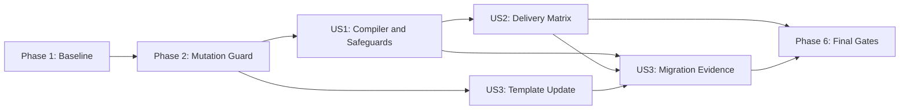

---

description: "Implementation tasks for the TypeScript 6 upgrade"
---

# Tasks: TypeScript 6 Upgrade

**Input**: Design documents from `specs/20260826-typescript-6-upgrade/`

**Prerequisites**: [plan.md](plan.md), [spec.md](spec.md), [research.md](research.md), [data-model.md](data-model.md), and [quickstart.md](quickstart.md)

**Tests**: This feature explicitly requires the existing lint, typecheck, generation, audit, compliance, coverage, production-build, E2E, email-preview, and Docker-image checks. No new application test file is expected unless a TypeScript 6 diagnostic forces an observable code change.

**Organization**: Tasks are grouped by user story so the compiler migration, delivery proof, and migration record remain independently reviewable.

## Format: `[ID] [P?] [Story] Description`

- **[P]**: Can run in parallel because it uses a distinct output surface and has no dependency on another incomplete task
- **[Story]**: Maps the task to US1, US2, or US3 from [spec.md](spec.md)
- Every task names the exact repository paths it changes or validates

## Phase 1: Setup (Baseline Evidence)

**Purpose**: Preserve a reproducible pre-migration comparison before changing the dependency graph.

- [X] T001 Capture the pre-change Node.js, pnpm, TypeScript, lint, and typecheck results from `package.json` and append a dated implementation-baseline section to `specs/20260826-typescript-6-upgrade/research.md`

---

## Phase 2: Foundational (Mutation Guard)

**Purpose**: Establish the clean, frozen dependency and configuration baseline that blocks all implementation work.

**CRITICAL**: Do not change the compiler until this phase confirms that the starting graph is reproducible and the protected configuration files are unchanged.

- [X] T002 Run a frozen pnpm 11.22.0 install from `package.json` and `pnpm-lock.yaml`, then confirm `tsconfig.json`, `eslint.config.mjs`, `next.config.ts`, and `.specify/templates/overrides/plan-template.md` match the planned baseline recorded in `specs/20260826-typescript-6-upgrade/research.md`

**Checkpoint**: The TypeScript 5.9.3 baseline is reproducible and the allowed migration surfaces are known.

---

## Phase 3: User Story 1 - Upgrade Without Weakening Quality Safeguards (Priority: P1) MVP

**Goal**: Resolve TypeScript 6.0.x through the approved range while keeping strict type checking and the complete current lint policy green.

**Independent Test**: A frozen install resolves the root compiler within 6.0.x, `pnpm exec tsc --version` reports 6.0.x, and lint plus typecheck pass with no lint-policy change, suppression, strictness reduction, explicit source root, or speculative global type list.

### Dependency Migration and Validation

- [X] T003 [US1] Change only the root development dependency to `typescript: "~6.0.2"` in `package.json` and regenerate `pnpm-lock.yaml` with Corepack and the pinned pnpm 11.22.0
- [X] T004 [US1] Review every `package.json` and `pnpm-lock.yaml` hunk to confirm TypeScript 6.0.x plus unavoidable TypeScript-qualified peer snapshots are the only dependency changes and ESLint 9.39.4, `eslint-config-next` 16.3.2, and `typescript-eslint` 8.67.0 remain fixed
- [X] T005 [US1] Run the frozen-install, manifest-range, local-compiler-version, and `pnpm why typescript` checks from `specs/20260826-typescript-6-upgrade/quickstart.md` against `package.json` and `pnpm-lock.yaml`, stopping on any peer conflict or 6.1+ resolution
- [X] T006 [US1] Run the configuration-invariant checks and `pnpm lint` from `specs/20260826-typescript-6-upgrade/quickstart.md`, confirming `tsconfig.json`, `eslint.config.mjs`, and `next.config.ts` retain all safeguards and contain no migration bypass
- [X] T007 [US1] Run `pnpm typecheck` from `package.json`; on success leave `tsconfig.json` and source unchanged, or on a reproducible diagnostic change only the exact compiler-reported file and its focused regression test, then record changed paths and the final `compilerOptions.types` decision in `specs/20260826-typescript-6-upgrade/research.md`

**Checkpoint**: User Story 1 is complete when the upgraded compiler, unchanged lint stack, lint, and full-project typecheck pass independently.

---

## Phase 4: User Story 2 - Prove the Application Still Builds and Behaves the Same (Priority: P2)

**Goal**: Prove the upgraded dependency graph across generation, audits, automated tests, production builds, browser journeys, and both deployable image targets.

**Independent Test**: Starting from the frozen TypeScript 6 lockfile, every command in the full application gate passes, both Docker targets build, and final review finds no unrelated dependency, source, configuration, historical-spec, or runtime change.

### Delivery Matrix

- [X] T008 [P] [US2] Start the test database from `docker-compose.yml`, then run `db:generate` and `db:deploy` from `package.json` against `prisma/schema.prisma` without changing schema or migrations
- [X] T009 [P] [US2] Run `audit:prod` and `test:coverage` from `package.json`, requiring zero high/critical production audit failure and all thresholds in `vitest.config.ts` to pass
- [X] T010 [P] [US2] Run the standalone production `build` script from `package.json` with `next.config.ts`, confirming Next.js uses the project-local TypeScript 6 compiler and emits no ignored type error
- [X] T011 [P] [US2] Run the isolated email-preview Playwright suite configured by `emails/playwright.config.ts` and confirm no compiler or browser regression in `emails/`
- [X] T012 [US2] Run the production-artifact E2E flow from `package.json` through `scripts/test-e2e.sh`, requiring all routing, security-header, health, and feature smoke tests in `tests/e2e/` to pass
- [X] T013 [US2] Build the `runner` and `migrator` targets from `docker/Dockerfile` using the exact commands in `.github/workflows/ci.yml`, confirming no Docker, Compose, runtime, network, volume, port, or secret change is needed
- [X] T014 [US2] Audit the final implementation diff across `package.json`, `pnpm-lock.yaml`, `tsconfig.json`, `eslint.config.mjs`, `next.config.ts`, `src/`, `tests/`, `emails/`, `docker/Dockerfile`, `.github/workflows/ci.yml`, and pre-existing `specs/**` to reject unrelated updates, refactors, behavior changes, or historical rewrites

**Checkpoint**: User Story 2 is complete when the complete delivery matrix passes and the scoped diff is clean.

---

## Phase 5: User Story 3 - Leave an Explicit Migration Record (Priority: P3)

**Goal**: Preserve the final global-type decision and make TypeScript 6.0.x the baseline for future plans without rewriting historical plans.

**Independent Test**: The migration evidence states why explicit Node globals were or were not required, the active plan template resolves with TypeScript 6.0.x, and no pre-existing `specs/**/plan.md` changes solely to update its historical compiler version.

### Migration Record and Template

- [X] T015 [P] [US3] Change the `Language/Version` default from TypeScript 5.x to TypeScript 6.0.x in `.specify/templates/overrides/plan-template.md` without altering any other template default
- [X] T016 [US3] Resolve the active plan template with `specify preset resolve plan-template`, verify `.specify/templates/overrides/plan-template.md` reports TypeScript 6.0.x, and confirm every pre-existing `specs/**/plan.md` remains unchanged
- [X] T017 [US3] Finalize the implementation-evidence section in `specs/20260826-typescript-6-upgrade/research.md` with the resolved compiler, peer compatibility, full-suite result, changed-file list, and evidence-backed `tsconfig.json` global-type decision

**Checkpoint**: User Story 3 is complete when future planning uses the new baseline and the migration rationale is reviewable without altering history.

---

## Phase 6: Polish & Cross-Cutting Completion

**Purpose**: Reconcile all stories, verify recovery and scope, and prepare the mandatory post-implementation gates.

- [X] T018 Run the complete sequence and recovery review in `specs/20260826-typescript-6-upgrade/quickstart.md`, run `git diff --check`, and verify the final files satisfy every invariant in `specs/20260826-typescript-6-upgrade/data-model.md` without exposing `.env` or secret values
- [X] T019 Mark every completed item in `specs/20260826-typescript-6-upgrade/tasks.md`, then execute the mandatory `after_implement` compliance and quality-gate commands declared in `.specify/extensions.yml`, resolving any failure without weakening `package.json`, `tsconfig.json`, `eslint.config.mjs`, or the required test matrix

---

## Requirement Coverage

| Requirement | Tasks |
|-------------|-------|
| FR-001 | T003, T005 |
| FR-002 | T003, T004, T014 |
| FR-003 | T005 |
| FR-004 | T005 |
| FR-005 | T004, T006 |
| FR-006 | T006 |
| FR-007 | T006, T007 |
| FR-008 | T007 |
| FR-009 | T007, T017 |
| FR-010 | T006, T007 |
| FR-011 | T008-T012, T018-T019 |
| FR-012 | T013 |
| FR-013 | T015-T016 |
| FR-014 | T014, T016 |
| FR-015 | T001 |
| FR-016 | T004, T014, T018 |

## Dependencies & Execution Order

### Phase Dependencies

- **Setup (Phase 1)**: No dependencies; T001 starts immediately.
- **Foundational (Phase 2)**: T002 depends on T001 and blocks compiler mutation.
- **User Story 1 (Phase 3)**: T003-T007 depend on T002 and execute in order because they mutate and validate the same dependency/configuration state.
- **User Story 2 (Phase 4)**: Depends on T007. T008-T011 may run in parallel on distinct generated output surfaces; T012-T014 complete the integrated and scope checks.
- **User Story 3 (Phase 5)**: T015 can start after T002 in parallel with US1. T016 depends on T015. T017 depends on the final evidence from T007 and T008-T014.
- **Polish (Phase 6)**: T018 depends on all three stories. T019 is last because the mandatory compliance hook requires every task checkbox to be complete.

### User Story Dependency Graph



### Within Each User Story

- **US1**: Dependency mutation precedes lock review, frozen install, lint, and typecheck; there is no safe intra-story parallelism.
- **US2**: Generation/database, audit/coverage, production build, and email-preview validation can run concurrently after US1; integrated E2E, image builds, and diff audit follow.
- **US3**: Template editing precedes template resolution; final evidence waits for US1 and US2 results.
- Stop immediately on a failing check, repair only the failing in-scope surface, and rerun that check before continuing.

## Parallel Execution Examples

### User Story 1

US1 is intentionally sequential because all tasks depend on the same manifest, lockfile, and compiler state:

```text
Task: "T003 update package.json and pnpm-lock.yaml"
then Task: "T004 review dependency churn"
then Task: "T005 verify frozen resolution"
then Task: "T006 verify lint safeguards"
then Task: "T007 verify typecheck and global types"
```

### User Story 2

After T007, launch these independent output surfaces together:

```text
Task: "T008 generate/deploy Prisma state using prisma/schema.prisma"
Task: "T009 run audit and coverage using package.json and vitest.config.ts"
Task: "T010 build the application using package.json and next.config.ts"
Task: "T011 test the email catalogue using emails/playwright.config.ts"
```

Then run T012, T013, and T014 in order for integrated E2E, deployment images, and final scope review.

### User Story 3

T015 can run after T002 while US1 proceeds, because it changes only the active template:

```text
Task: "T015 update .specify/templates/overrides/plan-template.md"
Task: "T003-T007 complete the compiler migration in parallel"
```

Run T016 after T015; run T017 only after US1 and US2 supply final evidence.

## Implementation Strategy

### MVP First (User Story 1 Only)

1. Complete T001-T002 to preserve and verify the baseline.
2. Complete T003-T007 in order.
3. Stop and independently verify frozen TypeScript 6 resolution, lint, and typecheck.
4. Treat this as the technical MVP, not merge-ready delivery; US2, US3, and final hooks remain required before release.

### Incremental Delivery

1. **Baseline**: T001-T002 establish reproducibility and mutation boundaries.
2. **MVP**: US1 upgrades the compiler and proves unchanged safeguards.
3. **Release confidence**: US2 exercises every delivery surface and rejects scope drift.
4. **Maintainability**: US3 records the decision and updates future planning.
5. **Completion**: T018-T019 reconcile artifacts and run mandatory governance gates.

### Parallel Team Strategy

1. Complete T001-T002 together.
2. One developer executes sequential US1 while another completes T015-T016.
3. After T007, distribute T008-T011 across separate workers or terminals with isolated outputs.
4. Rejoin for T012-T014, T017, and the final gates.

## Notes

- `[P]` tasks use distinct generated outputs or files and have no incomplete dependency.
- Story labels provide direct traceability to the prioritized scenarios in [spec.md](spec.md).
- Existing automated suites are the feature tests; do not add synthetic production code solely to test a compiler version.
- If T007 discovers a source diagnostic, keep the correction and any focused regression test in US1 and document the exact paths before US2 starts.
- Do not run broad dependency updates, edit historical specs, print secrets, or weaken lint/type/build checks.
- Mark each task complete only after its command and file-level acceptance conditions pass.