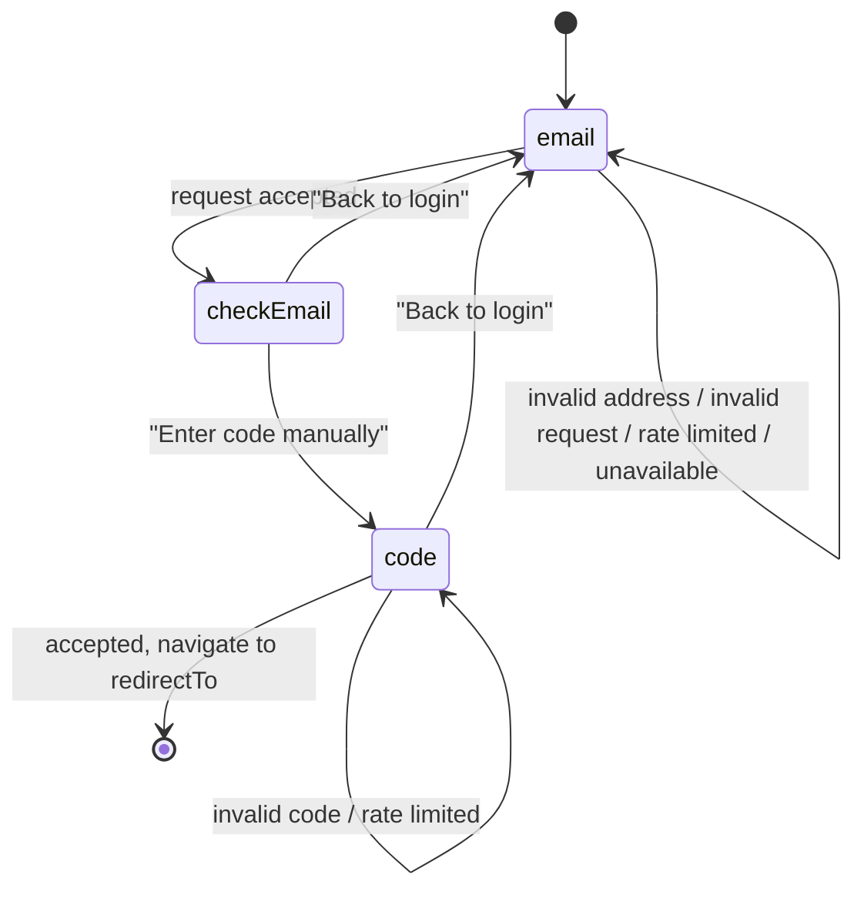

# Contract: Login UI states

**Feature**: [../spec.md](../spec.md) | **Plan**: [../plan.md](../plan.md)

The login page exposes three steps on the single URL `/[locale]/login`. Step changes never touch the
address bar and never push a history entry; a reload returns to `email`.

## State machine



Context carried across steps in client state only: the submitted address, the active locale, and the
validated callback path. None of it is written to the URL.

## Step contracts

### `email`

Unchanged from today apart from the accepted outcome. On `{ status: "accepted" }` the form is replaced
by `checkEmail` instead of showing an inline status message. The existing `invalidEmail`,
`invalidRequest`, `rateLimited` and `unavailable` states remain and keep their current copy.

### `checkEmail`

| Element | Source | Notes |
|---------|--------|-------|
| Logo and product name | Existing page chrome above the card | Already rendered by the login page; not duplicated |
| Heading | `Login.checkEmail.title` | "Check your email" |
| Body | `Login.checkEmail.description` | States that a temporary login link was sent; never claims delivery succeeded |
| Address | Submitted address, visually emphasized | Rendered from client state, escaped as text |
| Primary action | `Login.checkEmail.actions.enterCode` | Moves to `code` |
| Secondary action | `Login.checkEmail.actions.backToLogin` | Returns to `email` |

Rendered identically whether or not an account exists.

### `code`

| Element | Source | Notes |
|---------|--------|-------|
| Heading | `Login.code.title` | Receives focus on entry |
| Field label | `Login.code.field.label` | Bound to a single `<input>` |
| Field description | `Login.code.field.description` | Mentions the code arrives in the email |
| Submit | `Login.code.actions.submitIdle` / `submitPending` | Disabled while pending |
| Secondary action | `Login.checkEmail.actions.backToLogin` | Returns to `email` |
| Error | `Login.code.states.invalid` | One generic message for every rejection reason |
| Throttled | `Login.states.rateLimited` | Reuses the existing `{seconds}` message |

Input requirements: one semantic `<input type="text">` with `autoComplete="one-time-code"`,
`inputMode="text"`, `autoCapitalize="characters"`, `spellCheck={false}`, an accessible label and
description, and `aria-invalid` on rejection. A segmented visual treatment is permitted only as
presentation over that single field. Paste of the complete code must work.

## Accessibility contract

- Entering a step moves focus to that step's heading (`tabIndex={-1}`).
- Pending, success and error text is announced through a live region: `role="status"`/`aria-live="polite"`
  for progress, `role="alert"`/`aria-live="assertive"` for errors — matching the existing form.
- Every action is reachable and operable by keyboard alone, in tab order.
- No step change causes layout shift, overflow or overlap at mobile and desktop widths.

## Message keys

New keys, required in `en`, `es` and `ca`:

```text
Login.actions.backToLogin
Login.checkEmail.title
Login.checkEmail.description
Login.checkEmail.actions.enterCode
Login.code.title
Login.code.description
Login.code.field.label
Login.code.field.description
Login.code.actions.submitIdle
Login.code.actions.submitPending
Login.code.states.invalid
```

English reference copy: "Check your email"; "We've sent you a temporary login link. Please check your
inbox at {email}."; "Enter code manually"; "Back to login". Spanish and Catalan use natural, complete
equivalents rather than literal translations.
