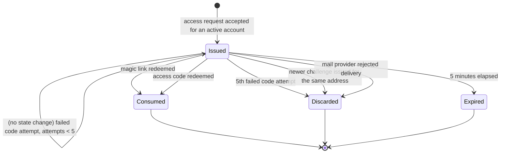

# Phase 1 Data Model: Login Access Code

**Feature**: [spec.md](./spec.md) | **Plan**: [plan.md](./plan.md) | **Date**: 2026-08-31

No new entity is introduced. The spec's "login challenge" already maps onto the existing
`VerificationToken` model with `purpose = LOGIN`; this feature adds the two fields that let the same
row be redeemed by a code as well as by a link.

## Changed model: `VerificationToken`

| Field | Type | Change | Purpose |
|-------|------|--------|---------|
| `identifier` | `String` | unchanged | Email address the challenge was issued for |
| `token` | `String @unique` | unchanged | Auth.js hash of the raw magic-link token |
| `expires` | `DateTime` | unchanged | Single shared expiry for link and code (FR-005) |
| `purpose` | `VerificationPurpose` | unchanged | `LOGIN` for this feature |
| `loginCodeHash` | `String?` | **new** | Keyed, address-bound digest of the access code |
| `loginCodeAttempts` | `Int @default(0)` | **new** | Failed code submissions against this challenge |

Unchanged supporting fields (`proposedName`, `locale`, `termsVersion`, `privacyVersion`, `acceptedAt`,
`deliveredAt`, `createdAt`) and the existing constraints `@@unique([identifier, token])` and
`@@index([identifier, purpose, expires])` are untouched. No new index is added: a login challenge is
newest-only, so lookup by `(identifier, purpose)` already resolves to at most one row and the hash is
then compared directly.

### Field rules

**`loginCodeHash`**

- Value: `sha256("login-code:" + normalizedIdentifier + ":" + code + AUTH_SECRET)`, hex encoded.
- `normalizedIdentifier` is the trimmed, lower-cased address — the same normalization
  `parseLoginEmail` and the adapter already apply.
- Written only inside the advisory-locked `createVerificationToken` transaction, together with the row.
- `NULL` for every challenge issued before this feature is deployed, and for any purpose other than
  `LOGIN`. A `NULL` hash can never match a submitted code, so those challenges remain link-only.
- Compared with a constant-time comparison. Never logged, never returned in a response.

**`loginCodeAttempts`**

- Starts at `0`. Incremented only when a challenge exists for the submitted address and the submitted
  code does not match it.
- When the incremented value reaches `5`, the row is deleted in the same transaction (FR-029). The
  next submission is then indistinguishable from any other invalid code.
- Successful redemption deletes the row, so the counter never has to be reset.

## Lifecycle



`Consumed`, `Discarded` and `Expired` are all row deletion or an unusable row; none of them is
distinguishable from the outside, which is what makes the single generic error of FR-012 truthful.

Transitions and where they are enforced:

| Transition | Enforcement |
|------------|-------------|
| Issued | `createVerificationToken` in `src/lib/auth-adapter.ts`, inside a per-identifier advisory lock that first deletes prior `LOGIN` rows |
| Consumed via link | Existing atomic `DELETE ... RETURNING` on `(identifier, token, purpose)` |
| Consumed via code | New atomic `DELETE ... RETURNING` on `(identifier, loginCodeHash, purpose)` with `expires > now()` |
| Discarded — attempts | Transactional increment, then delete when `loginCodeAttempts >= 5` |
| Discarded — superseded | Existing `deleteMany` on prior `LOGIN` rows during issuance |
| Discarded — delivery failure | Existing compensation in `sendVerificationRequest` |
| Expired | `expires` predicate on every read and consume; expired rows are never returned |

## Derived and in-memory values

| Value | Where it lives | Lifetime |
|-------|----------------|----------|
| Plaintext access code | `verificationCode` in the AsyncLocalStorage publication, then the rendered email | One request; never persisted, never logged |
| Raw magic-link token | Auth.js request scope and the email URL | Unchanged from today |
| Delegation placeholder token | The new route's request scope | One request; opaque, carries no meaning |

## Rate-limit keys (`RateLimitBucket`)

No schema change. Two new key families are written by the existing `consumeSharedRateLimit`:

| Key | Limit | Window | Charged |
|-----|-------|--------|---------|
| `auth:login-code:client:<trusted-client-id>` | 10 | 5 min | Before any lookup, on every code submission |
| `auth:login-code:address:<sha256(normalized-email)>` | 10 | 5 min | After the address parses, before the challenge lookup |

Existing families are unchanged: `auth:email:client:*` (5 per 15 min), `auth:email:address:*`
(3 per 15 min), `mail:provider-health:*`.

## Validation rules

| Input | Rule | On failure |
|-------|------|------------|
| `email` | Existing `loginEmailSchema`: trimmed, lower-cased, max 254, valid address | Generic `invalid_code` |
| `code` | Normalize (trim, upper-case, strip internal whitespace and hyphens), then exactly 10 characters from `0123456789ABCDEFGHJKMNPQRSTVWXYZ` | Generic `invalid_code` |
| `callbackUrl` | Existing `parseLoginCallbackPath(locale, value)` allow-list with home fallback | Silently replaced by the locale home path |
| `locale` | Existing `loginLocaleSchema` (`en` \| `es` \| `ca`) | Falls back to `en` |
| `csrfToken` | Existing `validateAuthCsrfToken` against the Auth.js cookie | `invalid_request` (403) |
| Request origin | Existing `isCanonicalRequestOrigin` | `misdirected_request` (421) |

## Migration

Single forward-only migration, additive and non-blocking:

```sql
ALTER TABLE "VerificationToken" ADD COLUMN "loginCodeHash" TEXT;
ALTER TABLE "VerificationToken" ADD COLUMN "loginCodeAttempts" INTEGER NOT NULL DEFAULT 0;
```

Both columns are nullable or defaulted, so the statement takes no table rewrite and old and new
application versions can run against the same schema during rollout. The corrective forward migration
is the matching pair of `DROP COLUMN` statements; nothing in the magic-link path reads either column.
