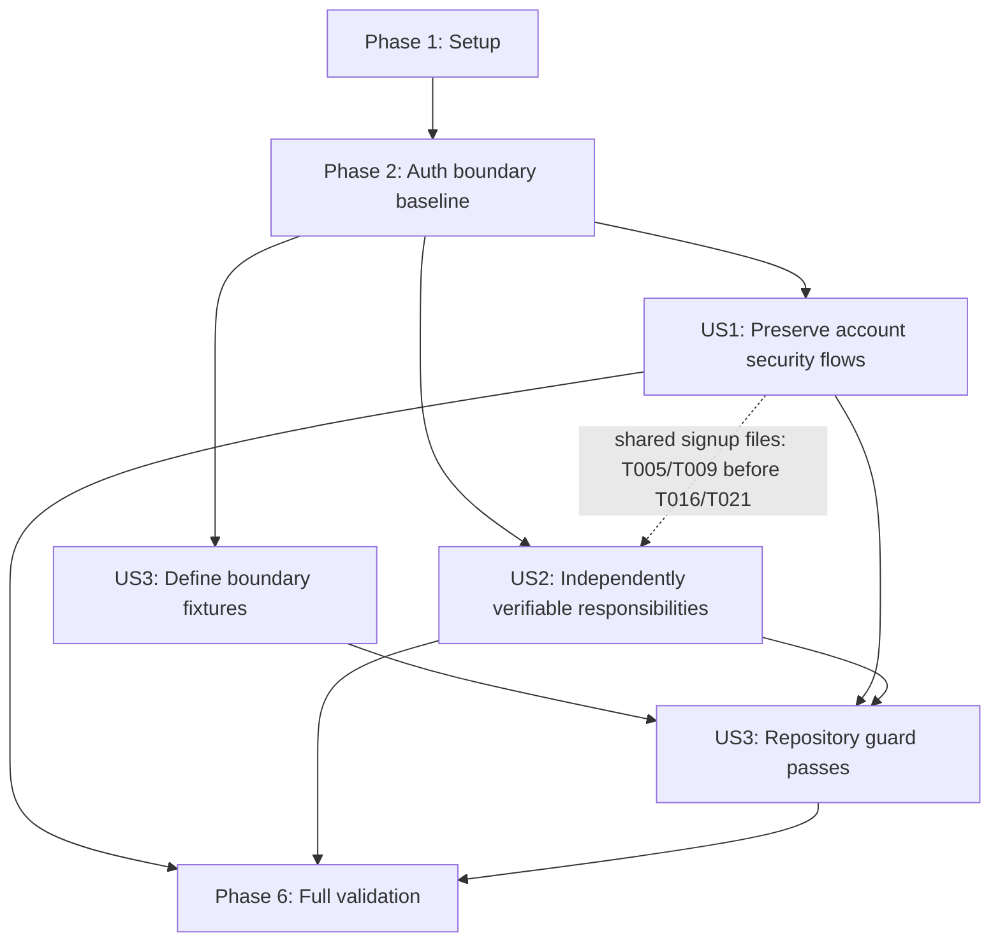

# Tasks: Separate Application Layers

**Input**: Design documents from `/specs/20260831-separate-application-layers/`

**Prerequisites**: plan.md, spec.md, research.md, data-model.md, contracts/, quickstart.md

**Tests**: Automated tests are required by the specification and constitution. Write each listed
test first, run it, and confirm it fails for the intended missing boundary or behavior before
implementing the corresponding source change.

**Organization**: Tasks are grouped by user story so each behavioral increment can be implemented
and validated independently.

## Format: `[ID] [P?] [Story] Description`

- **[P]**: Can run in parallel after its explicit prerequisites because it uses different files.
- **[Story]**: Maps implementation work to US1, US2, or US3 from spec.md.
- Every task names the exact file or directory it operates on.

## Phase 1: Setup (Shared Baseline)

**Purpose**: Prepare the pinned toolchain, establish the pre-refactor behavior baseline, and protect
unrelated user work already present in the working tree.

- [X] T001 Install dependencies from package.json with the pinned pnpm version, generate the existing Prisma client, and read the installed Next.js route-handler guide under node_modules/next/dist/docs/ before editing src/app/api/**/route.ts
- [X] T002 Capture the pre-implementation git status and preserve existing unrelated changes in .github/workflows/backup-restore-verify.yml, .github/workflows/ci.yml, .github/workflows/deploy.yml, README.md, and vitest.config.ts without reverting or absorbing them into this feature
- [X] T003 Run the pre-refactor characterization baseline in tests/unit/login-service.test.ts, tests/unit/signup-service.test.ts, tests/unit/auth-route.test.ts, tests/unit/signup-route.test.ts, tests/unit/signup-activation-route.test.ts, and tests/unit/account-deletion-verify-route.test.ts

---

## Phase 2: Foundational (Authoritative Auth Boundary)

**Purpose**: Prove the unchanged Auth.js mutation and request-local authorization boundary before
moving read-only decisions out of routes.

**CRITICAL**: Do not begin user-story source edits until this baseline passes.

- [X] T004 Run tests/unit/auth-adapter.test.ts, tests/unit/signup-verification-context.test.ts, and tests/unit/verification-context.test.ts and confirm src/lib/auth-adapter.ts, src/modules/signup/verification-context.ts, src/modules/account/deletion/verification-context.ts, and prisma/schema.prisma require no feature changes

**Checkpoint**: Existing token consumption, advisory locks, account activation, policy acceptance,
session creation, and request-local callback authorization are established as immutable behavior.

---

## Phase 3: User Story 1 - Preserve Account Security Flows (Priority: P1) MVP

**Goal**: Move signup activation and account-deletion verification reads and decisions into their
owning domain services while preserving every status, payload, header, cookie, redirect, session
outcome, transaction, lock, and generic failure.

**Independent Test**: Run the focused route/service tests plus the existing PostgreSQL signup and
deletion integration suites; all invalid-token classes, user states, session states, success paths,
and callback failures produce the pre-refactor outcomes in
`contracts/http-compatibility.md`.

### Tests for User Story 1

> Write these tests first and confirm they fail because the new service operations do not exist and
> the routes still access persistence directly.

- [X] T005 [P] [US1] Add failing table-driven tests for preflightSignupActivation, evaluateSignupActivationSession, and resolveSignupActivationFailure covering unknown/wrong-purpose/undelivered/expired tokens, invalid users, locale fallback, no/matching/conflicting sessions, eligible candidates, session_failed, and invalid fallback in tests/unit/signup-service.test.ts
- [X] T006 [P] [US1] Create failing service-boundary tests for preflightAccountDeletionVerification and evaluateAccountDeletionVerificationSession covering unknown/wrong-purpose/undelivered/expired tokens, missing or non-ACTIVE users, locale fallback, no/matching/conflicting sessions, and eligible candidates in tests/unit/account-deletion-service.test.ts
- [X] T007 [P] [US1] Refactor tests/unit/signup-activation-route.test.ts to mock the planned signup service operations instead of @/lib/db and assert origin and token syntax handling, no Auth.js call for invalid preflight, session-result translation, exact callback construction, cookie passthrough, redirect allowlisting, thrown callback fallback, and session_failed reconciliation
- [X] T008 [P] [US1] Refactor tests/unit/account-deletion-verify-route.test.ts to mock the planned deletion service operations instead of @/lib/db and assert origin and token syntax handling, no Auth.js call for invalid preflight, session-result translation, exact localized intent callback, cookie passthrough, redirect allowlisting, and generic callback failure

### Implementation for User Story 1

- [X] T009 [P] [US1] Implement server-only SignupActivationCandidate discriminants plus preflightSignupActivation, evaluateSignupActivationSession, and resolveSignupActivationFailure in src/modules/signup/service.ts using one token read, one user read, and the existing parallel post-callback reads
- [X] T010 [P] [US1] Implement server-only AccountDeletionVerificationCandidate discriminants plus preflightAccountDeletionVerification and evaluateAccountDeletionVerificationSession in src/modules/account/deletion/service.ts without changing issuance, deletion transactions, rate limits, or logging
- [X] T011 [P] [US1] Refactor src/app/api/signup/activate/route.ts to remove @/lib/db and @/generated/prisma imports, delegate domain decisions to src/modules/signup/service.ts, preserve Auth.js session lookup order and runWithSignupActivation authorization, and translate all results through the existing redirects and response passthrough
- [X] T012 [P] [US1] Refactor src/app/api/account/deletion/verify/route.ts to remove @/lib/db and @/generated/prisma imports, delegate domain decisions to src/modules/account/deletion/service.ts, and preserve Auth.js session lookup order, runWithAccountDeletionVerification authorization, exact intent allowlisting, and generic failure redirects
- [X] T013 [US1] Run tests/unit/signup-service.test.ts, tests/unit/account-deletion-service.test.ts, tests/unit/signup-activation-route.test.ts, tests/unit/account-deletion-verify-route.test.ts, tests/unit/auth-adapter.test.ts, tests/unit/signup-verification-context.test.ts, and tests/unit/verification-context.test.ts and resolve only regressions introduced by US1
- [ ] T014 [US1] Run RUN_INTEGRATION_TESTS=true for tests/integration/signup-onboarding.test.ts, tests/integration/account-deletion-reauth.test.ts, and tests/integration/account-deletion.test.ts to verify real PostgreSQL token consumption, locks, transactions, session creation, and failure behavior remain unchanged

**Checkpoint**: Signup activation and deletion verification contain no route-level persistence access,
and the full account-security flow remains observably identical.

---

## Phase 4: User Story 2 - Keep Responsibilities Independently Verifiable (Priority: P2)

**Goal**: Make timing behavior, HTTP response construction, and personal-data-export internal
contracts independently testable without leaking transport or persistence concerns across
boundaries.

**Independent Test**: Service tests exercise the exact delay algorithm and domain results without a
Request or Response; route tests build the fixed accepted JSON without database mocks; export tests
and typecheck pass with Prisma-dependent contributor contracts available only from a server-only
module.

### Tests for User Story 2

> Write these tests and import changes first; confirm they fail against the response-returning
> helpers and missing internal type module.

- [ ] T015 [P] [US2] Update tests/unit/login-service.test.ts to target waitForAcceptedLogin, assert the unchanged repeated sleep schedule and Promise<void> result, and remove assertions on Response construction
- [ ] T016 [P] [US2] Update the timing case in tests/unit/signup-service.test.ts to target waitForAcceptedSignup, assert the unchanged repeated sleep schedule and Promise<void> result, and remove assertions on Response construction
- [ ] T017 [P] [US2] Update tests/unit/auth-route.test.ts to mock waitForAcceptedLogin as a void promise and assert both unknown-user and delegated-provider accepted paths construct exactly 200 {status: "accepted"} after awaiting it
- [ ] T018 [P] [US2] Update tests/unit/signup-route.test.ts to mock waitForAcceptedSignup as a void promise and assert every existing accepted path constructs exactly 200 {status: "accepted"} after awaiting it while all non-accepted contracts remain unchanged
- [ ] T019 [P] [US2] Point server-only contributor test imports at the planned internal module in tests/fixtures/personal-data-export-product-contributor.ts and tests/integration/personal-data-export-generation.test.ts and confirm typecheck fails until src/modules/account/data-export/internal-types.ts exists

### Implementation for User Story 2

- [ ] T020 [P] [US2] Rename acceptedLoginResponse to waitForAcceptedLogin in src/modules/login/service.ts, preserve the 500 ms floor, inclusive 0-100 ms jitter, injected clock/random/sleep seams, and remaining-time loop exactly, and return Promise<void>
- [ ] T021 [P] [US2] Rename acceptedSignupResponse to waitForAcceptedSignup in src/modules/signup/service.ts, preserve the 500 ms floor, inclusive 0-100 ms jitter, injected clock/random/sleep seams, and remaining-time loop exactly, and return Promise<void>
- [ ] T022 [P] [US2] Create src/modules/account/data-export/internal-types.ts with import "server-only" and move PersonalDataModuleDeclaration, PersonalDataExportReadContext, PersonalDataContribution, PersonalDataExportContributor, and PersonalDataExportRegistry out of src/modules/account/data-export/types.ts while keeping public serializable contracts unchanged
- [ ] T023 [P] [US2] Update src/app/api/auth/[...nextauth]/route.ts to await waitForAcceptedLogin on both accepted paths and construct Response.json({status: "accepted"}) in the route without changing validation, rate limits, provider delegation, or logs
- [ ] T024 [P] [US2] Update src/app/api/signup/route.ts to await waitForAcceptedSignup and construct Response.json({status: "accepted"}) in the route without changing origin, CSRF, validation, rate limits, provider behavior, or logs
- [ ] T025 [US2] Update internal type imports only in src/modules/account/data-export/registry.ts, src/modules/account/data-export/service.ts, src/modules/account/data-export/contributors/account.ts, src/modules/account/data-export/contributors/active-sessions.ts, and src/modules/account/data-export/contributors/policy-acceptances.ts, preserving export generation behavior and public imports in src/modules/account/data-export/components/data-export-panel.tsx
- [ ] T026 [US2] Run tests/unit/login-service.test.ts, tests/unit/signup-service.test.ts, tests/unit/auth-route.test.ts, tests/unit/signup-route.test.ts, tests/unit/personal-data-export-registry.test.ts, tests/unit/personal-data-export-contributors.test.ts, tests/unit/personal-data-export-projection-audit.test.ts, tests/integration/personal-data-export-generation.test.ts, and pnpm typecheck to verify transport-independent services and the server-only export type split

**Checkpoint**: Domain services construct no HTTP response, routes retain the accepted public
contract, and public data-export types contain no persistence dependency.

---

## Phase 5: User Story 3 - Prevent Boundary Regressions (Priority: P3)

**Goal**: Fail the automated test gate whenever future code reintroduces route-to-persistence,
service-to-HTTP, public-type-to-Prisma, or client-to-server dependencies, while preserving exactly
one health-route exception.

**Independent Test**: A table of representative violations is rejected with the violating
workspace-relative path, the exact health route is accepted, Server Component service calls are not
flagged, and the repository scan passes after US1 and US2.

### Tests for User Story 3

> Define the rule fixtures first and confirm they fail before implementing the classifier and source
> traversal in the same test module.

- [ ] T027 [US3] Create failing table-driven contract cases for all four prohibited boundary classes, the exact src/app/api/health/route.ts allowlist, and an allowed Server Component service import in tests/unit/architecture-boundaries.test.ts

### Implementation for User Story 3

- [ ] T028 [US3] Implement normalized path classification, static module-specifier checks, service Response-construction checks, and directive-prologue client detection in tests/unit/architecture-boundaries.test.ts so every synthetic violation reports its workspace-relative path
- [ ] T029 [US3] Add recursive .ts/.tsx source traversal and aggregate assertions for API routes, domain services, public types.ts files, and use-client modules in tests/unit/architecture-boundaries.test.ts, following the filesystem pattern in tests/unit/email-architecture.test.ts
- [ ] T030 [US3] Run tests/unit/architecture-boundaries.test.ts against representative fixtures and the real src/ tree, confirm only src/app/api/health/route.ts may import persistence, and verify package.json, pnpm-lock.yaml, and .github/workflows/ci.yml require no feature changes

**Checkpoint**: The existing test and coverage job automatically enforces every application boundary
and reports actionable violating paths without a new dependency or CI step.

---

## Phase 6: Polish & Cross-Cutting Validation

**Purpose**: Prove full behavioral compatibility, quality, scope control, and governance after all
three stories are complete.

- [ ] T031 [P] Run pnpm lint and pnpm typecheck using eslint.config.mjs and tsconfig.json and fix only issues caused by this feature
- [ ] T032 Run RUN_INTEGRATION_TESTS=true pnpm test:coverage using vitest.config.ts across tests/unit/ and tests/integration/, including tests/integration/email-response-time.test.ts, and retain the configured 80/75/80/80 coverage thresholds
- [ ] T033 Run pnpm build, pnpm audit:prod, and pnpm test:e2e using package.json, next.config.ts, tests/e2e/signup-onboarding.spec.ts, and tests/e2e/account-deletion.spec.ts and resolve only feature regressions
- [ ] T034 [P] Review the feature-owned diff for package.json, pnpm-lock.yaml, prisma/schema.prisma, prisma/migrations/, src/generated/, .env.example, docker/, docker-compose.yml, docker-compose.prod.yml, and .github/workflows/ and confirm this feature adds no dependency, schema, generated code, environment, container, deployment, indexing, or CI change while preserving the unrelated baseline from T002
- [ ] T035 Execute every validation scenario in specs/20260831-separate-application-layers/quickstart.md, mark completed tasks in specs/20260831-separate-application-layers/tasks.md, and then run .specify/scripts/bash/compliance-check.sh --all

---

## Dependencies & Execution Order

### Phase Dependencies

- **Phase 1 - Setup**: Starts immediately.
- **Phase 2 - Foundational**: Depends on Phase 1 and blocks source edits.
- **Phase 3 - US1**: Depends on Phase 2; delivers the behavior-preserving callback refactor.
- **Phase 4 - US2**: Depends on Phase 2 and is functionally independent of US1. Its login and export
  tracks can run beside US1, but tasks touching `src/modules/signup/service.ts` or
  `tests/unit/signup-service.test.ts` must be serialized with T005/T009.
- **Phase 5 - US3**: T027-T028 may begin after Phase 2, but T029-T030 require US1 and US2 so the real
  source scan can pass.
- **Phase 6 - Polish**: Depends on completed US1, US2, and US3.

### User Story Dependency Graph



### Within Each User Story

- Write and run story tests before source implementation; verify the expected failure.
- Implement domain operations before adapting their route callers.
- Preserve the existing Auth.js adapter and verification contexts as the mutation authority.
- Run the focused story checkpoint before starting dependent work.
- Do not mark a story complete while its independent test criteria fail.

## Parallel Opportunities

### User Story 1

```text
Parallel test batch: T005, T006, T007, T008
After those fail as expected, parallel service batch: T009, T010
After service operations exist, parallel route batch: T011, T012
Then serialize checkpoint validation: T013 -> T014
```

### User Story 2

```text
Parallel failing-test batch: T015, T016, T017, T018, T019
Parallel implementation tracks: T020 (login), T021 (signup), T022 (export types)
Parallel route follow-up: T023 after T020, T024 after T021
Export import follow-up: T025 after T022
Then serialize checkpoint validation: T026
```

Do not run T016/T021 concurrently with T005/T009 because both pairs edit the same signup test and
service files. The remaining login, route, deletion, and export tracks use separate files.

### User Story 3

T027-T029 are intentionally serial because they build one test module. That serial track can run in
parallel with US1 and US2 through T028; execute the real-source pass in T029-T030 only after both
stories remove the known violations.

## Implementation Strategy

### MVP First: User Story 1

1. Complete Setup and the authoritative Auth.js baseline.
2. Write all US1 service and route tests and observe their intended failures.
3. Implement the two domain preflights and adapt the two callback routes.
4. Run the focused unit and live-PostgreSQL checkpoints.
5. Stop and compare the complete HTTP/session behavior matrix before continuing.

US1 is the suggested MVP because it removes duplicated security decisions from the two sensitive
callbacks while preserving all user-visible behavior. It is independently testable, though the full
feature still requires US2 and US3.

### Incremental Delivery

1. **US1**: Separate callback domain reads from HTTP/Auth.js orchestration with no behavior change.
2. **US2**: Separate timing from response construction and persistence-aware export types from
   public contracts.
3. **US3**: Enforce all resulting boundaries through the existing test gate.
4. **Polish**: Run complete coverage, production build, audit, E2E, scope, and governance checks.

### Parallel Team Strategy

- Developer A owns US1 signup files.
- Developer B owns US1 deletion files, then US3's architecture test.
- Developer C owns US2 login and data-export files.
- Coordinate the US2 signup timing tasks after Developer A releases
  `src/modules/signup/service.ts` and `tests/unit/signup-service.test.ts`.

## Notes

- Existing user changes in `.github/workflows/*.yml`, `README.md`, and `vitest.config.ts` are outside
  this feature and must not be reverted, reformatted, or claimed by implementation work.
- No task may modify Prisma schema/migrations, Auth.js adapter/provider/context behavior, package
  dependencies, Docker/deployment files, localized UI/messages, metadata, sitemap, or robots rules.
- Architecture assertions supplement behavior tests; they do not replace PostgreSQL/provider or E2E
  verification.
- Commit creation is not part of this task list.
